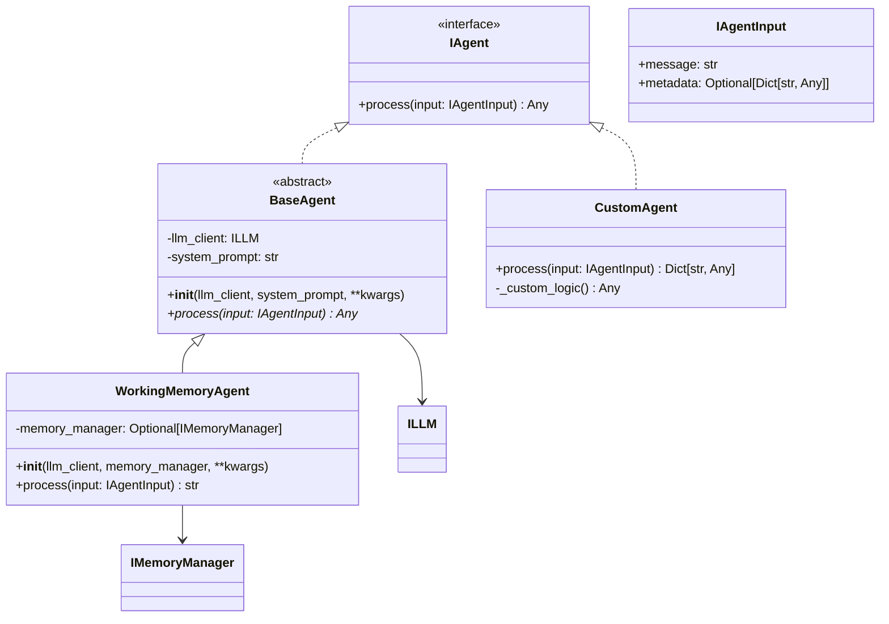

# Arshai Framework Architecture

## System Overview

The Arshai framework provides a **developer-empowered, three-layer architecture** for building AI-powered applications. The system prioritizes **developer authority and choice** while providing powerful, well-designed components that can be composed freely.

## Three-Layer Architecture Philosophy

Arshai follows a unique three-layer approach where **developer authority increases** as you move up the layers:

### **Layer 1: LLM Clients (Deepest - Minimal Developer Authority)**
- **Core AI components** maintained exclusively by framework contributors
- **Users consume as-is** with predefined features and interfaces
- **Unified behavior** across all providers (OpenAI, Azure, Gemini, etc.)
- **Example**: All LLM clients implement identical `ILLM` interface with consistent function calling

### **Layer 2: Agents (Middle - Moderate Developer Authority)**
- **Purpose-driven wrappers** over LLM clients for specific tasks
- **Developers can customize and create their own** following framework interfaces
- **Framework provides minimal base classes** and examples, not requirements
- **Example**: `BaseAgent` provides optional structure, but developers can implement `IAgent` directly

### **Layer 3: Agentic Systems (Surface - Maximum Developer Authority)**
- **Minimal framework implementation** - mostly interfaces and suggested patterns
- **Developers decide orchestration patterns** (workflows, multi-agent systems, etc.)
- **Framework provides building blocks**, developers control composition
- **Example**: Workflow interfaces exist, but developers choose their own orchestration approach

```mermaid
graph TB
    subgraph "Layer 3: Agentic Systems (Maximum Developer Authority)"
        DEV["Developer Decides:"]
        DEV --> ORCH["Orchestration Patterns"]
        DEV --> COMP["Component Composition"]
        DEV --> TOOLS["Tool Integration"]
        ORCH --> WF["Workflows (Optional)"]
        ORCH --> MULTI["Multi-Agent Systems"]
        ORCH --> CUSTOM["Custom Patterns"]
    end
    
    subgraph "Layer 2: Agents (Moderate Developer Authority)"
        AGENT["Developer Creates:"]
        AGENT --> CUSTOM_AGENT["Custom Agents"]
        AGENT --> BASE["BaseAgent (Optional)"]
        AGENT --> DIRECT["Direct IAgent Implementation"]
        BASE --> MEMORY_AGENT["WorkingMemoryAgent"]
        BASE --> SIMPLE_AGENT["SimpleAgent"]
    end
    
    subgraph "Layer 1: LLM Clients (Minimal Developer Authority)"
        LLM["Framework Provides:"]
        LLM --> OPENAI["OpenAI Client"]
        LLM --> AZURE["Azure Client"]
        LLM --> GEMINI["Gemini Client"]
        LLM --> OPENROUTER["OpenRouter Client"]
    end
    
    subgraph "Supporting Components (Developer Choice)"
        MEMORY["Memory Managers"]
        VECTOR["Vector Databases"]
        EMBED["Embedding Services"]
        SEARCH["Web Search"]
    end
    
    DEV --> AGENT
    AGENT --> LLM
    AGENT --> MEMORY
    AGENT --> VECTOR
    TOOLS --> EMBED
    TOOLS --> SEARCH
    
    style DEV fill:#e1f5fe
    style AGENT fill:#f3e5f5
    style LLM fill:#e8f5e8
    style MEMORY fill:#fff3e0
```



## Core Architectural Principles

The Arshai framework is built on foundational principles that **empower developers** while providing reliable, consistent components:

### Developer Authority Philosophy
- **You decide** how to compose components together
- **You control** dependency injection and configuration patterns
- **You choose** which framework utilities to use (all optional)
- **Framework provides** building blocks, not prescriptive patterns

### Interface-First Design
- All components implement **well-defined interfaces**
- **Multiple implementations** available with consistent behavior
- **Easy testing and mocking** through interface contracts
- **Extensibility** through implementing interfaces directly

### Direct Instantiation Priority
- **Primary approach**: Direct component creation by developers
- **Optional utilities**: Convenience functions available if desired
- **No hidden dependencies**: All parameters explicit in constructors
- **Clear imports**: Know exactly what you're using

### Component Independence
- **Self-contained**: Each component reads its own environment variables
- **No global state**: Components work independently
- **Explicit dependencies**: All dependencies passed through constructors
- **Composable**: Mix and match components freely

## Component Architecture by Layer

### Layer 1: LLM Clients (Framework-Managed)

LLM clients represent the **core AI capabilities** with minimal developer customization. All clients implement the unified `ILLM` interface with identical behavior.

**Key Characteristics:**
- **Unified Interface**: All providers behave identically from application perspective
- **Progressive Streaming**: Real-time function execution during streaming
- **Function Calling**: Regular functions + background tasks support
- **Structured Output**: Type-safe response formatting
- **Error Resilience**: Graceful handling of partial failures

**Direct Usage Pattern:**
```python
from arshai.llms.openai import OpenAIClient
from arshai.core.interfaces.illm import ILLMConfig, ILLMInput

# Developer creates directly
config = ILLMConfig(model="gpt-4o", temperature=0.7)
client = OpenAIClient(config)

# Developer controls input
input_data = ILLMInput(
    system_prompt="You are a helpful assistant",
    user_message="Hello!",
    regular_functions={"search": search_function},
    background_tasks={"log": log_function}
)

response = await client.chat(input_data)
```

### Layer 2: Agents (Developer-Customizable)

Agents are **purpose-driven wrappers** over LLM clients. Framework provides minimal base classes and examples, but developers have full authority to customize or create from scratch.



**Agent Creation Patterns:**

```python
# Pattern 1: Use Optional Base Class
class MyAgent(BaseAgent):
    async def process(self, input: IAgentInput) -> str:
        llm_input = ILLMInput(
            system_prompt=self.system_prompt,
            user_message=input.message
        )
        result = await self.llm_client.chat(llm_input)
        return result['llm_response']

# Pattern 2: Direct Interface Implementation
class CustomAgent(IAgent):
    def __init__(self, llm_client: ILLM, custom_config):
        self.llm_client = llm_client
        self.config = custom_config
    
    async def process(self, input: IAgentInput) -> Dict[str, Any]:
        # Complete developer control
        return {"custom_response": "developer decides format"}

# Usage: Developer creates everything
llm = OpenAIClient(config)
agent = MyAgent(llm, "You are helpful")
response = await agent.process(IAgentInput(message="Hello"))
```

### Layer 3: Agentic Systems (Maximum Developer Authority)

Agentic systems represent **orchestration and composition patterns**. The framework provides interfaces and optional base implementations, but developers have complete authority over how components work together.

**Workflow System Example (Optional Framework Component):**

```python
# Option 1: Use Framework Base Classes (Optional)
from arshai.workflows.base import BaseWorkflowRunner

class MyWorkflowRunner(BaseWorkflowRunner):
    def configure_nodes(self):
        # Developer customizes
        pass

# Option 2: Implement Interface Directly (Maximum Control)
class CustomWorkflowRunner(IWorkflowRunner):
    def __init__(self, agents: Dict[str, IAgent]):
        self.agents = agents  # Developer controls composition
    
    async def run(self, input_data):
        # Developer decides orchestration logic
        result1 = await self.agents['analyzer'].process(input_data)
        result2 = await self.agents['synthesizer'].process(result1)
        return result2

# Option 3: Use Framework Implementation As-Is (If It Fits)
from arshai.workflows import WorkflowRunner
runner = WorkflowRunner(config)  # Use if it meets your needs

# Usage: Developer controls everything
analyzer = AnalyzerAgent(llm_client, "Analyze input")
synthesizer = SynthesizerAgent(llm_client, "Synthesize results")

workflow = CustomWorkflowRunner({
    'analyzer': analyzer,
    'synthesizer': synthesizer
})

result = await workflow.run(input_data)
```

| Layer 3 Component | Developer Authority | Framework Provides |
|-------------------|--------------------|--------------------|
| **Orchestration Patterns** | Complete control over flow logic | Optional interfaces and base classes |
| **Multi-Agent Coordination** | Choose coordination approach | Example patterns and utilities |
| **Tool Integration** | Decide tool creation and usage | Optional tool implementations |
| **Configuration Management** | Choose config approach | Optional config loader utility |
| **Workflow Management** | Design workflow logic | Optional workflow base classes |

## Developer Empowerment Patterns

### Direct Instantiation (Primary Approach)

The framework prioritizes **direct instantiation** where developers explicitly create and compose components:

```python
# Developer creates each component explicitly
from arshai.llms.openai import OpenAIClient
from arshai.memory.working_memory.redis_memory_manager import RedisMemoryManager
from arshai.agents.working_memory import WorkingMemoryAgent

# Clear, explicit dependencies
llm_config = ILLMConfig(model="gpt-4o", temperature=0.7)
llm_client = OpenAIClient(llm_config)

memory_manager = RedisMemoryManager(
    redis_url="redis://localhost:6379",
    ttl=3600
)

agent = WorkingMemoryAgent(
    llm_client=llm_client,
    memory_manager=memory_manager,
    system_prompt="You are a helpful assistant"
)

# Developer controls the interaction
response = await agent.process(IAgentInput(
    message="Hello!",
    metadata={"conversation_id": "conv_123"}
))
```

### Optional Utilities (Convenience Only)

For developers who prefer convenience, optional utilities are available:

```python
# Optional utility functions (if desired)
from arshai.utils.llm_utils import create_llm_client
from arshai.utils.memory_utils import create_memory_manager

# Still explicit, just more convenient
llm_client = create_llm_client("openai", {"model": "gpt-4o"})
memory_manager = create_memory_manager("redis", {"redis_url": "redis://localhost:6379"})

# Developer still controls composition
agent = WorkingMemoryAgent(llm_client, memory_manager, system_prompt)
```

### Configuration Management (Optional)

Framework provides lightweight configuration support without imposing patterns:

```python
# Optional configuration loading
from arshai.config import load_config, ConfigLoader

# Function approach
config = load_config("app.yaml")  # Returns {} if file doesn't exist
llm_settings = config.get("llm", {})

# Class approach
config_loader = ConfigLoader("app.yaml")
llm_settings = config_loader.get("llm", {})

# Developer handles environment variables
import os
api_key = os.getenv("OPENAI_API_KEY")

# Developer creates components with config data
llm_client = OpenAIClient(ILLMConfig(
    model=llm_settings.get("model", "gpt-4o"),
    temperature=llm_settings.get("temperature", 0.7)
))
```

## Supporting Components (Developer Choice)

### Memory Management

Memory components can be used independently or composed as needed:

```python
# Direct instantiation based on needs
from arshai.memory.working_memory.redis_memory_manager import RedisMemoryManager
from arshai.memory.working_memory.in_memory_manager import InMemoryManager

# Developer chooses persistence approach
if production_mode:
    memory = RedisMemoryManager(
        redis_url=os.getenv("REDIS_URL"),
        ttl=3600
    )
else:
    memory = InMemoryManager(ttl=1800)

# Use with agents or directly
await memory.store({
    "conversation_id": "conv_123",
    "working_memory": "User is asking about pricing"
})
```

### Vector Databases and Embeddings

```python
# Developer composes vector search capabilities
from arshai.embeddings.openai_embeddings import OpenAIEmbeddings
from arshai.vector_db.milvus_client import MilvusClient

# Direct instantiation with clear dependencies
embedding_service = OpenAIEmbeddings(
    model="text-embedding-3-small"
    # Reads OPENAI_API_KEY from environment
)

vector_db = MilvusClient(
    host=os.getenv("MILVUS_HOST", "localhost"),
    port=int(os.getenv("MILVUS_PORT", "19530"))
)

# Developer controls how they work together
documents = ["doc1", "doc2", "doc3"]
embeddings = await embedding_service.embed_documents(documents)
await vector_db.store_vectors("my_collection", embeddings, documents)
```

### Tool Integration (Layer 3)

```python
# Tools are Layer 3 - developer controls everything
from arshai.tools import WebSearchTool  # Optional framework tool

# Option 1: Use framework tools (optional)
web_search = WebSearchTool()

# Option 2: Create custom tools
class DatabaseTool:
    def search_database(self, query: str) -> str:
        # Developer's custom logic
        return "database results"

database_tool = DatabaseTool()

# Option 3: Simple functions
def calculate(expression: str) -> float:
    return eval(expression)  # Developer decides safety

# Agent integration - developer controls tool passing
class MyAgent(BaseAgent):
    async def process(self, input: IAgentInput):
        tools = {
            "web_search": web_search.search,
            "database_search": database_tool.search_database,
            "calculate": calculate
        }
        
        llm_input = ILLMInput(
            system_prompt=self.system_prompt,
            user_message=input.message,
            regular_functions=tools  # Developer chooses which tools
        )
        
        return await self.llm_client.chat(llm_input)
```

## Architecture Benefits

### For Developers
- **Complete Control**: Decide how to compose and configure components
- **No Hidden Magic**: All dependencies are explicit in constructors
- **Flexible Patterns**: Use framework utilities or create your own
- **Clear Imports**: Know exactly what components you're using
- **Easy Testing**: Mock interfaces directly, no complex setup

### For Framework Maintainers
- **Clear Boundaries**: Each layer has well-defined responsibilities
- **Reduced Complexity**: No global state or hidden dependencies
- **Better Testing**: Components can be tested in isolation
- **Easier Documentation**: Clear examples of direct usage

### For Contributors
- **Layer 1 Focus**: Contribute to core AI capabilities (LLM clients)
- **Example Contributions**: Share patterns and examples for Layers 2-3
- **Clear Contracts**: Well-defined interfaces to implement

## Migration from Settings-Based Patterns

If you're migrating from Settings-based code:

```python
# OLD: Framework controls creation
settings = Settings()
llm = settings.create_llm()
agent = settings.create_agent("conversation", config)

# NEW: Developer controls creation  
llm_config = ILLMConfig(model="gpt-4o", temperature=0.7)
llm = OpenAIClient(llm_config)

memory = RedisMemoryManager(redis_url=os.getenv("REDIS_URL"))
agent = WorkingMemoryAgent(llm, memory, "You are helpful")
```

**Benefits of Migration:**
- **Explicit Dependencies**: No hidden Settings dependencies
- **Better Testing**: Easy to mock individual components
- **More Flexible**: Compose components exactly as needed
- **Clearer Code**: Obvious what components are being used

## Framework Component Summary

| Layer | Component Type | Developer Authority | Framework Provides |
|-------|----------------|--------------------|--------------------|
| **Layer 1** | LLM Clients | Minimal - use as provided | Complete implementations with unified interface |
| **Layer 1** | Core Interfaces | None - must follow contracts | Well-defined protocols for consistency |
| **Layer 2** | Agent Base Classes | Moderate - extend or ignore | Optional base classes and examples |
| **Layer 2** | Memory Managers | High - compose as needed | Multiple implementation options |
| **Layer 3** | Workflow Systems | Maximum - design your own | Optional base classes and interfaces |
| **Layer 3** | Tool Integration | Complete - total control | Optional tool implementations |
| **Layer 3** | Configuration | Complete - use or ignore | Optional config loader utility |

**Key Principle**: As you move up layers, **developer authority increases** while **framework prescription decreases**.

## Complete Example: Multi-Component Application

```python
#!/usr/bin/env python3
"""Complete example showing three-layer architecture in practice."""

import os
import asyncio
from typing import Dict, Any

# Layer 1: LLM Clients (Direct imports)
from arshai.llms.openai import OpenAIClient
from arshai.core.interfaces.illm import ILLMConfig, ILLMInput

# Layer 2: Agents and Supporting Components (Direct imports)
from arshai.agents.base import BaseAgent
from arshai.agents.working_memory import WorkingMemoryAgent
from arshai.memory.working_memory.redis_memory_manager import RedisMemoryManager
from arshai.core.interfaces.iagent import IAgent, IAgentInput

# Layer 3: Tools and Configuration (Optional utilities)
from arshai.tools import WebSearchTool
from arshai.config import load_config


class CustomerServiceAgent(BaseAgent):
    """Custom agent for customer service - demonstrates Layer 2 authority."""
    
    def __init__(self, llm_client, memory_manager, search_tool):
        super().__init__(llm_client, "You are a helpful customer service agent")
        self.memory_manager = memory_manager
        self.search_tool = search_tool
    
    async def process(self, input: IAgentInput) -> Dict[str, Any]:
        # Developer decides tool integration pattern
        async def search_knowledge_base(query: str) -> str:
            return await self.search_tool.search(query)
        
        async def update_memory(content: str) -> None:
            if input.metadata and "conversation_id" in input.metadata:
                await self.memory_manager.store({
                    "conversation_id": input.metadata["conversation_id"],
                    "working_memory": content
                })
        
        # Developer controls LLM input composition
        llm_input = ILLMInput(
            system_prompt=self.system_prompt,
            user_message=input.message,
            regular_functions={"search_knowledge_base": search_knowledge_base},
            background_tasks={"update_memory": update_memory}
        )
        
        result = await self.llm_client.chat(llm_input)
        
        return {
            "response": result['llm_response'],
            "usage": result['usage']
        }


class CustomerServiceOrchestrator:
    """Layer 3: Application orchestration - maximum developer control."""
    
    def __init__(self, agents: Dict[str, IAgent]):
        self.agents = agents
    
    async def handle_request(self, request_type: str, message: str, conversation_id: str):
        """Developer decides orchestration logic completely."""
        
        if request_type == "technical":
            agent = self.agents["technical_agent"]
        elif request_type == "billing":
            agent = self.agents["billing_agent"]
        else:
            agent = self.agents["general_agent"]
        
        # Developer controls how agents are invoked
        input_data = IAgentInput(
            message=message,
            metadata={"conversation_id": conversation_id, "request_type": request_type}
        )
        
        response = await agent.process(input_data)
        return response


async def main():
    """Complete application setup - demonstrates developer authority."""
    
    # Optional: Load configuration (developer choice)
    config = load_config("customer_service_config.yaml")  # Returns {} if no file
    
    # Layer 1: Create LLM client (developer controls configuration)
    llm_config = ILLMConfig(
        model=config.get("llm", {}).get("model", "gpt-4o"),
        temperature=config.get("llm", {}).get("temperature", 0.7)
    )
    llm_client = OpenAIClient(llm_config)
    
    # Supporting components: Developer chooses implementations
    memory_manager = RedisMemoryManager(
        redis_url=os.getenv("REDIS_URL", "redis://localhost:6379"),
        ttl=3600
    )
    
    search_tool = WebSearchTool()  # Optional framework tool
    
    # Layer 2: Create agents (developer decides composition)
    technical_agent = CustomerServiceAgent(llm_client, memory_manager, search_tool)
    billing_agent = WorkingMemoryAgent(llm_client, memory_manager, "You handle billing inquiries")
    general_agent = CustomerServiceAgent(llm_client, memory_manager, search_tool)
    
    # Layer 3: Application orchestration (complete developer control)
    orchestrator = CustomerServiceOrchestrator({
        "technical_agent": technical_agent,
        "billing_agent": billing_agent,
        "general_agent": general_agent
    })
    
    # Use the system
    response = await orchestrator.handle_request(
        request_type="technical",
        message="My app keeps crashing when I try to export data",
        conversation_id="customer_123_session_456"
    )
    
    print(f"Response: {response}")


if __name__ == "__main__":
    asyncio.run(main())
```

**Key Architectural Points Demonstrated:**
1. **Direct Instantiation**: All components created explicitly by developer
2. **Layer Separation**: Clear boundaries between LLM clients, agents, and orchestration
3. **Developer Authority**: Complete control over composition and configuration
4. **Optional Utilities**: Configuration loading and tools used by choice
5. **Interface Contracts**: All components follow well-defined interfaces
6. **No Hidden Dependencies**: All requirements explicit in constructors

## Best Practices for Three-Layer Architecture

### Layer 1: LLM Client Usage
- **Use as provided**: Don't try to modify LLM client behavior
- **Follow interfaces**: All clients implement ILLM identically  
- **Direct instantiation**: Create clients with explicit configuration
- **Environment variables**: Let clients handle their own secrets

### Layer 2: Agent Development
- **Choose your approach**: Use BaseAgent or implement IAgent directly
- **Explicit dependencies**: Pass all requirements through constructor
- **Stateless design**: Use external memory managers for state
- **Clear return types**: Document what your agent returns

### Layer 3: System Architecture
- **Design your patterns**: Don't be constrained by framework implementations
- **Compose freely**: Mix and match components as needed
- **Optional utilities**: Use framework tools only if they fit your needs
- **Control orchestration**: Decide how components work together

### General Guidelines
- **Prefer explicit over implicit**: Make dependencies obvious
- **Test components independently**: Mock interfaces for unit tests
- **Document your choices**: Explain why you chose specific patterns
- **Start simple**: Begin with direct instantiation, add utilities as needed

## Related Documentation

This architecture document provides the foundation for understanding Arshai's three-layer philosophy. For detailed information on specific components:

- **[LLM Architecture](./llm_architecture.md)**: Deep dive into Layer 1 LLM client design and implementation
- **[Agent Architecture](./agent_architecture.md)**: Layer 2 agent patterns and development approaches  
- **[Migration Guide](./migration_guide.md)**: Step-by-step guide from Settings-based to direct instantiation patterns
- **[Developer Patterns Guide](../guides/developer_patterns.md)**: Best practices and common implementation patterns
- **[Component Usage Guide](../guides/component_usage.md)**: Direct usage examples for all framework components

## Summary

Arshai's three-layer architecture **empowers developers** by providing:

1. **Layer 1**: Reliable, consistent AI capabilities through unified LLM clients
2. **Layer 2**: Flexible agent building blocks with optional base classes
3. **Layer 3**: Complete control over system orchestration and component composition

The framework provides **powerful building blocks** without imposing patterns, enabling developers to create exactly the AI applications they envision.