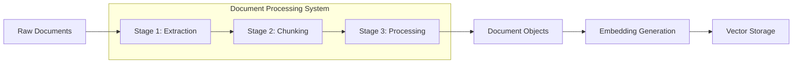
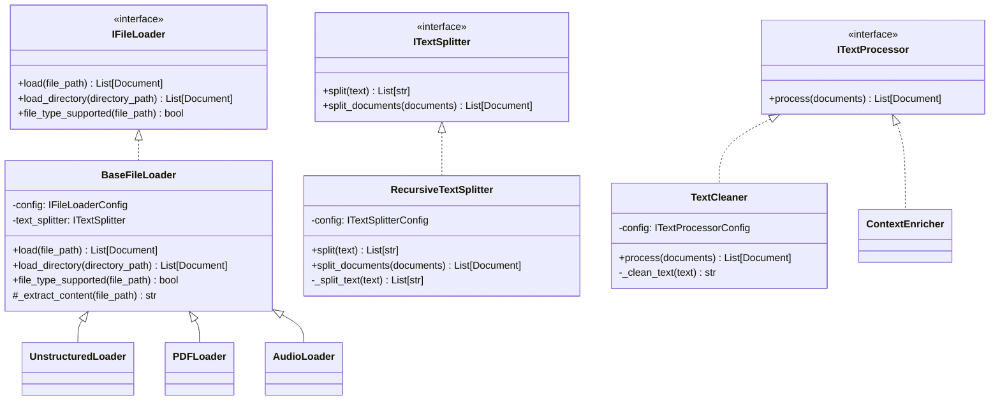
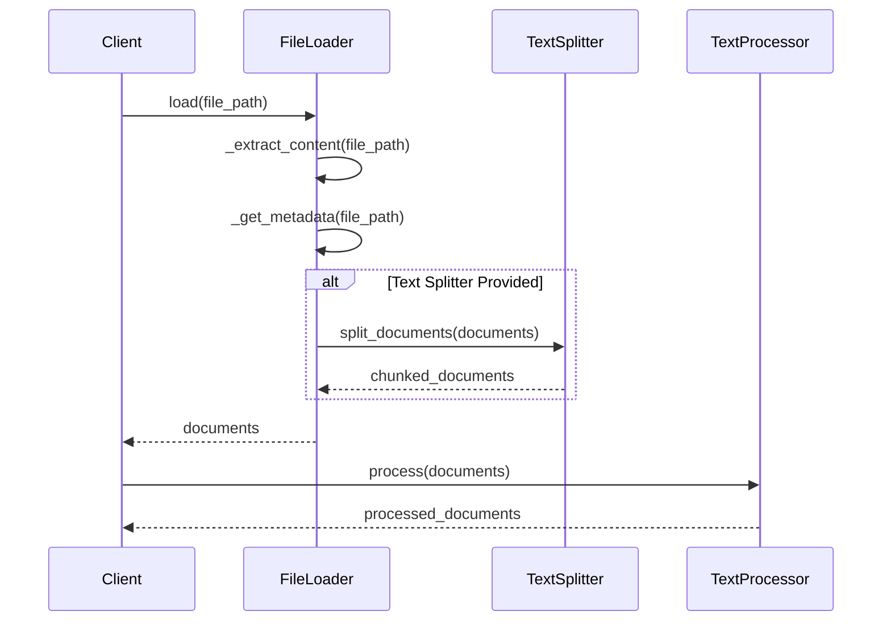

# Document Processing System

The Document Processing system in Arshai provides a comprehensive pipeline for extracting, processing, and managing document content for AI applications. This system is particularly important for retrieval-augmented generation (RAG) applications, where document content needs to be processed and made available to language models in a structured, queryable format.

## Architecture Overview

The Document Processing system follows a modular, three-stage architecture that separates concerns and enables flexible composition of components:



### Three-Stage Processing Model

1. **Extraction (File Loaders)**:
   - Extracts raw content from various document formats
   - Preserves document metadata
   - Converts binary formats to text representation

2. **Chunking (Text Splitters)**:
   - Breaks down large documents into manageable chunks
   - Preserves semantic coherence and context
   - Optimizes chunk size for embedding models and LLMs

3. **Processing (Text Processors)**:
   - Cleans and normalizes text content
   - Enhances document metadata
   - Prepares content for embedding and indexing

## Component Architecture

The Document Processing system is composed of three main component types, each following a clean interface design:



### File Loaders

File loaders are responsible for extracting content from various document types, following the `IFileLoader` interface:

```python
class IFileLoader(Protocol):
    """Interface for file content extraction."""
    
    def load(self, file_path: str) -> List[Document]:
        """
        Load a document from a file.
        
        Args:
            file_path: Path to the file
            
        Returns:
            List[Document]: Extracted document content
        """
        ...
    
    def load_directory(self, directory_path: str, glob_pattern: str = "*") -> List[Document]:
        """
        Load documents from a directory.
        
        Args:
            directory_path: Path to the directory
            glob_pattern: Pattern for matching files
            
        Returns:
            List[Document]: Extracted document content
        """
        ...
    
    def file_type_supported(self, file_path: str) -> bool:
        """
        Check if the file type is supported.
        
        Args:
            file_path: Path to the file
            
        Returns:
            bool: Whether the file type is supported
        """
        ...
```

The `BaseFileLoader` abstract class provides common functionality for all file loaders:
- File existence validation
- Directory traversal
- Metadata extraction
- Integration with text splitters

#### Key File Loader Implementations

1. **PDFLoader**:
   - Extracts text and metadata from PDF documents
   - Supports OCR for scanned documents
   - Preserves page structure information

2. **UnstructuredLoader**:
   - General-purpose loader using the unstructured library
   - Handles multiple document formats automatically
   - Preserves document structure when possible

3. **AudioLoader**:
   - Transcribes audio files to text
   - Supports multiple audio formats
   - Integrates with speech-to-text services

4. **Specialized Loaders**:
   - `UnstructuredWordDocumentLoader`: For Word documents
   - `UnstructuredPowerPointLoader`: For PowerPoint presentations
   - `UnstructuredHTMLLoader`: For HTML files
   - `UnstructuredExcelLoader`: For Excel spreadsheets

### Text Splitters

Text splitters handle document chunking for optimal processing by LLMs and embedding models, following the `ITextSplitter` interface:

```python
class ITextSplitter(Protocol):
    """Interface for text splitting."""
    
    def split(self, text: str) -> List[str]:
        """
        Split text into chunks.
        
        Args:
            text: Text to split
            
        Returns:
            List[str]: Text chunks
        """
        ...
    
    def split_documents(self, documents: List[Document]) -> List[Document]:
        """
        Split documents into chunks.
        
        Args:
            documents: Documents to split
            
        Returns:
            List[Document]: Document chunks with updated metadata
        """
        ...
```

#### Key Text Splitter Implementations

1. **RecursiveTextSplitter**:
   - Splits text based on a hierarchy of separators
   - Preserves semantic coherence between chunks
   - Configurable chunk size and overlap
   - Default separator hierarchy: `["\n\n", "\n", ". ", " ", ""]`

### Text Processors

Text processors transform and enhance document content after extraction and chunking, following the `ITextProcessor` interface:

```python
class ITextProcessor(Protocol):
    """Interface for document processing."""
    
    def process(self, documents: List[Document]) -> List[Document]:
        """
        Process documents.
        
        Args:
            documents: Documents to process
            
        Returns:
            List[Document]: Processed documents
        """
        ...
```

#### Key Text Processor Implementations

1. **TextCleaner**:
   - Normalizes whitespace and formatting
   - Removes unwanted characters and patterns
   - Standardizes text representation
   - Configurable cleaning operations

2. **ContextEnricher**:
   - Adds metadata based on document content
   - Detects language, entities, and keywords
   - Enhances documents with contextual information
   - Adds timestamps and processing information

## Document Object Model

All components in the document processing system work with a standardized `Document` data structure:

```python
class Document(IDTO):
    """Representation of a document or document chunk."""
    
    page_content: str = Field(
        description="The textual content of the document or chunk"
    )
    metadata: Dict[str, Any] = Field(
        default_factory=dict,
        description="Metadata associated with the document"
    )
```

Standard metadata fields include:
- `source`: Source file path or URL
- `document_id`: Unique document identifier
- `chunk_id`: Identifier for the specific chunk
- `created_at`: Timestamp when the document was processed
- `page_number`: Page number for page-based documents
- `chunk_index`: Index of the chunk within the document
- `total_chunks`: Total number of chunks in the document

## Implementation Details

### Document Loading Process

The document loading process follows the three-stage architecture:



### Configuration Models

Each component type has associated configuration models for customization:

#### File Loader Configuration

```python
class IFileLoaderConfig(IDTO):
    """Configuration for file loaders."""
    
    include_metadata: bool = Field(
        default=True,
        description="Whether to include metadata in the document"
    )
    encoding: str = Field(
        default="utf-8",
        description="Encoding to use for text files"
    )
    recursive: bool = Field(
        default=True,
        description="Whether to recursively traverse directories"
    )
```

#### Text Splitter Configuration

```python
class ITextSplitterConfig(IDTO):
    """Configuration for text splitters."""
    
    chunk_size: int = Field(
        default=1000,
        description="Target size for chunks (in characters)"
    )
    chunk_overlap: int = Field(
        default=200,
        description="Overlap between chunks (in characters)"
    )
    separators: List[str] = Field(
        default_factory=lambda: ["\n\n", "\n", ". ", " ", ""],
        description="Hierarchy of separators for splitting"
    )
    keep_separator: bool = Field(
        default=False,
        description="Whether to keep the separator with the chunk"
    )
```

#### Text Processor Configuration

```python
class TextCleanerConfig(IDTO):
    """Configuration for text cleaner."""
    
    remove_extra_whitespace: bool = Field(
        default=True,
        description="Whether to normalize whitespace"
    )
    remove_urls: bool = Field(
        default=False,
        description="Whether to remove URLs"
    )
    lowercase: bool = Field(
        default=False,
        description="Whether to convert text to lowercase"
    )
    remove_punctuation: bool = Field(
        default=False,
        description="Whether to remove punctuation"
    )
    remove_digits: bool = Field(
        default=False,
        description="Whether to remove digits"
    )
    strip_html: bool = Field(
        default=True,
        description="Whether to remove HTML tags"
    )
```

### Recursive Text Splitting Algorithm

The `RecursiveTextSplitter` implements a hierarchical approach to chunking:

```python
def _split_text(self, text: str) -> List[str]:
    """
    Split text into chunks using a recursive approach.
    
    This method tries each separator in order until the chunks
    are small enough. If a separator doesn't yield chunks under
    the size limit, it moves to the next separator.
    
    Args:
        text: Text to split
        
    Returns:
        List[str]: Text chunks
    """
    # Try each separator in order
    for separator in self.separators:
        if separator == "":
            # Handle the base case - character-level splitting
            return self._split_by_characters(text)
            
        # Split the text by the current separator
        splits = text.split(separator)
        
        # Check if any split is still too large
        any_too_large = False
        for split in splits:
            if len(split) > self.chunk_size:
                any_too_large = True
                break
                
        if not any_too_large:
            # All chunks are small enough, combine with overlap
            return self._merge_splits_with_overlap(splits, separator)
            
    # If we reach here, we need to try the next separator
    # This is handled by the recursive loop
```

## Usage Examples

### Basic Document Processing Pipeline

```python
from src.document_loaders import PDFLoader, RecursiveTextSplitter, TextCleaner

# Create components
loader = PDFLoader()
splitter = RecursiveTextSplitter(
    config=ITextSplitterConfig(
        chunk_size=1000,
        chunk_overlap=200
    )
)
cleaner = TextCleaner()

# Process a document
documents = loader.load("document.pdf")
chunked_documents = splitter.split_documents(documents)
processed_documents = cleaner.process(chunked_documents)

# Display results
for i, doc in enumerate(processed_documents):
    print(f"Chunk {i+1} (Length: {len(doc.page_content)})")
    print(f"Content preview: {doc.page_content[:100]}...")
    print(f"Source: {doc.metadata.get('source')}")
    print(f"Page: {doc.metadata.get('page_number')}")
    print("-" * 50)
```

### Using the Integrated Pipeline

```python
from src.document_loaders import PDFLoader, RecursiveTextSplitter, TextCleaner

# Create loader with integrated text splitter
text_splitter = RecursiveTextSplitter(
    chunk_size=1500,
    chunk_overlap=150
)
loader = PDFLoader(text_splitter=text_splitter)

# Load and automatically chunk documents
chunked_documents = loader.load("document.pdf")

# Apply text cleaning
cleaner = TextCleaner()
processed_documents = cleaner.process(chunked_documents)

print(f"Extracted {len(processed_documents)} chunks from the document")
```

### Processing Multiple File Types

```python
from src.document_loaders import UnstructuredLoader
from src.document_loaders.config import UnstructuredLoaderConfig

# Configure the unstructured loader
config = UnstructuredLoaderConfig(
    strategy="fast",
    include_metadata=True,
    ocr_languages=["eng"]
)

# Create loader
loader = UnstructuredLoader(config=config)

# Process multiple files in a directory
documents = loader.load_directory(
    "documents/",
    glob_pattern="**/*.{pdf,docx,pptx,html,txt}"
)

print(f"Processed {len(documents)} files:")
for doc in documents:
    print(f"- {doc.metadata.get('source')}: {len(doc.page_content)} chars")
```

### Creating a Custom Text Processor

```python
from src.document_loaders.processors import ITextProcessor
from seedwork.interfaces.idocument import Document
from typing import List
import re

class EntityExtractor(ITextProcessor):
    """Custom processor that extracts entities from text."""
    
    def __init__(self, entity_types=None):
        """
        Initialize the entity extractor.
        
        Args:
            entity_types: Types of entities to extract
        """
        self.entity_types = entity_types or ["PERSON", "ORG", "LOC"]
        
    def process(self, documents: List[Document]) -> List[Document]:
        """
        Extract entities from documents and add to metadata.
        
        Args:
            documents: Documents to process
            
        Returns:
            List[Document]: Documents with entity metadata
        """
        processed_docs = []
        
        for document in documents:
            # Simple regex-based entity extraction (for demonstration)
            # In practice, you would use a proper NLP library
            entities = {
                "PERSON": self._extract_persons(document.page_content),
                "ORG": self._extract_organizations(document.page_content),
                "LOC": self._extract_locations(document.page_content)
            }
            
            # Create a new document with updated metadata
            metadata = {**document.metadata, "entities": entities}
            processed_doc = Document(
                page_content=document.page_content,
                metadata=metadata
            )
            
            processed_docs.append(processed_doc)
            
        return processed_docs
    
    def _extract_persons(self, text):
        """Extract person names (simplified example)."""
        # This is a simplified example - in practice, use a proper NLP library
        name_pattern = r"Mr\.\s[A-Z][a-z]+ [A-Z][a-z]+|Mrs\.\s[A-Z][a-z]+ [A-Z][a-z]+|Dr\.\s[A-Z][a-z]+ [A-Z][a-z]+"
        return list(set(re.findall(name_pattern, text)))
    
    def _extract_organizations(self, text):
        """Extract organization names (simplified example)."""
        # This is a simplified example
        org_pattern = r"\b[A-Z][a-z]+ (Inc|Corp|LLC|Company|Organization)\b"
        return list(set(re.findall(org_pattern, text)))
    
    def _extract_locations(self, text):
        """Extract location names (simplified example)."""
        # This is a simplified example
        loc_pattern = r"\b[A-Z][a-z]+ (City|County|State|Country|Street|Avenue|Road)\b"
        return list(set(re.findall(loc_pattern, text)))
```

## Integration with Vector Databases

The Document Processing system integrates with vector databases for document indexing and retrieval:

```python
from src.document_loaders import PDFLoader, RecursiveTextSplitter, TextCleaner
from src.vector_db import MilvusVectorStore
from src.embeddings import OpenAIEmbeddings

# Create document processing pipeline
loader = PDFLoader()
splitter = RecursiveTextSplitter(chunk_size=1000, chunk_overlap=200)
cleaner = TextCleaner()

# Process documents
documents = loader.load("document.pdf")
chunked_documents = splitter.split_documents(documents)
processed_documents = cleaner.process(chunked_documents)

# Create embedding model and vector store
embedding_model = OpenAIEmbeddings(model="text-embedding-ada-002")
vector_store = MilvusVectorStore(
    collection_name="documents",
    embedding_model=embedding_model
)

# Create embeddings and index documents
vector_store.add_documents(processed_documents)

# Search for relevant documents
results = vector_store.similarity_search(
    query="What is machine learning?",
    k=5
)

for document in results:
    print(f"Relevance: {document.metadata.get('score')}")
    print(f"Content: {document.page_content[:200]}...")
    print("-" * 50)
```

## Best Practices

### Document Extraction

1. **File Format Handling**:
   - Choose the appropriate loader for each file type
   - Use `UnstructuredLoader` for general-purpose loading
   - Consider OCR for scanned documents

2. **Metadata Preservation**:
   - Preserve original file metadata when possible
   - Add extraction timestamps for tracking
   - Include source information for auditability

3. **Error Handling**:
   - Implement robust error handling for corrupt files
   - Log extraction errors with appropriate context
   - Continue processing other files when one fails

### Document Chunking

1. **Chunk Size Optimization**:
   - Balance chunk size with embedding model limits
   - Consider the granularity needed for retrieval
   - Match chunk size to LLM context window limits

2. **Semantic Coherence**:
   - Choose separators that preserve semantic meaning
   - Avoid splitting in the middle of sentences
   - Use appropriate overlap to maintain context

3. **Content Type Specialization**:
   - Use different chunking strategies for different content types
   - Optimize separators for code, prose, tables, etc.
   - Consider structure-aware splitting for structured documents

### Document Processing

1. **Text Normalization**:
   - Standardize text formatting (whitespace, line endings)
   - Handle special characters and encoding issues
   - Consider language-specific preprocessing

2. **Metadata Enhancement**:
   - Add relevant metadata during processing
   - Include content classification information
   - Extract key entities and concepts

3. **Pipeline Composition**:
   - Chain processors in a logical sequence
   - Apply text cleaning before semantic enrichment
   - Preserve original content when appropriate

## Troubleshooting

### Common Issues

1. **Extraction Failures**:
   - Check file format compatibility
   - Verify file integrity
   - Check permissions and file accessibility

2. **Chunking Issues**:
   - Adjust chunk size and overlap
   - Try different separator hierarchies
   - Check for unusual document formatting

3. **Processing Problems**:
   - Inspect document encoding
   - Check for special characters or formatting
   - Validate processor configuration

## Future Enhancements

1. **Enhanced Extraction**:
   - Support for more file formats
   - Improved OCR capabilities
   - Structure preservation for complex documents

2. **Advanced Chunking**:
   - Semantic-aware chunking algorithms
   - Machine learning-based chunking
   - Structure-preserving document splitting

3. **Intelligent Processing**:
   - AI-powered content summarization
   - Entity recognition and extraction
   - Automatic document classification 