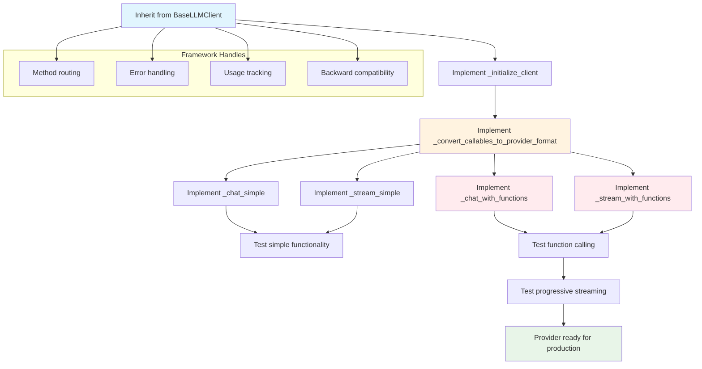
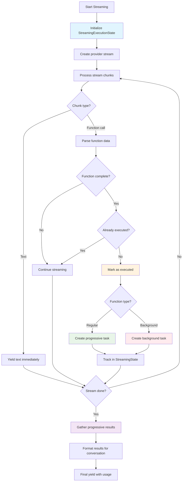

# Contributing: LLM Provider Implementation

This guide explains how to add new LLM providers to the Arshai framework following the established architectural patterns and standards.

## Overview

Adding a new LLM provider involves implementing 5 abstract methods in a class that inherits from `BaseLLMClient`. The framework handles all complexity management, routing, orchestration, and error handling - you only need to implement provider-specific API integration.

## Prerequisites

Before implementing a new provider, ensure you understand:
- The [LLM Architecture](../technical/llm_architecture.md) design principles
- The unified function interface pattern (`regular_functions` + `background_tasks`)  
- Progressive streaming concepts and implementation requirements
- The critical implementation notes in [`/arshai/llms/README.md`](../../arshai/llms/README.md)

### **Critical Architecture Context**

Understanding **why** the architecture was designed this way is essential for proper implementation:

#### **The Object-Based Function Problem**
Early implementations used dictionary-based function tracking which caused **critical infinite loops**:

```python
# ❌ PROBLEMATIC PATTERN (eliminated in current architecture)
function_calls = {}
for call in provider_function_calls:
    function_calls[call.name] = call.args  # Overwrites duplicate function names!

# If LLM calls same function twice: weather("Tokyo") + weather("London")
# Only the last call survives: weather("London")
# First call is lost, causing infinite retry loops
```

**Current Solution**: Object-based `List[FunctionCall]` preserves ALL function calls:
```python
# ✅ CURRENT PATTERN - Preserves all calls
function_calls = []
for i, call in enumerate(provider_function_calls):
    function_calls.append(FunctionCall(
        name=call.name,
        args=call.args,
        call_id=f"{call.name}_{i}",  # Unique identifier prevents loss
        is_background=call.is_background
    ))
```

#### **The Interface Unification Decision**
Original interface had three different ways to specify functions, creating complexity:

```python
# ❌ OLD COMPLEX INTERFACE (eliminated)
ILLMInput(
    tools_list=[{"name": "search", "parameters": {...}}],      # Schema format
    callable_functions={"calculate": calc_func},               # Callable format  
    background_tasks={"notify": notify_func}                   # Background format
)
```

**Problems**: 
- Providers needed complex conversion logic for multiple input types
- Background task detection required additional parameters
- Type safety was limited due to mixed formats

**Current Solution**: Pure callable interface with explicit separation:
```python
# ✅ CURRENT UNIFIED INTERFACE
ILLMInput(
    regular_functions={"search": search_func, "calculate": calc_func},  # All callables
    background_tasks={"notify": notify_func}                            # Explicit background
)
```

**Benefits**:
- Single conversion pattern for all providers
- Clear type safety with full IDE support
- Background tasks explicitly declared in function docstrings
- Reduced complexity and better maintainability

## Implementation Checklist

### 1. Class Structure Setup

Create a new file in `/arshai/llms/` following the naming convention:

```python
# /arshai/llms/your_provider.py

from arshai.llms.base_llm_client import BaseLLMClient
from arshai.core.interfaces.illm import ILLMConfig, ILLMInput
from typing import Dict, Any, Callable, AsyncGenerator

class YourProviderClient(BaseLLMClient):
    """
    Your Provider implementation using the BaseLLMClient framework.
    
    This client demonstrates integration with [Provider Name] API
    following Arshai's standardized patterns and progressive streaming.
    """
    
    def __init__(self, config: ILLMConfig, **provider_specific_args):
        """Initialize with provider-specific configuration."""
        # Store provider-specific configuration
        self.provider_arg = provider_specific_args.get('provider_arg')
        
        # Initialize base class (this calls _initialize_client())
        super().__init__(config)
```

### 2. Implementation Flow Overview

Before diving into specific methods, here's the overall implementation flow for any LLM provider:



### 3. Required Abstract Method Implementations

#### Method 1: Client Initialization

```python
def _initialize_client(self) -> Any:
    """
    Initialize the provider-specific client.
    
    Returns:
        Provider client instance
        
    Raises:
        ValueError: If required configuration is missing
    """
    # Check required environment variables/configuration
    api_key = os.environ.get("YOUR_PROVIDER_API_KEY")
    if not api_key:
        raise ValueError("YOUR_PROVIDER_API_KEY environment variable is required")
    
    try:
        # Try to use safe HTTP client if available
        from arshai.clients.utils.safe_http_client import SafeHttpClientFactory
        client = SafeHttpClientFactory.create_your_provider_client(api_key=api_key)
        self.logger.info("Provider client created with safe HTTP configuration")
        return client
    except ImportError:
        # Fallback to basic client
        self.logger.warning("Safe HTTP client not available, using basic client")
        return YourProviderSDK(api_key=api_key)
```

#### Method 2: Function Conversion

```python
def _convert_callables_to_provider_format(self, functions: Dict[str, Callable]) -> Any:
    """
    Convert python callables to provider-specific function declarations.
    Pure conversion without execution metadata.
    
    Args:
        functions: Dictionary of callable functions to convert
        
    Returns:
        Provider-specific function declarations format
    """
    provider_functions = []
    
    for name, func in functions.items():
        try:
            # Inspect function for schema generation
            signature = inspect.signature(func)
            description = func.__doc__ or f"Execute {name} function"
            
            # Build provider-specific function schema
            function_schema = {
                "name": name,
                "description": description,
                "parameters": self._build_parameters_schema(signature)
            }
            
            provider_functions.append(function_schema)
            
        except Exception as e:
            self.logger.warning(f"Failed to convert function {name}: {str(e)}")
            continue
    
    return provider_functions
```

#### Method 3 & 4: Chat Methods

```python
async def _chat_simple(self, input: ILLMInput) -> Dict[str, Any]:
    """Handle simple chat without tools or background tasks."""
    try:
        # Prepare provider-specific request
        request_data = {
            "model": self.config.model,
            "messages": [
                {"role": "system", "content": input.system_prompt},
                {"role": "user", "content": input.user_message}
            ],
            "temperature": self.config.temperature,
            "max_tokens": self.config.max_tokens
        }
        
        # Add structured output configuration if needed
        if input.structure_type:
            request_data["response_format"] = self._create_structure_schema(input.structure_type)
        
        # Make API call
        response = await self._client.chat.completions.create(**request_data)
        
        # Standardize usage metadata
        usage = self._standardize_usage_metadata(
            response.usage,
            self._get_provider_name(),
            self.config.model,
            getattr(response, 'id', None)
        )
        
        # Extract and return response
        content = response.choices[0].message.content
        return {"llm_response": content, "usage": usage}
        
    except Exception as e:
        self.logger.error(f"Error in simple chat: {str(e)}")
        return {
            "llm_response": f"An error occurred: {str(e)}",
            "usage": self._standardize_usage_metadata(None, self._get_provider_name(), self.config.model)
        }

async def _chat_with_functions(self, input: ILLMInput) -> Dict[str, Any]:
    """Handle complex chat with tools and/or background tasks."""
    # Prepare messages and tools
    messages = [
        {"role": "system", "content": input.system_prompt},
        {"role": "user", "content": input.user_message}
    ]
    
    # Convert functions using unified approach
    all_functions = {}
    if input.regular_functions:
        all_functions.update(input.regular_functions)
    if input.background_tasks:
        all_functions.update(input.background_tasks)
    
    provider_tools = []
    if all_functions:
        provider_tools = self._convert_callables_to_provider_format(all_functions)
    
    # Multi-turn conversation loop
    current_turn = 0
    accumulated_usage = None
    
    while current_turn < input.max_turns:
        try:
            # Make API call with tools
            response = await self._client.chat.completions.create(
                model=self.config.model,
                messages=messages,
                tools=provider_tools,
                temperature=self.config.temperature
            )
            
            # Process usage
            if response.usage:
                current_usage = self._standardize_usage_metadata(
                    response.usage, self._get_provider_name(), self.config.model
                )
                accumulated_usage = self._accumulate_usage_safely(current_usage, accumulated_usage)
            
            # Check for function calls
            if response.choices[0].message.tool_calls:
                # Process function calls using orchestrator
                function_calls_list = self._extract_function_calls(
                    response.choices[0].message.tool_calls, input
                )
                
                if function_calls_list:
                    # Execute via orchestrator
                    execution_input = FunctionExecutionInput(
                        function_calls=function_calls_list,
                        available_functions=input.regular_functions or {},
                        available_background_tasks=input.background_tasks or {}
                    )
                    
                    execution_result = await self._execute_functions_with_orchestrator(execution_input)
                    
                    # Add results to conversation
                    self._add_function_results_to_messages(execution_result, messages)
                    
                    # Continue if regular functions executed
                    if execution_result.get('regular_results'):
                        current_turn += 1
                        continue
            
            # Return final response
            content = response.choices[0].message.content
            return {"llm_response": content, "usage": accumulated_usage}
            
        except Exception as e:
            self.logger.error(f"Error in function calling turn {current_turn}: {str(e)}")
            return {
                "llm_response": f"An error occurred: {str(e)}",
                "usage": accumulated_usage
            }
    
    return {
        "llm_response": "Maximum number of function calling turns reached",
        "usage": accumulated_usage
    }
```

#### Method 5 & 6: Streaming Methods

```python
async def _stream_simple(self, input: ILLMInput) -> AsyncGenerator[Dict[str, Any], None]:
    """Handle simple streaming without tools or background tasks."""
    try:
        # Prepare streaming request
        stream = await self._client.chat.completions.create(
            model=self.config.model,
            messages=[
                {"role": "system", "content": input.system_prompt},
                {"role": "user", "content": input.user_message}
            ],
            stream=True,
            temperature=self.config.temperature
        )
        
        accumulated_usage = None
        collected_text = ""
        
        async for chunk in stream:
            # Process usage metadata
            if chunk.usage:
                current_usage = self._standardize_usage_metadata(
                    chunk.usage, self._get_provider_name(), self.config.model
                )
                accumulated_usage = self._accumulate_usage_safely(current_usage, accumulated_usage)
            
            # Process content
            if chunk.choices and chunk.choices[0].delta.content:
                collected_text += chunk.choices[0].delta.content
                yield {"llm_response": collected_text}
        
        # Final usage yield
        yield {"llm_response": None, "usage": accumulated_usage}
        
    except Exception as e:
        yield {"llm_response": f"Streaming error: {str(e)}", "usage": None}

async def _stream_with_functions(self, input: ILLMInput) -> AsyncGenerator[Dict[str, Any], None]:
    """Handle complex streaming with progressive function execution."""
    # This is the most complex method - implement progressive streaming
    # See detailed implementation in /arshai/llms/README.md
    
    # Key requirements:
    # 1. Execute functions immediately when arguments complete during streaming
    # 2. Use StreamingExecutionState to track active tasks
    # 3. Prevent duplicate function executions
    # 4. Gather results after streaming completes
    # 5. Handle both regular functions and background tasks progressively
    
    pass  # Implementation details in README.md

#### Progressive Streaming Implementation Pattern



### 3. Helper Method Implementations

Add provider-specific helper methods:

```python
def _accumulate_usage_safely(self, current_usage: Dict[str, Any], accumulated_usage: Dict[str, Any] = None) -> Dict[str, Any]:
    """Safely accumulate usage metadata without in-place mutations."""
    if accumulated_usage is None:
        return current_usage
    
    return {
        "input_tokens": accumulated_usage["input_tokens"] + current_usage["input_tokens"],
        "output_tokens": accumulated_usage["output_tokens"] + current_usage["output_tokens"],
        "total_tokens": accumulated_usage["total_tokens"] + current_usage["total_tokens"],
        "thinking_tokens": accumulated_usage.get("thinking_tokens", 0) + current_usage.get("thinking_tokens", 0),
        "tool_calling_tokens": accumulated_usage.get("tool_calling_tokens", 0) + current_usage.get("tool_calling_tokens", 0),
        "provider": current_usage["provider"],
        "model": current_usage["model"],
        "request_id": current_usage.get("request_id")
    }

def _extract_function_calls(self, tool_calls, input: ILLMInput) -> List[FunctionCall]:
    """Extract function calls from provider response."""
    function_calls_list = []
    
    for i, tool_call in enumerate(tool_calls):
        function_name = tool_call.function.name
        function_args = json.loads(tool_call.function.arguments)
        call_id = f"{function_name}_{i}"
        
        # Determine if it's a background task
        is_background = function_name in (input.background_tasks or {})
        
        function_calls_list.append(FunctionCall(
            name=function_name,
            args=function_args,
            call_id=call_id,
            is_background=is_background
        ))
    
    return function_calls_list
```

## Testing Requirements

### 1. Create Test Suite

Create `/tests/unit/llms/test_your_provider.py`:

```python
import pytest
from arshai.llms.your_provider import YourProviderClient
from arshai.core.interfaces.illm import ILLMConfig, ILLMInput

class TestYourProviderClient:
    """Test suite for YourProviderClient following framework standards."""
    
    @pytest.fixture
    def client_config(self):
        return ILLMConfig(model="your-model", temperature=0.7)
    
    @pytest.fixture
    def client(self, client_config):
        return YourProviderClient(client_config)
    
    def test_simple_chat(self, client):
        """Test simple chat functionality."""
        # Implementation must pass framework test standards
        pass
    
    def test_function_calling(self, client):
        """Test function calling with orchestrator."""
        # Implementation must pass framework test standards  
        pass
    
    def test_progressive_streaming(self, client):
        """Test progressive streaming functionality."""
        # Implementation must pass framework test standards
        pass
```

### 2. Test Compliance

Your implementation must pass all framework tests:
- Simple chat and streaming
- Function calling with both regular functions and background tasks
- Progressive streaming with real-time execution
- Error handling and usage tracking
- Multi-turn conversations

## Code Standards

### 1. Error Handling

```python
# Good: Graceful error handling with context
try:
    response = await self._client.api_call()
    return self._process_response(response)
except ProviderAPIError as e:
    self.logger.error(f"Provider API error: {str(e)}")
    return {
        "llm_response": f"Provider API temporarily unavailable: {str(e)}",
        "usage": self._standardize_usage_metadata(None, self._get_provider_name(), self.config.model)
    }
except Exception as e:
    self.logger.error(f"Unexpected error: {str(e)}")
    # Always return usage data even on failure
    return {"llm_response": f"An error occurred: {str(e)}", "usage": usage}
```

### 2. Logging Standards

```python
# Use framework logging patterns
self.logger.info(f"Initializing {self.__class__.__name__} with model: {self.config.model}")
self.logger.debug(f"Processing {len(function_calls)} function calls")
self.logger.warning(f"Failed to convert function {name}: {str(e)}")
self.logger.error(f"Critical error in provider integration: {str(e)}")
```

### 3. Configuration Management

```python
# Environment variable patterns
API_KEY = os.environ.get("YOUR_PROVIDER_API_KEY")
BASE_URL = os.environ.get("YOUR_PROVIDER_BASE_URL", "https://api.yourprovider.com")
TIMEOUT = int(os.environ.get("YOUR_PROVIDER_TIMEOUT", "30"))

# Validation
if not API_KEY:
    raise ValueError("YOUR_PROVIDER_API_KEY environment variable is required")
```

## Integration Checklist

### Before Submitting

- [ ] All 5 abstract methods implemented
- [ ] Progressive streaming support added
- [ ] Function conversion handles both regular and background tasks
- [ ] Error handling follows framework patterns
- [ ] Usage metadata standardized
- [ ] Test suite created and passing
- [ ] Documentation updated
- [ ] Environment variable documentation added
- [ ] Safe HTTP client integration attempted with fallback

### Code Review Requirements

- **Architecture Compliance**: Follows BaseLLMClient patterns exactly
- **Progressive Streaming**: Implements real-time function execution during streaming  
- **Error Resilience**: Graceful handling of all failure modes
- **Test Coverage**: Comprehensive test suite covering all functionality
- **Documentation**: Clear usage examples and configuration requirements

## Common Implementation Pitfalls

### ❌ What NOT to Do

1. **Don't duplicate framework logic** - The base class handles routing, orchestration, error handling
2. **Don't mix function types** - Use the unified callable interface only  
3. **Don't ignore progressive streaming** - All streaming methods must support real-time function execution
4. **Don't fail fast on function errors** - Collect errors and provide context to the model
5. **Don't forget usage tracking** - Always return standardized usage metadata

### ✅ What to Do

1. **Follow the template** - Use existing providers as reference implementations
2. **Leverage framework helpers** - Use `_standardize_usage_metadata`, `_execute_functions_with_orchestrator`
3. **Implement progressive streaming** - Execute functions immediately during streaming
4. **Handle errors gracefully** - Provide informative error messages and preserve usage data
5. **Test thoroughly** - Ensure your implementation passes all framework test scenarios

## Support and Resources

- **Architecture Documentation**: [/docs/technical/llm_architecture.md](../technical/llm_architecture.md)
- **Implementation Guide**: [/arshai/llms/README.md](../../arshai/llms/README.md) 
- **Reference Implementations**: Study existing providers in `/arshai/llms/`
- **Test Examples**: Framework test suites in `/tests/unit/llms/`

For questions about implementation details or architectural decisions, refer to the comprehensive implementation notes in the LLM module README.

## Documentation References

- **[LLM Architecture Overview](../technical/llm_architecture.md)**: Comprehensive understanding of the framework's design principles and architecture
- **[User Guide](../guides/llm_usage.md)**: See how your provider implementation will be used by framework users
- **[Implementation README](../../arshai/llms/README.md)**: Critical implementation notes, step-by-step guidance, and common pitfalls
- **[Architecture Decisions](../../ARCHITECTURE_DECISIONS.md)**: Historical context and reasoning behind current architectural patterns