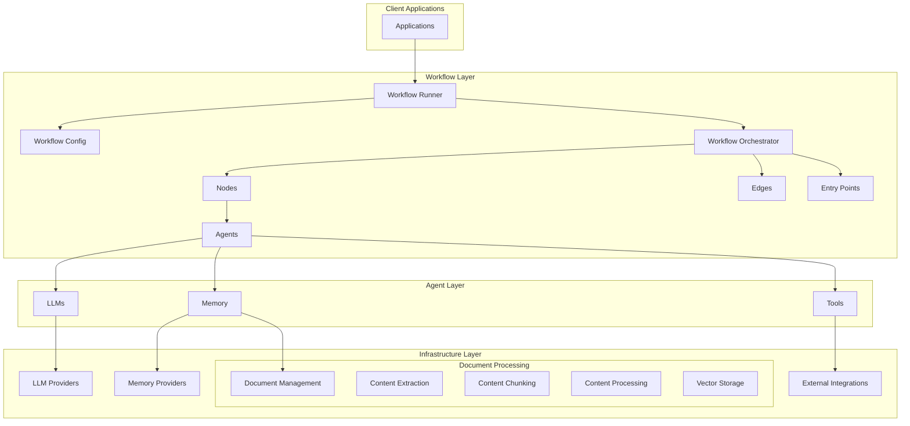
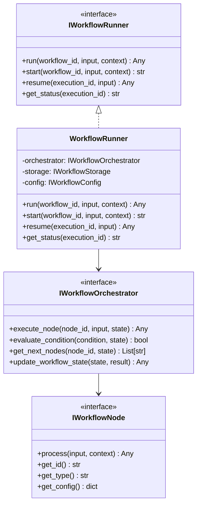
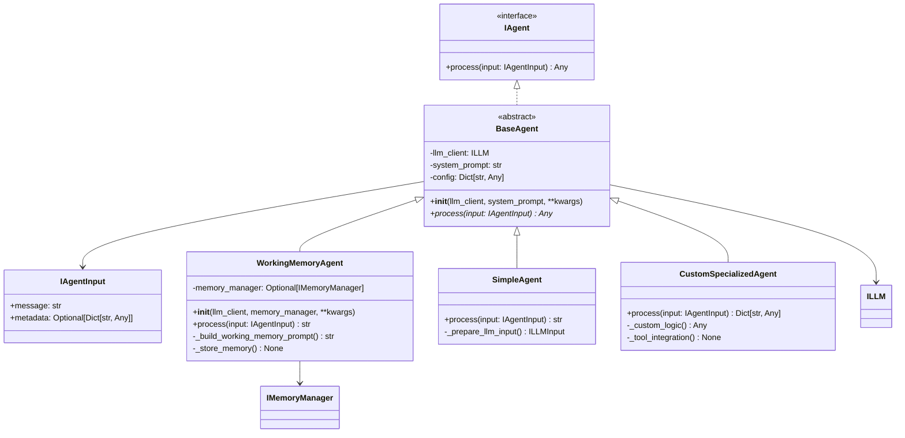
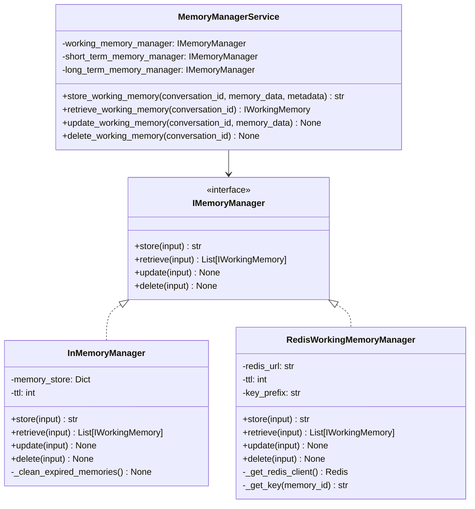
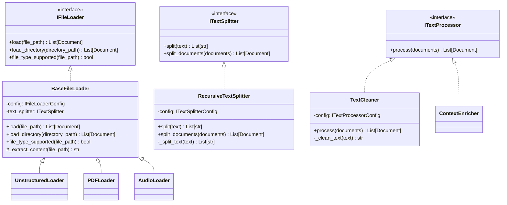
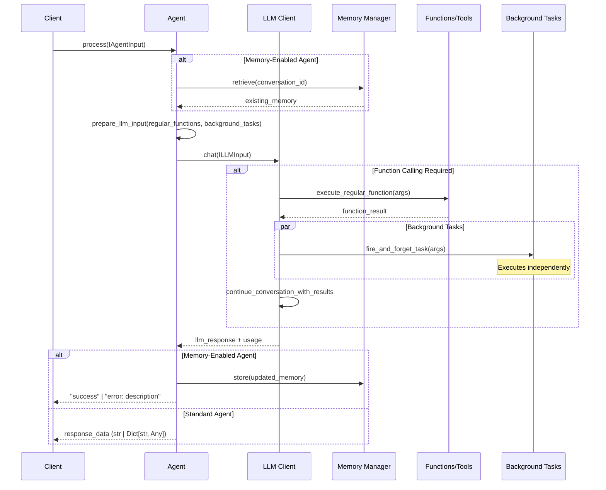
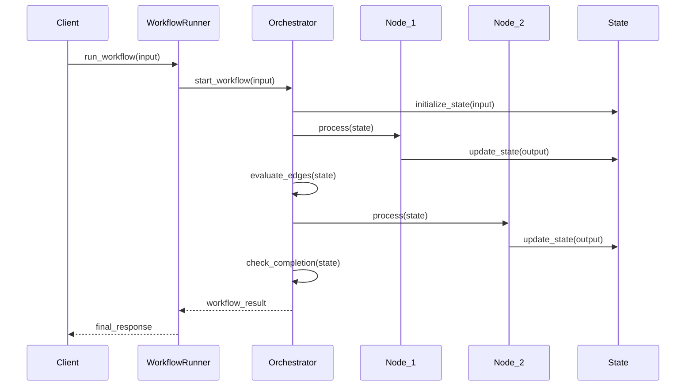
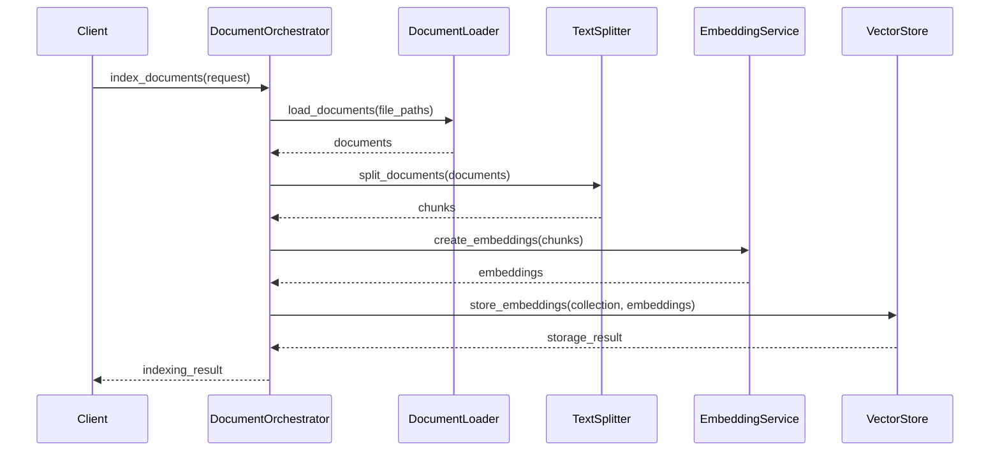
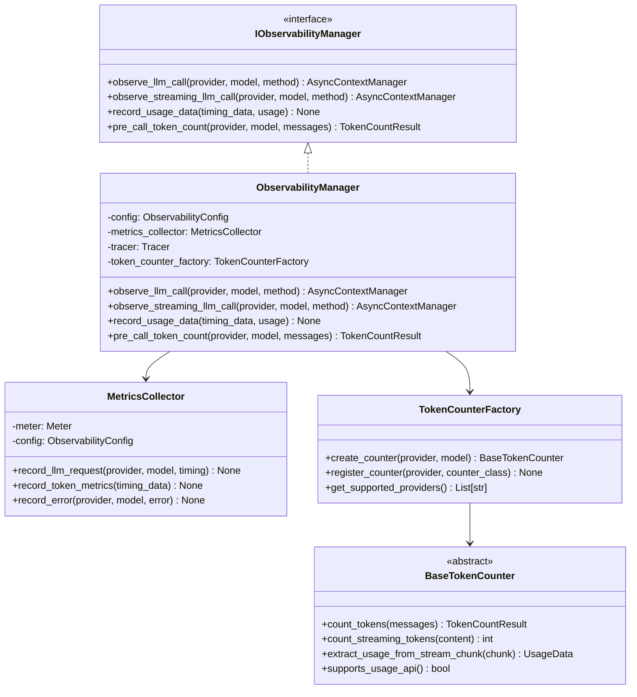

# Arshai Framework Architecture

## System Overview

The Arshai framework provides a comprehensive architecture for building AI-powered applications, with a focus on modularity, extensibility, and clean interfaces. The system follows a layered approach with clear separation of concerns between components.



## Core Architectural Principles

The Arshai framework is built on several foundational principles:

### Interface-First Design
- All components implement well-defined interfaces
- Interfaces are separated from implementations
- Multiple implementations can be provided for each interface
- Enables easy testing, mocking, and extensibility

### Clean Architecture
- Clear separation between domain, application, and infrastructure layers
- Domain logic is independent of infrastructure concerns
- Components depend on abstractions, not concrete implementations
- Business rules are isolated from external dependencies

### Factory Pattern
- Component creation is delegated to factory classes
- Factories handle dependency injection and configuration
- Enables centralized creation logic and service discovery
- Simplifies component instantiation and management

### Provider Pattern
- External services are accessed through provider interfaces
- Multiple providers can implement the same interface
- Configuration determines which provider is used
- Enables easy switching between service implementations

## Component Architecture

### Workflow System

The Workflow System serves as the orchestration layer, managing the flow of information between agents and external systems.



| Component | Responsibility |
|-----------|----------------|
| Workflow Runner | Executes workflow instances, manages state and handles errors |
| Workflow Config | Defines workflow structure, nodes, edges, and entry points |
| Workflow Orchestrator | Coordinates execution flow between nodes based on edge conditions |
| Nodes | Encapsulate agents with specific business logic adaptations |
| Edges | Define transition paths and conditions between nodes |
| Entry Points | Provide interfaces for external systems to interact with workflows |

### Agent System

The Agent System provides a minimal, flexible framework for building intelligent agents that interact with LLMs and external tools. The system prioritizes simplicity and composition over complex inheritance hierarchies.



#### Core Design Principles

**1. Minimal Interface**
- Single method contract: `process(input: IAgentInput) -> Any`
- Flexible return types to accommodate different use cases
- Input standardized through `IAgentInput` with message and optional metadata

**2. Stateless Design**
- Agents maintain no conversation state internally
- State management delegated to external memory managers
- Enables concurrent processing and horizontal scaling

**3. Composition over Inheritance**
- Agents compose LLM clients, memory managers, and tools
- No enforced tool framework - use any Python function
- Framework-agnostic approach allows integration with existing systems

**4. Function Calling Integration**
- Regular functions: Return results to LLM conversation
- Background tasks: Fire-and-forget operations for logging/monitoring
- Dynamic tool selection based on agent requirements

#### Agent Types and Patterns

| Agent Type | Use Case | Return Type | Key Features |
|------------|----------|-------------|--------------|
| **SimpleAgent** | Basic LLM interaction | `str` | Direct message processing, minimal overhead |
| **WorkingMemoryAgent** | Conversation context management | `str` ("success"/"error") | Automatic memory updates, conversation continuity |
| **SpecializedAgent** | Domain-specific tasks | `Dict[str, Any]` | Structured output, custom validation, tool integration |
| **OrchestrationAgent** | Multi-agent coordination | `Dict[str, Any]` | Agent composition, workflow management |

#### Implementation Patterns

**Basic Agent Pattern:**
```python
class MyAgent(BaseAgent):
    async def process(self, input: IAgentInput) -> str:
        llm_input = ILLMInput(
            system_prompt=self.system_prompt,
            user_message=input.message
        )
        result = await self.llm_client.chat(llm_input)
        return result.get('llm_response', '')
```

**Tool Integration Pattern:**
```python
class ToolEnabledAgent(BaseAgent):
    async def process(self, input: IAgentInput) -> Dict[str, Any]:
        def calculate(expression: str) -> float:
            return eval(expression)  # Example tool
        
        async def log_interaction(query: str) -> None:
            print(f"Background task: {query}")  # Background task
        
        llm_input = ILLMInput(
            system_prompt=self.system_prompt,
            user_message=input.message,
            regular_functions={"calculate": calculate},
            background_tasks={"log_interaction": log_interaction}
        )
        result = await self.llm_client.chat(llm_input)
        return {"response": result.get('llm_response', '')}
```

**Agent Composition Pattern:**
```python
class OrchestratorAgent(BaseAgent):
    def __init__(self, llm_client: ILLM, specialized_agents: Dict[str, IAgent], **kwargs):
        super().__init__(llm_client, system_prompt, **kwargs)
        self.agents = specialized_agents
    
    async def process(self, input: IAgentInput) -> Dict[str, Any]:
        # Use LLM function calling to coordinate specialist agents
        async def call_specialist(agent_name: str, task: str) -> str:
            if agent_name in self.agents:
                result = await self.agents[agent_name].process(
                    IAgentInput(message=task)
                )
                return str(result)
            return "Agent not found"
        
        llm_input = ILLMInput(
            system_prompt="Coordinate specialist agents to complete tasks",
            user_message=input.message,
            regular_functions={"call_specialist": call_specialist}
        )
        result = await self.llm_client.chat(llm_input)
        return {"orchestrator_response": result.get('llm_response', '')}
```

| Component | Responsibility |
|-----------|----------------|
| **IAgent Interface** | Defines minimal contract for all agents |
| **BaseAgent** | Provides common initialization and LLM client management |
| **WorkingMemoryAgent** | Specialized for conversation context management |
| **Agent Composition** | Patterns for coordinating multiple agents |
| **Tool Integration** | Python function integration with LLM function calling |

### Memory Management

The Memory System handles conversation history, context management, and data persistence across interactions.



| Component | Responsibility |
|-----------|----------------|
| Memory Manager | Coordinates memory operations and provider selection |
| Memory Providers | Implement specific storage mechanisms (in-memory, Redis, etc.) |
| Context Window Management | Handle limitations of LLM context sizes |
| Summarization | Create compressed representations of conversation history |

### Document Processing

The Document Processing system handles loading, processing, embedding, and retrieval of documents.



| Component | Responsibility |
|-----------|----------------|
| Document Loaders | Extract content from various file formats |
| Text Processors | Transform and normalize text content |
| Text Splitters | Chunk documents into appropriate segments |
| Embedding Service | Generate vector representations of text |
| Vector Store | Index and retrieve document chunks based on semantic similarity |

## Data Flow Patterns

### Basic Agent Interaction



### Workflow Execution Flow



### Document Processing Flow



## Implementation Details

### Document Processing Implementation

The document processing pipeline follows a three-stage architecture:

1. **Content Extraction** (File Loaders):
   - Extract raw content from various file formats
   - Preserve document metadata
   - Handle different document structures

2. **Content Chunking** (Text Splitters):
   - Break down large documents into manageable chunks
   - Preserve semantic coherence across chunks
   - Apply appropriate chunking strategies for different content types

3. **Content Processing** (Text Processors):
   - Clean and normalize text
   - Enrich document metadata
   - Prepare content for embedding and indexing

This modular design allows each component to be used independently or combined in processing pipelines:

```python
from src.document_loaders import PDFLoader, RecursiveTextSplitter, TextCleaner

# Create components
loader = PDFLoader()
splitter = RecursiveTextSplitter(chunk_size=1000, chunk_overlap=200)
cleaner = TextCleaner()

# Process document
raw_documents = loader.load("document.pdf")
chunked_documents = splitter.split_documents(raw_documents)
processed_documents = cleaner.process(chunked_documents)
```

### Memory Management Implementation

The memory management system provides a unified interface for different types of memory:

1. **Working Memory**:
   - Short-term conversation context
   - Current interaction state
   - Recent message history

2. **Short-Term Memory**:
   - Intermediate information storage
   - Session-specific data
   - Temporary caching

3. **Long-Term Memory**:
   - Persistent knowledge base
   - User preferences and settings
   - Learned information

Implementation example:

```python
from src.memory import MemoryManagerService
from src.memory.working_memory import InMemoryManager, RedisWorkingMemoryManager

# Configure memory manager with different providers
memory_manager = MemoryManagerService(
    config={
        "working_memory": {
            "provider": "redis",  # or "in_memory"
            "ttl": 3600,
            "redis_url": "redis://localhost:6379/0"
        }
    }
)

# Store and retrieve working memory
memory_id = memory_manager.store_working_memory(
    conversation_id="conversation123",
    memory_data="Working memory content",
    metadata={"user_id": "user123"}
)

memory = memory_manager.retrieve_working_memory(
    conversation_id="conversation123"
)
```

## Design Patterns and Architectural Styles

### Clean Architecture

Arshai follows clean architecture principles with clear separation of concerns:

- **Domain Layer**: Core business logic and interfaces (seedwork/interfaces)
- **Application Layer**: Use case implementations and orchestration (src/workflows)
- **Infrastructure Layer**: External integrations and technical implementations (src/llms, src/memory, etc.)

### Interface-First Design

All components implement interfaces defined in the seedwork module, allowing for:
- Multiple implementations of the same interface
- Easy testing through mocking
- Clear contracts between components
- Pluggable architecture for extensions

### Factory Pattern

Component creation is managed through factory classes that:
- Encapsulate initialization logic
- Handle configuration injection
- Provide consistent access patterns
- Enable component registration and discovery

### Repository Pattern

Data access is abstracted through repository interfaces that:
- Hide implementation details of storage
- Provide consistent data access methods
- Enable switching between storage backends
- Encapsulate query construction

### Strategy Pattern

Interchangeable algorithms are implemented using the strategy pattern:
- Text splitting strategies
- Embedding strategies
- Memory management strategies
- Tool selection strategies

## Resilience Strategies

### LLM Service Failures
- Automatic retries with exponential backoff
- Circuit breaker pattern to prevent cascading failures
- Fallback to alternative providers when primary is unavailable
- Graceful degradation with simpler models when needed

### Memory Storage Failures
- Local caching for temporary resilience
- Automatic recovery when storage becomes available
- Graceful degradation to in-memory storage when persistent storage fails
- Periodic state snapshots for recovery

### Tool Execution Failures
- Timeouts for external tool calls
- Error reporting to agents for handling in conversation
- Fallback options for critical tools
- Monitoring and alerting for recurring failures

### Workflow Execution Failures
- State persistence for long-running workflows
- Resumable execution from checkpoints
- Error handling nodes for managing failures
- Compensation logic for rolling back partial changes

## Security Model

### Authentication
- API key authentication for service access
- OAuth integration for user-context operations
- Role-based access control for administrative functions
- JWT token validation for session management

### Authorization
- Granular permissions for workflow and agent operations
- Resource-based access control for document collections
- Scoped access tokens with limited privileges
- User context isolation for multi-tenant deployments

### Data Protection
- Encryption of sensitive data at rest
- Secure transmission with TLS
- Configurable data retention policies
- Content filtering for prohibited information

### Audit and Compliance
- Comprehensive logging of all operations
- Audit trails for security-relevant events
- Configurable logging levels for different environments
- Compliance modes for regulated industries

## Integration Patterns

### External System Integration
- Adapter pattern for system adaptation
- Gateway pattern for unified access
- Facade pattern for simplification
- Event-driven integration for loose coupling

### API Integration
- RESTful API for synchronous operations
- WebSocket for real-time communication
- GraphQL for flexible data retrieval
- Webhooks for event notification

### Message Queue Integration
- Producer/Consumer pattern for asynchronous processing
- Command pattern for operation encapsulation
- Event sourcing for state reconstruction
- CQRS for read/write separation

### Database Integration
- Repository pattern for data access abstraction
- Unit of work pattern for transaction management
- Query object pattern for query composition
- Data mapper pattern for object-relational mapping

## Architecture Evolution

### Current State
The architecture currently emphasizes:
- Flexible workflow orchestration
- Modular component design
- Multiple integration points for LLMs and tools
- Comprehensive document processing capabilities

### Observability System

The Observability System provides comprehensive monitoring and instrumentation for production AI applications, with a focus on LLM performance tracking and OpenTelemetry integration.



| Component | Responsibility |
|-----------|----------------|
| Observability Manager | Coordinates monitoring activities and provides context managers |
| Metrics Collector | Collects and exports metrics using OpenTelemetry |
| Token Counter Factory | Creates provider-specific token counting implementations |
| Token Counters | Handle accurate token counting for different LLM providers |
| Timing Data | Tracks token-level timing metrics for streaming responses |

#### Key Metrics

The system provides four core metrics for LLM performance monitoring:

- **`llm_time_to_first_token_seconds`**: Time from request start to first token
- **`llm_time_to_last_token_seconds`**: Time from request start to last token  
- **`llm_duration_first_to_last_token_seconds`**: Duration from first token to last token
- **`llm_completion_tokens`**: Count of completion tokens generated

#### Provider Support

- **OpenAI/Azure**: Uses `tiktoken` for accurate token counting + API usage data
- **Anthropic**: Uses native token counting API with event-based streaming
- **Google Gemini**: Uses native token counting API with content-based streaming
- **OpenRouter**: Uses OpenAI-compatible API with estimation fallbacks

#### Integration Patterns

The observability system integrates seamlessly with the LLM architecture through constructor-based injection:

```python
# Constructor-based Integration (Recommended)
from arshai.llms.openai import OpenAIClient
from arshai.observability import ObservabilityManager, ObservabilityConfig

# Configure observability
obs_config = ObservabilityConfig(
    service_name="my-ai-service",
    track_token_timing=True,
    metrics_enabled=True
)
obs_manager = ObservabilityManager(obs_config)

# Pass to any LLM client constructor
client = OpenAIClient(config, observability_manager=obs_manager)

# Use client normally - observability is automatic
response = await client.chat(input_data)
```

The BaseLLMClient framework handles all observability integration automatically:
- Provider name is auto-detected from class name
- Usage data is collected from standardized responses
- Metrics are recorded for both chat and stream methods
- No additional code needed in provider implementations

### Future Directions
Planned architectural enhancements include:
- Enhanced distributed processing capabilities
- Improved scaling for high-volume scenarios
- Advanced caching strategies for performance optimization
- Extended observability backends and custom metric exporters 