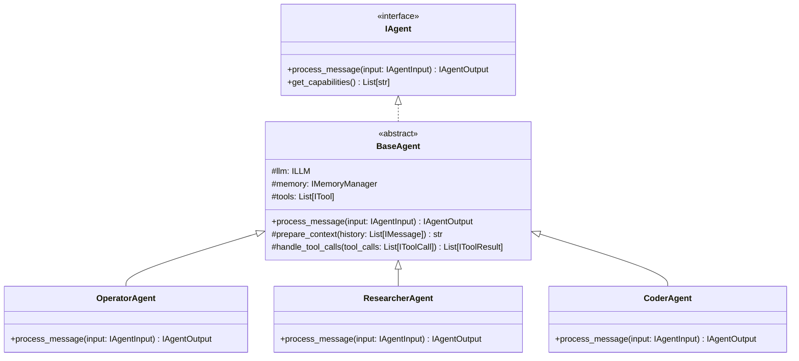
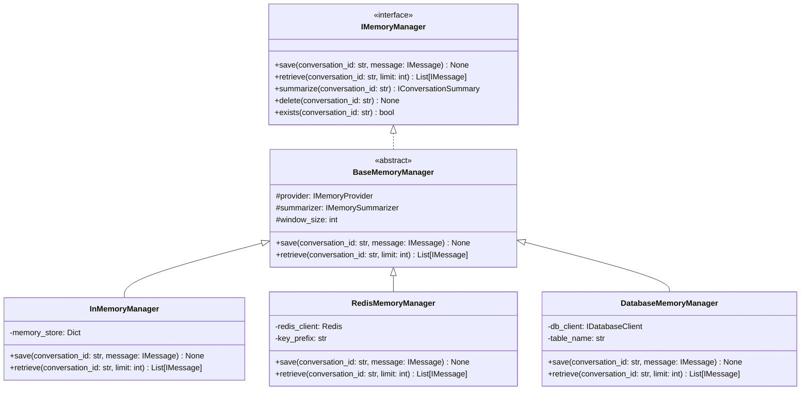
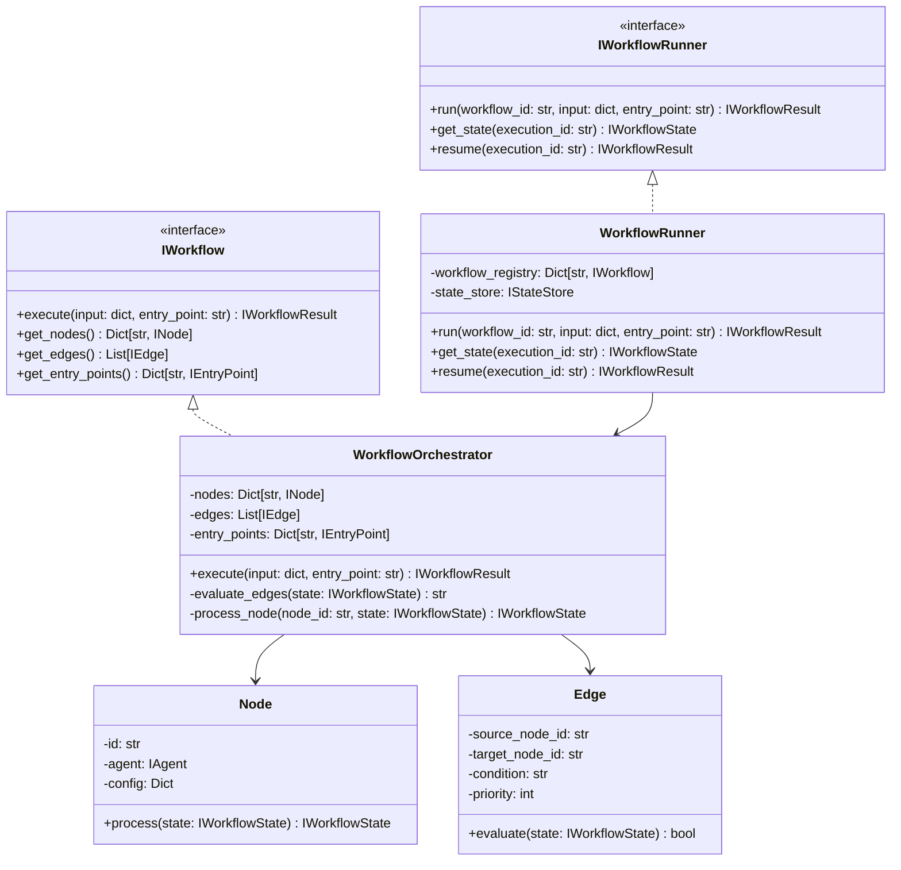
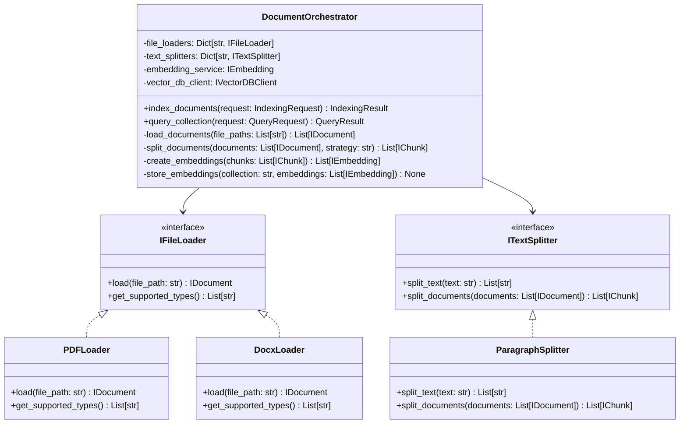

# Arshai Code Structure

## Directory Organization

```
arshai/
├── seedwork/              # Core interfaces and abstract classes
│   └── interfaces/        # Interface definitions for all components
├── src/                   # Implementation code
│   ├── agents/            # Agent implementations
│   ├── callbacks/         # Callback handlers
│   ├── clients/           # External service clients
│   ├── config/            # Configuration management
│   ├── document_loaders/  # Document loading utilities
│   ├── embeddings/        # Embedding model implementations
│   ├── factories/         # Factory classes for component creation
│   ├── llms/              # LLM provider implementations
│   ├── memory/            # Memory management implementations
│   ├── prompts/           # Prompt templates and management
│   ├── rerankers/         # Reranking implementations
│   ├── speech/            # Speech processing capabilities
│   ├── tools/             # Tool implementations
│   ├── utils/             # Utility functions and helpers
│   ├── websearch/         # Web search functionality
│   └── workflows/         # Workflow system implementations
├── tests/                 # Test suite
│   ├── unit/              # Unit tests
│   ├── integration/       # Integration tests
│   └── fixtures/          # Test fixtures and data
├── examples/              # Example implementations
├── docs/                  # Documentation
│   └── technical/         # Technical documentation
└── vector_db/             # Vector database abstractions
```

## Core Classes and Modules

### Seedwork Interfaces

The `seedwork` package contains all interface definitions that establish the contracts for the system components. These interfaces follow the Interface Segregation Principle from SOLID.

#### Key Interfaces

| Interface | Purpose | Key Methods |
|-----------|---------|------------|
| `IAgent` | Defines agent behavior | `process_message()`, `get_capabilities()` |
| `ILLM` | LLM provider contract | `generate()`, `generate_stream()` |
| `IMemoryManager` | Memory operations | `save()`, `retrieve()`, `summarize()` |
| `IWorkflow` | Workflow definitions | `execute()`, `get_nodes()`, `get_edges()` |
| `IWorkflowRunner` | Workflow execution | `run()`, `get_state()`, `resume()` |
| `ITool` | Tool capabilities | `execute()`, `get_schema()` |
| `IVectorDBClient` | Vector DB operations | `store()`, `query()`, `delete_collection()` |
| `IEmbedding` | Embedding generation | `embed()`, `embed_batch()` |
| `ITextSplitter` | Text chunking | `split_text()`, `split_documents()` |
| `ITextProcessor` | Text transformations | `process()`, `transform()` |
| `IFileLoader` | Document loading | `load()`, `get_supported_types()` |
| `ISpeech` | Speech processing | `speech_to_text()`, `text_to_speech()` |
| `IWebSearch` | Web search | `search()`, `get_results()` |

### Implementation Architecture

#### Agent System

The agent system is built around the adapter pattern, with specific agent implementations adapting the core LLM capabilities to different use cases.



#### Memory Management

The memory system uses the strategy pattern to support different storage backends while maintaining a consistent interface.



#### Workflow System

The workflow system implements a directed graph model with nodes, edges, and state management.



#### Document Processing

The document processing system handles loading, chunking, embedding, and storing documents for retrieval.



## Key Algorithms and Business Logic

### Agent Execution Flow

```python
def process_message(self, input: IAgentInput) -> IAgentOutput:
    """
    Process a user message and generate a response.
    
    Complexity: O(n) where n is the conversation history length
    """
    # Retrieve conversation context
    conversation_history = self.memory.retrieve(input.conversation_id)
    
    # Prepare context for LLM
    context = self.prepare_context(conversation_history)
    
    # Generate response using LLM
    response = self.llm.generate(
        prompt=context + input.message,
        tools=self.tools,
        streaming=input.stream
    )
    
    # Handle any tool calls from the LLM
    if response.tool_calls:
        tool_results = self.handle_tool_calls(response.tool_calls)
        # Generate final response with tool results
        response = self.llm.generate(
            prompt=context + input.message,
            tool_results=tool_results,
            streaming=input.stream
        )
    
    # Save interaction to memory
    self.memory.save(
        conversation_id=input.conversation_id,
        message=IMessage(role="user", content=input.message)
    )
    self.memory.save(
        conversation_id=input.conversation_id,
        message=IMessage(role="assistant", content=response.content)
    )
    
    return IAgentOutput(
        agent_message=response.content,
        conversation_id=input.conversation_id,
        metadata=response.metadata,
        tool_calls=response.tool_calls
    )
```

### Workflow Execution Algorithm

```python
def execute(self, input: dict, entry_point: str) -> IWorkflowResult:
    """
    Execute a workflow from a specified entry point.
    
    Complexity: O(n+e) where n is the number of nodes and e is the number of edges
    """
    # Initialize workflow state
    state = IWorkflowState(
        workflow_id=self.id,
        execution_id=str(uuid.uuid4()),
        data={"input": input},
        history=[]
    )
    
    # Get the starting node
    if entry_point not in self.entry_points:
        raise ValueError(f"Entry point '{entry_point}' not found")
    
    current_node_id = self.entry_points[entry_point].target_node_id
    state.current_node_id = current_node_id
    
    # Execute until completion or max steps
    max_steps = 100  # Safety limit
    steps = 0
    
    while current_node_id and steps < max_steps:
        # Process the current node
        state = self.process_node(current_node_id, state)
        state.history.append(current_node_id)
        
        # Evaluate edges to find next node
        next_node_id = self.evaluate_edges(state)
        if next_node_id == current_node_id:
            break  # Prevent infinite loops
            
        current_node_id = next_node_id
        state.current_node_id = current_node_id
        steps += 1
    
    return IWorkflowResult(
        execution_id=state.execution_id,
        result=state.data.get("output", {}),
        completed=current_node_id is None,
        state=state
    )
```

### Document Chunking and Embedding

```python
def split_documents(self, documents: List[IDocument], chunk_size: int = 512, chunk_overlap: int = 128) -> List[IChunk]:
    """
    Split documents into chunks with overlap.
    
    Complexity: O(n) where n is the total text length across all documents
    """
    chunks = []
    chunk_id = 0
    
    for document in documents:
        # Split text into paragraphs first for more natural boundaries
        paragraphs = re.split(r'\n\s*\n', document.content)
        
        current_chunk = ""
        chunk_index = 0
        
        for paragraph in paragraphs:
            # If adding this paragraph would exceed chunk size, save current chunk
            if len(current_chunk) + len(paragraph) > chunk_size and current_chunk:
                chunks.append(IChunk(
                    id=str(uuid.uuid4()),
                    document_id=document.id,
                    content=current_chunk,
                    chunk_index=chunk_index,
                    metadata=document.metadata
                ))
                
                # Keep overlap from previous chunk
                words = current_chunk.split()
                overlap_word_count = min(len(words), chunk_overlap // 4)  # Approximate words in overlap
                current_chunk = " ".join(words[-overlap_word_count:]) if overlap_word_count > 0 else ""
                chunk_index += 1
                
            # Add paragraph to current chunk
            if current_chunk:
                current_chunk += "\n\n" + paragraph
            else:
                current_chunk = paragraph
        
        # Add final chunk if not empty
        if current_chunk:
            chunks.append(IChunk(
                id=str(uuid.uuid4()),
                document_id=document.id,
                content=current_chunk,
                chunk_index=chunk_index,
                metadata=document.metadata
            ))
    
    return chunks
```

## Error Handling and Recovery

### Global Exception Handling

```python
class ArshaiError(Exception):
    """Base exception for all Arshai errors."""
    pass

class LLMError(ArshaiError):
    """Error when interacting with LLM providers."""
    pass

class MemoryError(ArshaiError):
    """Error when interacting with memory storage."""
    pass

class WorkflowError(ArshaiError):
    """Error in workflow execution."""
    pass

class DocumentProcessingError(ArshaiError):
    """Error in document processing."""
    pass

# Example usage
try:
    response = llm_client.generate(prompt=prompt)
except Exception as e:
    # Specific handling for different error types
    if isinstance(e, openai.APIError):
        raise LLMError(f"OpenAI API error: {str(e)}")
    elif isinstance(e, openai.RateLimitError):
        # Implement retry with exponential backoff
        retry_with_backoff(lambda: llm_client.generate(prompt=prompt))
    else:
        raise LLMError(f"Unknown LLM error: {str(e)}")
```

### Retry Logic with Exponential Backoff

```python
def retry_with_backoff(func, initial_delay=1, max_delay=60, max_retries=5):
    """
    Retry a function with exponential backoff.
    
    Args:
        func: Function to retry
        initial_delay: Initial delay in seconds
        max_delay: Maximum delay in seconds
        max_retries: Maximum number of retries
        
    Returns:
        Result of the function call
    
    Raises:
        ArshaiError: If max retries exceeded
    """
    delay = initial_delay
    retries = 0
    
    while retries < max_retries:
        try:
            return func()
        except Exception as e:
            retries += 1
            if retries >= max_retries:
                raise ArshaiError(f"Max retries exceeded: {str(e)}")
            
            # Calculate jitter to avoid thundering herd
            jitter = random.uniform(0, 0.1 * delay)
            sleep_time = min(delay + jitter, max_delay)
            
            logger.warning(f"Retry {retries}/{max_retries} after {sleep_time:.2f}s: {str(e)}")
            time.sleep(sleep_time)
            
            # Exponential backoff
            delay = min(delay * 2, max_delay)
```

### Transaction Handling in Database Operations

```python
def save_workflow_state(self, state: IWorkflowState):
    """
    Save workflow state with transaction handling.
    """
    try:
        # Begin transaction
        self.db.begin()
        
        # Update workflow state
        self.db.execute(
            """
            INSERT INTO workflow_states 
            (execution_id, workflow_id, current_node_id, data, history) 
            VALUES (%s, %s, %s, %s, %s)
            ON CONFLICT (execution_id) DO UPDATE 
            SET current_node_id = EXCLUDED.current_node_id,
                data = EXCLUDED.data,
                history = EXCLUDED.history,
                updated_at = CURRENT_TIMESTAMP
            """,
            (
                state.execution_id,
                state.workflow_id,
                state.current_node_id,
                json.dumps(state.data),
                json.dumps(state.history)
            )
        )
        
        # Commit transaction
        self.db.commit()
    except Exception as e:
        # Rollback on error
        self.db.rollback()
        raise DatabaseError(f"Failed to save workflow state: {str(e)}")
```

## Code Organization Principles

### Layered Architecture

Arshai follows a layered architecture pattern:

1. **Interface Layer**: `seedwork/interfaces/` defines all contracts
2. **Application Layer**: High-level components like `src/workflows/`
3. **Domain Layer**: Core business logic in `src/agents/`, `src/llms/`, etc.
4. **Infrastructure Layer**: External integrations like `src/clients/`

### Dependency Inversion

The codebase adheres to dependency inversion principles:

1. High-level modules don't depend on low-level modules; both depend on abstractions
2. Abstractions don't depend on details; details depend on abstractions

```python
# Example of dependency inversion
class Agent:
    def __init__(self, llm: ILLM, memory: IMemoryManager, tools: List[ITool]):
        self.llm = llm
        self.memory = memory
        self.tools = tools
    
    # Agent depends on abstractions, not concrete implementations
```

### Factory Pattern for Component Creation

Component creation is managed through factories:

```python
class LLMFactory:
    def __init__(self, settings: Settings):
        self.settings = settings
        self.providers = {
            "openai": OpenAILLM,
            "azure": AzureOpenAILLM,
            # Other providers
        }
    
    def create(self, provider: str = None, model: str = None, **kwargs) -> ILLM:
        """Create an LLM instance based on settings or overrides."""
        provider = provider or self.settings.default_llm_provider
        model = model or self.settings.default_llm_model
        
        if provider not in self.providers:
            raise ValueError(f"Unsupported LLM provider: {provider}")
        
        llm_class = self.providers[provider]
        config = self.settings.get_llm_config(provider)
        
        # Override with kwargs
        if model:
            config["model"] = model
        config.update(kwargs)
        
        return llm_class(**config)
```

## Test Coverage Approach

### Testing Strategy

1. **Unit Tests**: Focused on individual components
2. **Integration Tests**: Testing component interactions
3. **Property-Based Tests**: Verifying invariants with random inputs
4. **Mock Objects**: Isolating components from external dependencies

### Example Unit Test

```python
def test_memory_manager_save_and_retrieve():
    """Test saving and retrieving messages from memory."""
    # Arrange
    memory = InMemoryManager(window_size=10)
    conversation_id = "test_conversation"
    message1 = IMessage(role="user", content="Hello")
    message2 = IMessage(role="assistant", content="Hi there")
    
    # Act
    memory.save(conversation_id, message1)
    memory.save(conversation_id, message2)
    retrieved = memory.retrieve(conversation_id)
    
    # Assert
    assert len(retrieved) == 2
    assert retrieved[0].role == "user"
    assert retrieved[0].content == "Hello"
    assert retrieved[1].role == "assistant"
    assert retrieved[1].content == "Hi there"
```

### Example Integration Test

```python
@pytest.mark.asyncio
async def test_workflow_with_multiple_nodes():
    """Test a workflow with multiple nodes interacting."""
    # Arrange
    settings = Settings(config_path="tests/fixtures/test_config.yaml")
    llm_factory = LLMFactory(settings)
    memory_factory = MemoryFactory(settings)
    agent_factory = AgentFactory(settings, llm_factory, memory_factory)
    
    # Create workflow components
    node1 = Node(id="node1", agent=agent_factory.create("operator"))
    node2 = Node(id="node2", agent=agent_factory.create("researcher"))
    
    edge = Edge(source_node_id="node1", target_node_id="node2", condition="data.needs_research == true")
    
    entry_point = EntryPoint(name="main", target_node_id="node1")
    
    workflow = WorkflowOrchestrator(
        nodes={"node1": node1, "node2": node2},
        edges=[edge],
        entry_points={"main": entry_point}
    )
    
    # Act
    result = await workflow.execute(
        input={"message": "Find information about climate change"},
        entry_point="main"
    )
    
    # Assert
    assert result.completed
    assert "node1" in result.state.history
    assert "node2" in result.state.history
    assert "climate change" in result.result.get("message", "")
```

## Extension Points and Customization

### Plugin Architecture

The system supports plugins through a registration mechanism:

```python
class PluginManager:
    def __init__(self):
        self.plugins = {}
    
    def register(self, name: str, plugin_class: Type):
        """Register a plugin."""
        if name in self.plugins:
            raise ValueError(f"Plugin {name} already registered")
        self.plugins[name] = plugin_class
    
    def get_plugin(self, name: str) -> Any:
        """Get a plugin instance."""
        if name not in self.plugins:
            raise ValueError(f"Plugin {name} not found")
        return self.plugins[name]()

# Usage
plugin_manager = PluginManager()
plugin_manager.register("custom_tool", CustomTool)
```

### Custom Tool Implementation

```python
from seedwork.interfaces.itool import ITool, IToolCall, IToolResult

class CustomTool(ITool):
    def __init__(self, api_key: str = None):
        self.api_key = api_key or os.environ.get("CUSTOM_TOOL_API_KEY")
        self.client = CustomAPIClient(api_key=self.api_key)
    
    def get_name(self) -> str:
        return "custom_tool"
    
    def get_description(self) -> str:
        return "A custom tool that provides specialized functionality"
    
    def get_parameters(self) -> Dict:
        return {
            "type": "object",
            "properties": {
                "query": {
                    "type": "string",
                    "description": "The query to process"
                },
                "options": {
                    "type": "object",
                    "description": "Additional options"
                }
            },
            "required": ["query"]
        }
    
    def execute(self, tool_call: IToolCall) -> IToolResult:
        query = tool_call.parameters.get("query")
        options = tool_call.parameters.get("options", {})
        
        try:
            result = self.client.process_query(query, **options)
            return IToolResult(
                tool_name=self.get_name(),
                tool_call_id=tool_call.id,
                content=result,
                error=None
            )
        except Exception as e:
            return IToolResult(
                tool_name=self.get_name(),
                tool_call_id=tool_call.id,
                content=None,
                error=str(e)
            )
```

## Performance Optimization

### LRU Caching for Expensive Operations

```python
from functools import lru_cache

class EmbeddingService:
    def __init__(self, model: str, dimensions: int):
        self.model = model
        self.dimensions = dimensions
        self.client = OpenAIClient()
    
    @lru_cache(maxsize=1000)
    def get_embedding(self, text: str) -> List[float]:
        """
        Get embedding for text with caching.
        
        This caches results for identical text to reduce API calls.
        """
        return self.client.create_embedding(text, model=self.model)
    
    def get_embeddings_batch(self, texts: List[str]) -> List[List[float]]:
        """
        Get embeddings for multiple texts, optimizing for batch operations.
        """
        # Check cache first for each text
        results = []
        uncached_texts = []
        uncached_indices = []
        
        for i, text in enumerate(texts):
            cached_result = self.get_embedding.__wrapped__.__self__.cache_info.cache.get(self._cache_key(text))
            if cached_result is not None:
                results.append(cached_result)
            else:
                uncached_texts.append(text)
                uncached_indices.append(i)
        
        # Only call API for uncached texts
        if uncached_texts:
            batch_results = self.client.create_embeddings_batch(uncached_texts, model=self.model)
            
            # Update cache and results
            for i, embedding in zip(uncached_indices, batch_results):
                self.get_embedding.__wrapped__.__self__.cache_info.cache[self._cache_key(texts[i])] = embedding
                results.append(embedding)
        
        return results
    
    def _cache_key(self, text: str) -> str:
        """Create a cache key for the text and model."""
        return f"{self.model}:{text}"
```

### Connection Pooling

```python
class DatabaseClient:
    def __init__(self, url: str, max_connections: int = 10):
        self.url = url
        self.pool = create_connection_pool(
            url=url,
            min_size=2,
            max_size=max_connections,
            max_idle_time=300,
            max_lifetime=3600
        )
    
    async def execute(self, query: str, params: Tuple = None):
        """Execute query with connection pooling."""
        async with self.pool.acquire() as connection:
            async with connection.transaction():
                return await connection.execute(query, params)
    
    async def fetch(self, query: str, params: Tuple = None):
        """Fetch results with connection pooling."""
        async with self.pool.acquire() as connection:
            return await connection.fetch(query, params)
```

### Parallel Processing

```python
import asyncio
from concurrent.futures import ThreadPoolExecutor

class DocumentProcessor:
    def __init__(self, max_workers: int = 4):
        self.executor = ThreadPoolExecutor(max_workers=max_workers)
    
    async def process_documents(self, file_paths: List[str]) -> List[IDocument]:
        """
        Process multiple documents in parallel.
        """
        loop = asyncio.get_event_loop()
        tasks = []
        
        for file_path in file_paths:
            task = loop.run_in_executor(
                self.executor,
                self._process_single_document,
                file_path
            )
            tasks.append(task)
        
        return await asyncio.gather(*tasks)
    
    def _process_single_document(self, file_path: str) -> IDocument:
        """Process a single document (CPU-bound operation)."""
        loader = self._get_loader_for_file(file_path)
        return loader.load(file_path)
    
    def _get_loader_for_file(self, file_path: str) -> IFileLoader:
        """Get appropriate loader based on file extension."""
        extension = file_path.split('.')[-1].lower()
        if extension == 'pdf':
            return PDFLoader()
        elif extension in ['docx', 'doc']:
            return DocxLoader()
        elif extension in ['txt', 'md']:
            return TextLoader()
        else:
            raise ValueError(f"Unsupported file type: {extension}")
```

## Troubleshooting and Debugging

### Comprehensive Logging

```python
import logging
from pythonjsonlogger import jsonlogger

class ArshaiLogger:
    def __init__(self, name: str, level: str = "INFO"):
        self.logger = logging.getLogger(name)
        self.logger.setLevel(getattr(logging, level))
        
        # JSON formatter for structured logging
        formatter = jsonlogger.JsonFormatter(
            fmt='%(asctime)s %(name)s %(levelname)s %(message)s %(trace_id)s %(user_id)s'
        )
        
        # Console handler
        console_handler = logging.StreamHandler()
        console_handler.setFormatter(formatter)
        self.logger.addHandler(console_handler)
        
        # File handler
        file_handler = logging.FileHandler('logs/arshai.log')
        file_handler.setFormatter(formatter)
        self.logger.addHandler(file_handler)
        
        # Default context
        self.context = {}
    
    def set_context(self, **kwargs):
        """Set context for all log messages."""
        self.context.update(kwargs)
    
    def _log(self, level, message, **kwargs):
        """Log with context."""
        extra = self.context.copy()
        extra.update(kwargs)
        getattr(self.logger, level)(message, extra=extra)
    
    def debug(self, message, **kwargs):
        self._log('debug', message, **kwargs)
    
    def info(self, message, **kwargs):
        self._log('info', message, **kwargs)
    
    def warning(self, message, **kwargs):
        self._log('warning', message, **kwargs)
    
    def error(self, message, **kwargs):
        self._log('error', message, **kwargs)
    
    def critical(self, message, **kwargs):
        self._log('critical', message, **kwargs)
```

### Debugging Tools

```python
def debug_llm_interaction(prompt: str, response: str, tools: List[Dict] = None):
    """
    Debug LLM interaction by logging input and output.
    
    Useful for diagnosing issues with LLM responses or tool usage.
    """
    logger = ArshaiLogger("llm_debug")
    
    # Format tool specifications
    tool_str = "None"
    if tools:
        tool_str = "\n".join([f"- {tool['name']}: {tool['description']}" for tool in tools])
    
    # Log full interaction
    logger.debug(
        "LLM Interaction",
        prompt_length=len(prompt),
        response_length=len(response),
        tools_count=len(tools) if tools else 0,
        prompt_sample=prompt[:100] + "..." if len(prompt) > 100 else prompt,
        response_sample=response[:100] + "..." if len(response) > 100 else response
    )
    
    # Write detailed debug file
    with open(f"logs/llm_debug_{int(time.time())}.md", "w") as f:
        f.write("# LLM Interaction Debug\n\n")
        f.write(f"## Timestamp: {datetime.datetime.now().isoformat()}\n\n")
        f.write("## Prompt\n\n```\n")
        f.write(prompt)
        f.write("\n```\n\n")
        f.write("## Response\n\n```\n")
        f.write(response)
        f.write("\n```\n\n")
        f.write("## Tools\n\n")
        f.write(tool_str)
        f.write("\n\n")
``` 