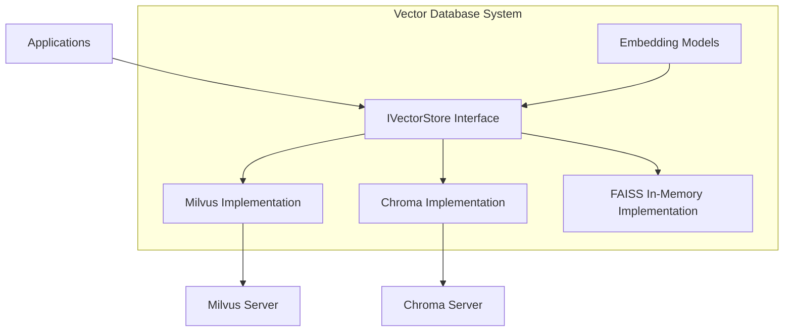
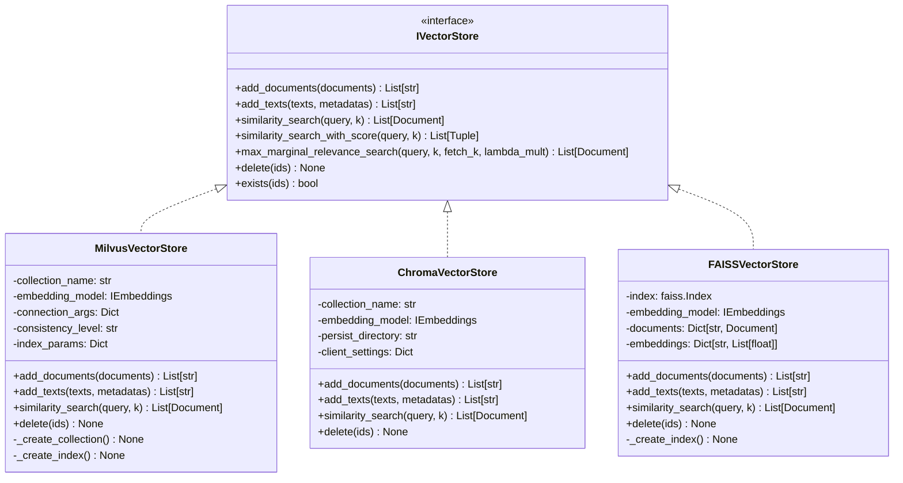
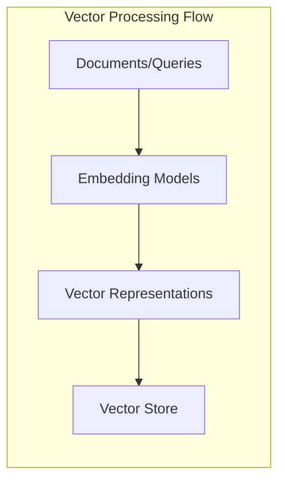

# Vector Database System

The Vector Database system in Arshai provides a robust infrastructure for storing, indexing, and retrieving vector embeddings of document chunks and other content. This system enables semantic search capabilities and forms a critical part of retrieval-augmented generation (RAG) applications.

## Architecture Overview

The Vector Database system follows a clean interface pattern that abstracts the underlying vector database implementations:



## Core Components

### IVectorStore Interface

The `IVectorStore` interface defines the standard contract for all vector database implementations:



### Vector Store Implementations

#### MilvusVectorStore

The `MilvusVectorStore` implementation provides integration with the Milvus vector database:

- High-performance vector similarity search
- Scalable to billions of vectors
- Support for hybrid search (vector + scalar filtering)
- Auto-scaling and distributed deployment support

#### ChromaVectorStore

The `ChromaVectorStore` implementation provides integration with the Chroma vector database:

- Open-source vector database
- Supports local and server modes
- Built-in metadata filtering
- Easy deployment and management

#### FAISSVectorStore

The `FAISSVectorStore` implementation provides an in-memory vector database using FAISS:

- High-performance in-memory vector search
- No external database dependencies
- Efficient for moderate-sized vector collections
- Suitable for development and testing

### Embedding Model Integration

Vector stores are tightly integrated with embedding models that convert text to vector representations:



## Implementation Details

### Vector Store Interface

```python
class IVectorStore(Protocol):
    """Interface for vector stores."""
    
    def add_documents(
        self, documents: List[Document], ids: Optional[List[str]] = None
    ) -> List[str]:
        """
        Add documents to the vector store.
        
        Args:
            documents: List of documents to add
            ids: Optional list of IDs for the documents
            
        Returns:
            List[str]: IDs of the added documents
        """
        ...
    
    def add_texts(
        self, 
        texts: List[str], 
        metadatas: Optional[List[Dict[str, Any]]] = None,
        ids: Optional[List[str]] = None
    ) -> List[str]:
        """
        Add texts to the vector store.
        
        Args:
            texts: List of texts to add
            metadatas: Optional list of metadata dictionaries
            ids: Optional list of IDs for the texts
            
        Returns:
            List[str]: IDs of the added texts
        """
        ...
    
    def similarity_search(
        self, query: str, k: int = 4, filter: Optional[Dict[str, Any]] = None
    ) -> List[Document]:
        """
        Perform similarity search.
        
        Args:
            query: Query text
            k: Number of results to return
            filter: Optional metadata filter
            
        Returns:
            List[Document]: Similar documents
        """
        ...
    
    def similarity_search_with_score(
        self, query: str, k: int = 4, filter: Optional[Dict[str, Any]] = None
    ) -> List[Tuple[Document, float]]:
        """
        Perform similarity search with relevance scores.
        
        Args:
            query: Query text
            k: Number of results to return
            filter: Optional metadata filter
            
        Returns:
            List[Tuple[Document, float]]: Documents with similarity scores
        """
        ...
    
    def max_marginal_relevance_search(
        self, 
        query: str, 
        k: int = 4, 
        fetch_k: int = 20,
        lambda_mult: float = 0.5, 
        filter: Optional[Dict[str, Any]] = None
    ) -> List[Document]:
        """
        Perform maximum marginal relevance search.
        
        This helps diversity in retrieved documents.
        
        Args:
            query: Query text
            k: Number of results to return
            fetch_k: Number of results to fetch before reranking
            lambda_mult: Controls diversity (0 = max diversity, 1 = max relevance)
            filter: Optional metadata filter
            
        Returns:
            List[Document]: Diverse and relevant documents
        """
        ...
    
    def delete(self, ids: List[str]) -> None:
        """
        Delete documents from the vector store.
        
        Args:
            ids: IDs of documents to delete
        """
        ...
```

### Milvus Vector Store Implementation

```python
class MilvusVectorStore(IVectorStore):
    """Milvus vector store implementation."""
    
    def __init__(
        self,
        collection_name: str,
        embedding_model: IEmbeddings,
        connection_args: Optional[Dict[str, Any]] = None,
        consistency_level: str = "Session",
        index_params: Optional[Dict[str, Any]] = None
    ):
        """
        Initialize Milvus vector store.
        
        Args:
            collection_name: Name of the Milvus collection
            embedding_model: Embedding model to use
            connection_args: Connection arguments for Milvus
            consistency_level: Consistency level for queries
            index_params: Parameters for vector index creation
        """
        self.collection_name = collection_name
        self.embedding_model = embedding_model
        self.connection_args = connection_args or {
            "host": "localhost",
            "port": "19530"
        }
        self.consistency_level = consistency_level
        self.index_params = index_params or {
            "index_type": "HNSW",
            "metric_type": "L2",
            "params": {"M": 8, "efConstruction": 64}
        }
        
        # Initialize connection and collection
        self._create_connection()
        self._create_collection()
        self._create_index()
    
    def _create_connection(self) -> None:
        """Create connection to Milvus server."""
        # Implementation details...
    
    def _create_collection(self) -> None:
        """Create collection if it doesn't exist."""
        # Implementation details...
    
    def _create_index(self) -> None:
        """Create vector index on the collection."""
        # Implementation details...
    
    def add_documents(
        self, documents: List[Document], ids: Optional[List[str]] = None
    ) -> List[str]:
        """Add documents to Milvus."""
        texts = [doc.page_content for doc in documents]
        metadatas = [doc.metadata for doc in documents]
        
        return self.add_texts(texts, metadatas, ids)
    
    def add_texts(
        self, 
        texts: List[str], 
        metadatas: Optional[List[Dict[str, Any]]] = None,
        ids: Optional[List[str]] = None
    ) -> List[str]:
        """Add texts to Milvus."""
        # Generate embeddings
        embeddings = self.embedding_model.embed_documents(texts)
        
        # Generate IDs if not provided
        if ids is None:
            ids = [str(uuid.uuid4()) for _ in texts]
        
        # Prepare data for insertion
        entities = {
            "id": ids,
            "text": texts,
            "embedding": embeddings
        }
        
        # Add metadata fields if provided
        if metadatas:
            for key in metadatas[0].keys():
                entities[key] = [meta.get(key) for meta in metadatas]
        
        # Insert data into Milvus
        # Implementation details...
        
        return ids
    
    def similarity_search(
        self, query: str, k: int = 4, filter: Optional[Dict[str, Any]] = None
    ) -> List[Document]:
        """Perform similarity search in Milvus."""
        # Generate query embedding
        query_embedding = self.embedding_model.embed_query(query)
        
        # Prepare search parameters
        search_params = {
            "metric_type": self.index_params["metric_type"],
            "params": {"ef": 64}
        }
        
        # Prepare output fields
        output_fields = ["text"] + self._get_metadata_fields()
        
        # Prepare filter expression if provided
        expr = None
        if filter:
            # Convert filter dict to Milvus expression
            # Implementation details...
        
        # Execute search
        search_result = self.collection.search(
            data=[query_embedding],
            anns_field="embedding",
            param=search_params,
            limit=k,
            expr=expr,
            output_fields=output_fields,
            consistency_level=self.consistency_level
        )
        
        # Convert results to Document objects
        documents = []
        for hits in search_result:
            for hit in hits:
                # Extract text and metadata
                text = hit.entity.get("text")
                
                # Extract metadata from entity
                metadata = {}
                for field in self._get_metadata_fields():
                    if field in hit.entity:
                        metadata[field] = hit.entity.get(field)
                
                # Add score to metadata
                metadata["score"] = hit.score
                
                # Create Document object
                doc = Document(page_content=text, metadata=metadata)
                documents.append(doc)
        
        return documents
    
    def delete(self, ids: List[str]) -> None:
        """Delete documents from Milvus."""
        expr = f"id in {ids}"
        self.collection.delete(expr)
    
    def _get_metadata_fields(self) -> List[str]:
        """Get metadata fields from collection schema."""
        # Implementation details...
```

## Integration with Embedding Models

The Vector Database system integrates with embedding models through the `IEmbeddings` interface:

```python
class IEmbeddings(Protocol):
    """Interface for embedding models."""
    
    def embed_documents(self, texts: List[str]) -> List[List[float]]:
        """
        Generate embeddings for documents.
        
        Args:
            texts: List of texts to embed
            
        Returns:
            List[List[float]]: Document embeddings
        """
        ...
    
    def embed_query(self, text: str) -> List[float]:
        """
        Generate embedding for a query.
        
        Args:
            text: Query text
            
        Returns:
            List[float]: Query embedding
        """
        ...
```

### Key Embedding Model Implementations

1. **OpenAIEmbeddings**:
   - Integrates with OpenAI embedding models (e.g., text-embedding-ada-002)
   - High-quality embeddings for semantic search
   - Supports batched embedding generation

2. **MGTEEmbeddings**:
   - Integrates with multi-lingual embedding models
   - Supports languages beyond English
   - Optimized for cross-lingual retrieval

3. **HuggingFaceEmbeddings**:
   - Integrates with local embedding models
   - Supports a wide range of open-source models
   - Can run entirely locally without API calls

## Collection Configuration

Configuring vector collections properly is essential for optimal performance:

### Milvus Collection Configuration

```python
from pymilvus import Collection, CollectionSchema, FieldSchema, DataType

# Define fields for the collection
fields = [
    FieldSchema(name="id", dtype=DataType.VARCHAR, description="Document ID", max_length=36, is_primary=True),
    FieldSchema(name="text", dtype=DataType.VARCHAR, description="Document text", max_length=65535),
    FieldSchema(name="embedding", dtype=DataType.FLOAT_VECTOR, description="Document embedding", dim=1536),
    FieldSchema(name="source", dtype=DataType.VARCHAR, description="Document source", max_length=255),
    FieldSchema(name="document_id", dtype=DataType.VARCHAR, description="Original document ID", max_length=36),
    FieldSchema(name="chunk_id", dtype=DataType.INT64, description="Chunk index")
]

# Create collection schema
schema = CollectionSchema(fields=fields, description="Document embeddings collection")

# Create collection
collection = Collection(name="documents", schema=schema)

# Create index on embedding field
index_params = {
    "index_type": "HNSW",
    "metric_type": "L2",
    "params": {"M": 8, "efConstruction": 64}
}
collection.create_index(field_name="embedding", index_params=index_params)
```

### Search Optimization

Optimizing search parameters for different use cases:

```python
# Standard search (balance between performance and accuracy)
search_params = {
    "metric_type": "L2",
    "params": {"ef": 64}
}

# High-accuracy search (slower but more accurate)
high_accuracy_params = {
    "metric_type": "L2",
    "params": {"ef": 256}
}

# High-performance search (faster but less accurate)
high_performance_params = {
    "metric_type": "L2",
    "params": {"ef": 16}
}
```

## Usage Examples

### Basic Vector Storage and Retrieval

```python
from src.vector_db import MilvusVectorStore
from src.embeddings import OpenAIEmbeddings
from seedwork.interfaces.idocument import Document

# Initialize embedding model
embedding_model = OpenAIEmbeddings(model="text-embedding-ada-002")

# Initialize vector store
vector_store = MilvusVectorStore(
    collection_name="documents",
    embedding_model=embedding_model,
    connection_args={"host": "localhost", "port": "19530"}
)

# Create documents
documents = [
    Document(
        page_content="Machine learning is a subset of artificial intelligence that involves training algorithms to make predictions or decisions based on data.",
        metadata={"source": "ml_guide.pdf", "page": 1}
    ),
    Document(
        page_content="Deep learning is a subset of machine learning based on artificial neural networks, which are inspired by the structure of the human brain.",
        metadata={"source": "ml_guide.pdf", "page": 2}
    ),
    Document(
        page_content="Natural language processing (NLP) is a field at the intersection of computer science, artificial intelligence, and linguistics.",
        metadata={"source": "nlp_guide.pdf", "page": 1}
    )
]

# Add documents to the vector store
doc_ids = vector_store.add_documents(documents)
print(f"Added {len(doc_ids)} documents to the vector store")

# Perform similarity search
query = "What is deep learning?"
results = vector_store.similarity_search(query, k=2)

for doc in results:
    print(f"Content: {doc.page_content}")
    print(f"Metadata: {doc.metadata}")
    print("-" * 50)
```

### Hybrid Search with Metadata Filtering

```python
from src.vector_db import MilvusVectorStore
from src.embeddings import OpenAIEmbeddings

# Initialize components
embedding_model = OpenAIEmbeddings()
vector_store = MilvusVectorStore(
    collection_name="technical_documents",
    embedding_model=embedding_model
)

# Search with metadata filtering
results = vector_store.similarity_search(
    query="How to implement backpropagation?",
    k=5,
    filter={"category": "deep_learning", "difficulty": "intermediate"}
)

for doc in results:
    print(f"Content: {doc.page_content}")
    print(f"Category: {doc.metadata.get('category')}")
    print(f"Difficulty: {doc.metadata.get('difficulty')}")
    print("-" * 50)
```

### Maximum Marginal Relevance Search

```python
from src.vector_db import MilvusVectorStore
from src.embeddings import OpenAIEmbeddings

# Initialize components
embedding_model = OpenAIEmbeddings()
vector_store = MilvusVectorStore(
    collection_name="articles",
    embedding_model=embedding_model
)

# Perform diverse search with maximum marginal relevance
results = vector_store.max_marginal_relevance_search(
    query="Climate change solutions",
    k=5,              # Return 5 results
    fetch_k=20,       # Fetch top 20 before reranking
    lambda_mult=0.7   # Balance between relevance and diversity
)

print("Diverse results for 'Climate change solutions':")
for doc in results:
    print(f"- {doc.page_content[:100]}...")
```

### Integration with Document Processing Pipeline

```python
from src.document_loaders import PDFLoader, RecursiveTextSplitter, TextCleaner
from src.vector_db import MilvusVectorStore
from src.embeddings import OpenAIEmbeddings

# Initialize document processing components
loader = PDFLoader()
splitter = RecursiveTextSplitter(chunk_size=1000, chunk_overlap=200)
cleaner = TextCleaner()

# Initialize vector store components
embedding_model = OpenAIEmbeddings()
vector_store = MilvusVectorStore(
    collection_name="research_papers",
    embedding_model=embedding_model
)

# Process and index documents
def index_document(file_path):
    # Extract content
    documents = loader.load(file_path)
    
    # Split into chunks
    chunks = splitter.split_documents(documents)
    
    # Clean text
    processed_chunks = cleaner.process(chunks)
    
    # Index in vector store
    doc_ids = vector_store.add_documents(processed_chunks)
    
    return len(doc_ids)

# Index multiple documents
files = ["paper1.pdf", "paper2.pdf", "paper3.pdf"]
for file in files:
    num_chunks = index_document(file)
    print(f"Indexed {num_chunks} chunks from {file}")

# Perform search
query = "Recent advances in quantum computing"
results = vector_store.similarity_search(query, k=3)

for doc in results:
    print(f"Source: {doc.metadata.get('source')}")
    print(f"Page: {doc.metadata.get('page_number')}")
    print(f"Content: {doc.page_content[:200]}...")
    print("-" * 50)
```

## Advanced Features

### Collection Management

```python
from src.vector_db import MilvusVectorStore
from src.embeddings import OpenAIEmbeddings

# Initialize components
embedding_model = OpenAIEmbeddings()
vector_store = MilvusVectorStore(
    collection_name="articles",
    embedding_model=embedding_model
)

# Get collection statistics
stats = vector_store.get_collection_stats()
print(f"Collection size: {stats['row_count']} documents")
print(f"Storage size: {stats['data_size']} bytes")
print(f"Index type: {stats['index_info'][0]['index_type']}")

# Flush data to disk (for durability)
vector_store.flush()

# Load collection into memory (for performance)
vector_store.load()

# Release collection from memory (to free resources)
vector_store.release()
```

### Vector Compression

```python
from src.vector_db import MilvusVectorStore
from src.embeddings import OpenAIEmbeddings

# Initialize with vector compression for improved storage efficiency
vector_store = MilvusVectorStore(
    collection_name="compressed_vectors",
    embedding_model=embedding_model,
    index_params={
        "index_type": "DISKANN",
        "metric_type": "L2",
        "params": {
            "search_list": 100
        }
    }
)
```

## Best Practices

### Vector Database Selection

1. **Production Deployments**:
   - Use Milvus for high-scale production deployments
   - Configure proper replication and sharding
   - Implement proper backup strategies

2. **Development and Testing**:
   - Use FAISS for local development and testing
   - Use Chroma for easy setup and local persistence
   - Consider containerized Milvus for staging environments

3. **Special Requirements**:
   - Use Milvus for hybrid search capabilities
   - Use FAISS for high-dimensional vectors
   - Use specialized databases for specific domains

### Performance Optimization

1. **Index Configuration**:
   - Choose appropriate index type (HNSW, IVF, etc.)
   - Configure index parameters based on dataset size
   - Balance between search speed and accuracy

2. **Resource Allocation**:
   - Allocate sufficient memory for index
   - Configure CPU and GPU resources appropriately
   - Monitor memory usage and scale as needed

3. **Batch Operations**:
   - Use batch insertion for better throughput
   - Use batch search for multiple queries
   - Implement proper error handling for batch operations

### Maintenance and Monitoring

1. **Health Checks**:
   - Implement regular health checks for vector databases
   - Monitor query latency and throughput
   - Set up alerts for abnormal behavior

2. **Data Management**:
   - Implement retention policies for obsolete vectors
   - Archive unused collections
   - Regularly update indexes for optimal performance

3. **Backup and Recovery**:
   - Implement regular backup procedures
   - Test recovery processes
   - Document disaster recovery procedures

## Troubleshooting

### Common Issues

1. **Connection Problems**:
   - Check network connectivity to vector database
   - Verify credentials and connection parameters
   - Check for firewall or security group settings

2. **Performance Degradation**:
   - Check index configuration
   - Monitor memory usage
   - Consider increasing hardware resources
   - Verify query complexity and optimization

3. **Data Inconsistency**:
   - Check for failed indexing operations
   - Verify data integrity
   - Consider rebuilding the index

## Future Enhancements

1. **Multi-modal Vectors**:
   - Support for image, audio, and video embeddings
   - Cross-modal search capabilities
   - Unified retrieval across modalities

2. **Adaptive Index Management**:
   - Automatic index parameter optimization
   - Dynamic index updates based on query patterns
   - Self-healing index capabilities

3. **Advanced Search Capabilities**:
   - Semantic filtering and ranking
   - Query planning and optimization
   - Context-aware retrieval mechanisms 