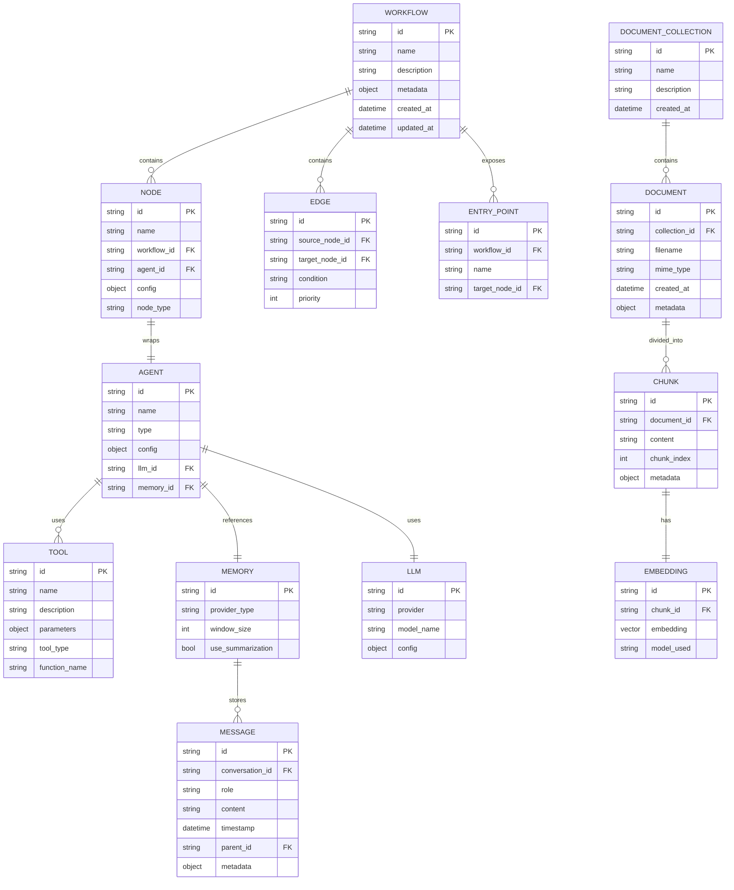
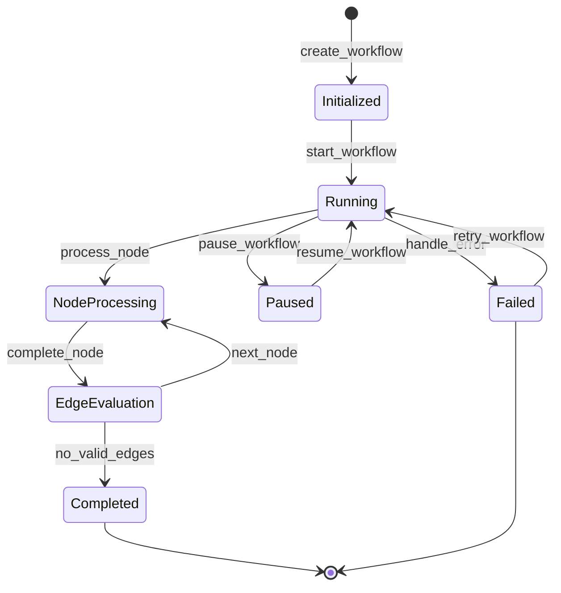
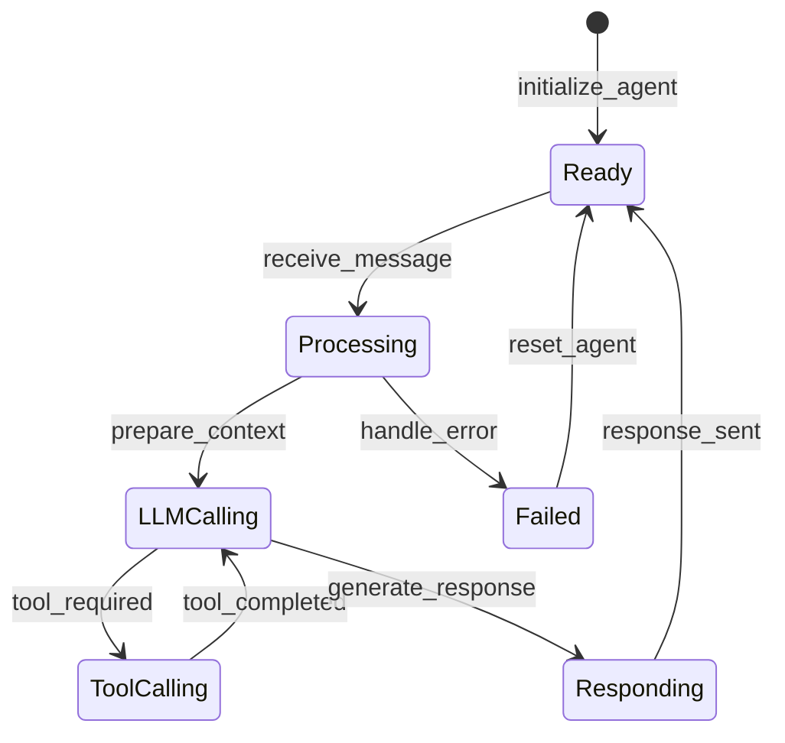
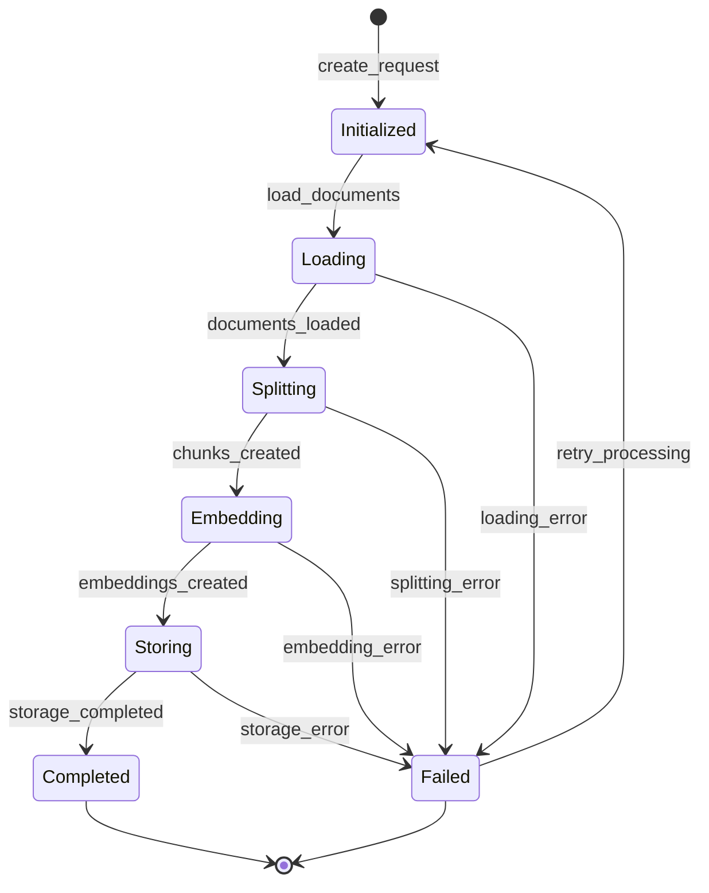

# Arshai Data Model

## Entity Relationship Diagram



## Database Schema

### Workflow System Tables

#### workflows
| Column | Type | Constraints | Description |
|--------|------|-------------|-------------|
| id | UUID | PRIMARY KEY | Unique identifier for the workflow |
| name | VARCHAR(255) | NOT NULL | Name of the workflow |
| description | TEXT | | Description of the workflow's purpose |
| metadata | JSONB | | Additional workflow metadata |
| created_at | TIMESTAMP | NOT NULL | Creation timestamp |
| updated_at | TIMESTAMP | NOT NULL | Last update timestamp |

#### nodes
| Column | Type | Constraints | Description |
|--------|------|-------------|-------------|
| id | UUID | PRIMARY KEY | Unique identifier for the node |
| name | VARCHAR(255) | NOT NULL | Name of the node |
| workflow_id | UUID | FOREIGN KEY | Reference to parent workflow |
| agent_id | UUID | FOREIGN KEY | Reference to agent implementation |
| config | JSONB | NOT NULL | Node-specific configuration |
| node_type | VARCHAR(50) | NOT NULL | Type of node (e.g., processing, decision) |

#### edges
| Column | Type | Constraints | Description |
|--------|------|-------------|-------------|
| id | UUID | PRIMARY KEY | Unique identifier for the edge |
| source_node_id | UUID | FOREIGN KEY | Reference to source node |
| target_node_id | UUID | FOREIGN KEY | Reference to target node |
| condition | TEXT | | Conditional expression for edge traversal |
| priority | INTEGER | NOT NULL, DEFAULT 0 | Execution priority for multiple valid edges |

#### entry_points
| Column | Type | Constraints | Description |
|--------|------|-------------|-------------|
| id | UUID | PRIMARY KEY | Unique identifier for the entry point |
| workflow_id | UUID | FOREIGN KEY | Reference to parent workflow |
| name | VARCHAR(255) | NOT NULL | Name of the entry point |
| target_node_id | UUID | FOREIGN KEY | First node to execute |

### Agent System Tables

#### agents
| Column | Type | Constraints | Description |
|--------|------|-------------|-------------|
| id | UUID | PRIMARY KEY | Unique identifier for the agent |
| name | VARCHAR(255) | NOT NULL | Name of the agent |
| type | VARCHAR(50) | NOT NULL | Type of agent (e.g., operator, assistant) |
| config | JSONB | NOT NULL | Agent-specific configuration |
| llm_id | UUID | FOREIGN KEY | Reference to LLM configuration |
| memory_id | UUID | FOREIGN KEY | Reference to memory configuration |

#### tools
| Column | Type | Constraints | Description |
|--------|------|-------------|-------------|
| id | UUID | PRIMARY KEY | Unique identifier for the tool |
| name | VARCHAR(255) | NOT NULL | Tool name |
| description | TEXT | NOT NULL | Tool description for LLM context |
| parameters | JSONB | NOT NULL | Tool parameter schema |
| tool_type | VARCHAR(50) | NOT NULL | Type of tool |
| function_name | VARCHAR(255) | NOT NULL | Function to execute |

#### agent_tools
| Column | Type | Constraints | Description |
|--------|------|-------------|-------------|
| agent_id | UUID | FOREIGN KEY | Reference to agent |
| tool_id | UUID | FOREIGN KEY | Reference to tool |
| PRIMARY KEY | | (agent_id, tool_id) | Composite primary key |

### Memory System Tables

#### memories
| Column | Type | Constraints | Description |
|--------|------|-------------|-------------|
| id | UUID | PRIMARY KEY | Unique identifier for memory |
| provider_type | VARCHAR(50) | NOT NULL | Type of memory provider |
| window_size | INTEGER | | Maximum context window size |
| use_summarization | BOOLEAN | NOT NULL, DEFAULT false | Whether to use summarization |

#### messages
| Column | Type | Constraints | Description |
|--------|------|-------------|-------------|
| id | UUID | PRIMARY KEY | Unique identifier for message |
| conversation_id | UUID | NOT NULL, INDEX | Conversation identifier |
| role | VARCHAR(50) | NOT NULL | Message role (user, assistant, system) |
| content | TEXT | NOT NULL | Message content |
| timestamp | TIMESTAMP | NOT NULL | Message timestamp |
| parent_id | UUID | FOREIGN KEY | Parent message reference |
| metadata | JSONB | | Additional message metadata |

### Document System Tables

#### document_collections
| Column | Type | Constraints | Description |
|--------|------|-------------|-------------|
| id | UUID | PRIMARY KEY | Unique identifier for collection |
| name | VARCHAR(255) | NOT NULL, UNIQUE | Collection name |
| description | TEXT | | Collection description |
| created_at | TIMESTAMP | NOT NULL | Creation timestamp |

#### documents
| Column | Type | Constraints | Description |
|--------|------|-------------|-------------|
| id | UUID | PRIMARY KEY | Unique identifier for document |
| collection_id | UUID | FOREIGN KEY | Reference to collection |
| filename | VARCHAR(255) | | Original filename |
| mime_type | VARCHAR(100) | NOT NULL | Document MIME type |
| created_at | TIMESTAMP | NOT NULL | Creation timestamp |
| metadata | JSONB | | Document metadata |

#### chunks
| Column | Type | Constraints | Description |
|--------|------|-------------|-------------|
| id | UUID | PRIMARY KEY | Unique identifier for chunk |
| document_id | UUID | FOREIGN KEY | Reference to document |
| content | TEXT | NOT NULL | Chunk content |
| chunk_index | INTEGER | NOT NULL | Position in document |
| metadata | JSONB | | Chunk metadata |

#### embeddings
| Column | Type | Constraints | Description |
|--------|------|-------------|-------------|
| id | UUID | PRIMARY KEY | Unique identifier for embedding |
| chunk_id | UUID | FOREIGN KEY | Reference to chunk |
| embedding | VECTOR | NOT NULL | Vector embedding |
| model_used | VARCHAR(100) | NOT NULL | Embedding model identifier |

## Data Structures and Types

### Core Data Types

#### Agent Types
```python
class IAgentInput(BaseModel):
    message: str
    conversation_id: str
    stream: bool = False
    metadata: Dict[str, Any] = Field(default_factory=dict)

class IAgentOutput(BaseModel):
    agent_message: str
    conversation_id: str
    metadata: Dict[str, Any] = Field(default_factory=dict)
    tool_calls: List[IToolCall] = Field(default_factory=list)

class IAgentConfig(BaseModel):
    task_context: str
    tools: List[ITool] = Field(default_factory=list)
    memory_config: Optional[IMemoryConfig] = None
    llm_config: Optional[ILLMConfig] = None
```

#### Memory Types
```python
class IMessage(BaseModel):
    role: str  # "user", "assistant", "system", "tool"
    content: str
    name: Optional[str] = None
    timestamp: Optional[datetime] = None
    metadata: Dict[str, Any] = Field(default_factory=dict)

class IConversationSummary(BaseModel):
    summary: str
    message_count: int
    last_message_id: str
    created_at: datetime
```

#### Workflow Types
```python
class IWorkflowState(BaseModel):
    workflow_id: str
    execution_id: str
    current_node_id: Optional[str] = None
    data: Dict[str, Any] = Field(default_factory=dict)
    history: List[str] = Field(default_factory=list)
    metadata: Dict[str, Any] = Field(default_factory=dict)
    
class IWorkflowConfig(BaseModel):
    name: str
    description: Optional[str] = None
    nodes: Dict[str, INodeConfig]
    edges: List[IEdgeConfig]
    entry_points: Dict[str, IEntryPointConfig]
    metadata: Dict[str, Any] = Field(default_factory=dict)
```

#### Document Types
```python
class IDocument(BaseModel):
    id: str
    content: str
    metadata: Dict[str, Any] = Field(default_factory=dict)
    
class IChunk(BaseModel):
    id: str
    document_id: str
    content: str
    chunk_index: int
    metadata: Dict[str, Any] = Field(default_factory=dict)
    
class IEmbedding(BaseModel):
    id: str
    chunk_id: str
    embedding: List[float]
    model_used: str
```

## Entity Relationships and Cardinality

### Workflow System
- A Workflow contains zero to many Nodes (1:N)
- A Workflow contains zero to many Edges (1:N)
- A Workflow exposes zero to many Entry Points (1:N)
- Each Node belongs to exactly one Workflow (N:1)
- Each Edge connects exactly one source Node to exactly one target Node (1:1)
- Each Edge belongs to exactly one Workflow (N:1)
- Each Entry Point targets exactly one Node (N:1)

### Agent System
- A Node wraps exactly one Agent (1:1)
- An Agent uses zero to many Tools (1:N)
- An Agent uses exactly one LLM (1:1)
- An Agent references exactly one Memory system (1:1)

### Memory System
- A Memory stores zero to many Messages (1:N)
- Messages can have parent-child relationships (hierarchical)
- All Messages in a conversation share the same conversation_id

### Document System
- A Document Collection contains zero to many Documents (1:N)
- A Document is divided into one to many Chunks (1:N)
- Each Chunk has exactly one Embedding (1:1)

## Data Validation Rules

### Workflow Validation
- Workflow must have at least one Entry Point
- Workflow graph must not contain cycles
- All Nodes referenced by Edges must exist in the Workflow
- All target Nodes referenced by Entry Points must exist in the Workflow

### Agent Validation
- Agent type must be one of predefined types
- Task context must not be empty
- Tool configurations must have valid schemas for parameters
- Memory configuration must specify a valid provider

### Memory Validation
- Window size must be positive if specified
- Message role must be one of: "user", "assistant", "system", "tool"
- Message content must not be empty
- Conversation IDs must be valid UUIDs

### Document Validation
- Document content must not be empty
- Chunk index must be non-negative
- Embedding vectors must have consistent dimensions based on model
- Collection names must be unique

## State Transition Diagrams

### Workflow State Transitions



### Agent State Transitions



### Document Processing State Transitions



## Data Persistence Strategy

### Primary Storage
- PostgreSQL for relational data (workflows, agents, etc.)
- Document processing uses hybrid approach with PostgreSQL for metadata and specialized vector databases for embeddings

### Transaction Boundaries
- Workflow state changes are atomic
- Document indexing uses staged transaction approach:
  1. Document metadata stored first
  2. Chunks created and stored
  3. Embeddings generated and stored
  4. Collection updated with document references

### Isolation Levels
- Workflow execution: READ COMMITTED for concurrent workflow execution
- Document indexing: REPEATABLE READ for consistent views during indexing process
- Configuration updates: SERIALIZABLE for critical configuration changes

## Caching Mechanisms

### Memory Cache
- In-memory LRU cache for active conversations
- Redis-based distributed cache for deployment across multiple instances
- Configurable TTL for conversation history

### Embedding Cache
- Embedding vectors cached in memory for frequently accessed collections
- Query results cached with configurable TTL
- Invalidation on document or chunk updates

### Agent State Cache
- Agent configuration cached for performance
- Tool definitions cached at agent level
- Token usage tracking for cost optimization

## Data Migration and Versioning

### Schema Versioning
- Database schema version tracked in metadata table
- Explicit version numbers for schema changes
- Backward compatibility for at least one previous version

### Migration Framework
- Alembic-based migration scripts for relational databases
- Migration scripts stored with codebase
- Automated testing of migrations in CI pipeline

### Data Transformation
- ETL processes for data model changes
- Temporary dual-write periods for critical transitions
- Blue/green deployment strategy for major data model changes 