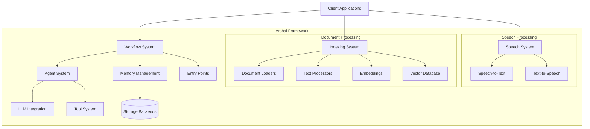

# Arshai Package: Technical Overview

## Service Purpose and Strategic Role
Arshai is a powerful AI multi-agent framework designed to build complex workflows with intelligent conversational agents, memory management, and tool integration. Its strategic role within the Arshai ecosystem is to provide a flexible, extensible foundation for creating AI-powered solutions that can tackle real-world business problems through orchestrated agent interactions, document processing, and natural language understanding.

## High-level Architectural Diagram

## Core Capabilities and Responsibilities

### Workflow System
- Orchestrates multi-agent interactions through a graph-based workflow model
- Manages state transitions between different agent nodes
- Routes information through defined paths with conditional logic
- Provides entry points for external integration

### Agent System
- Encapsulates AI models with specific capabilities and responsibilities
- Processes natural language inputs and produces structured outputs
- Utilizes tools to extend functionality beyond conversation
- Maintains consistent memory across interactions

### Memory Management
- Stores conversation history with configurable persistence strategies
- Manages context windows for limited-context LLMs
- Provides summarization capabilities for long-running conversations
- Supports different storage backends (in-memory, Redis, databases)

### Document Processing
- Loads documents from various sources and formats
- Chunks text into appropriate segments for embedding
- Generates embeddings for semantic search capabilities
- Indexes content in vector databases for retrieval
- Supports RAG (Retrieval Augmented Generation) applications

### Speech Processing
- Converts spoken language to text for agent processing
- Transforms text responses to natural-sounding speech
- Supports multiple voice options and speech configurations

### Tool System
- Extends agent capabilities with external functionality
- Provides structured interface for tool definition and usage
- Enables agents to interact with external systems and APIs

## Technology Stack and Infrastructure

### Core Technologies
- Python 3.11+ as the primary programming language
- Pydantic for data validation and settings management
- OpenAI and other LLM providers for natural language processing
- Vector databases for document embedding storage
- Redis for distributed memory management (optional)
- HTTP APIs for service integration

### Design Patterns
- Clean Architecture with interface-first design
- Factory Pattern for component creation
- Repository Pattern for data access
- Dependency Injection for flexible configuration
- Strategy Pattern for interchangeable algorithms

### Infrastructure Components
- Modular design for flexible deployment options
- Support for containerization and orchestration
- Configurable logging and monitoring
- Scalable vector storage with multiple backend options 