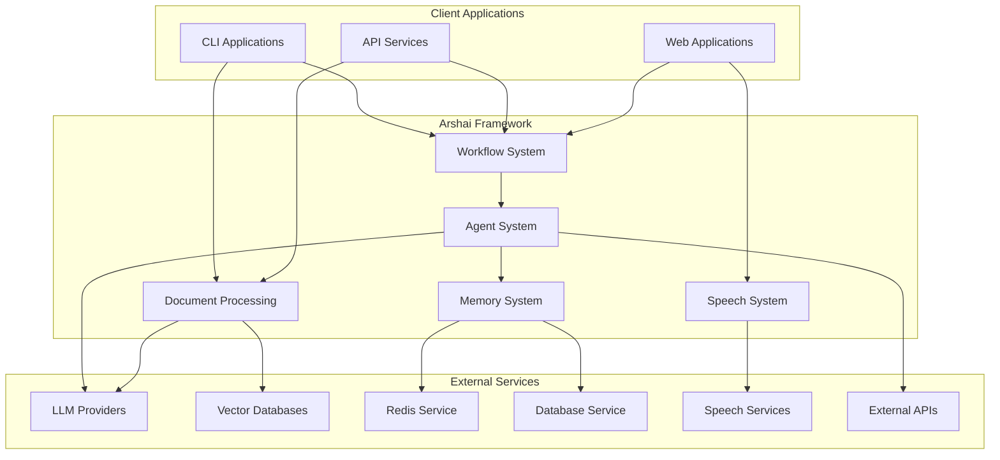

# Arshai Integration

## Service Dependency Mapping



### External Dependencies

| Service Type | Purpose | Integration Pattern | Optional? |
|--------------|---------|---------------------|-----------|
| LLM Providers | Natural language processing | API Client | No |
| Vector Databases | Document embedding storage | Client SDK | Yes* |
| Redis Service | Distributed memory storage | Client SDK | Yes |
| Database Service | Relational data storage | ORM | Yes |
| Speech Services | Speech-to-text, text-to-speech | API Client | Yes |
| External APIs | Tool functionality | API Client | Yes |

*Required for document processing features

## API Specifications

### Workflow API

#### Create Workflow
- **Endpoint**: `POST /api/v1/workflows`
- **Authentication**: API Key
- **Content-Type**: `application/json`
- **Request Body**:
```json
{
  "name": "string",
  "description": "string",
  "nodes": {
    "node_id": {
      "name": "string",
      "agent_id": "string",
      "config": {}
    }
  },
  "edges": [
    {
      "source_node_id": "string",
      "target_node_id": "string",
      "condition": "string",
      "priority": 0
    }
  ],
  "entry_points": {
    "entry_point_name": {
      "name": "string",
      "target_node_id": "string"
    }
  },
  "metadata": {}
}
```
- **Response**: `201 Created`
```json
{
  "workflow_id": "string",
  "name": "string",
  "created_at": "string"
}
```

#### Execute Workflow
- **Endpoint**: `POST /api/v1/workflows/{workflow_id}/execute`
- **Authentication**: API Key
- **Content-Type**: `application/json`
- **Request Body**:
```json
{
  "entry_point": "string",
  "input": {
    "message": "string",
    "metadata": {}
  }
}
```
- **Response**: `200 OK`
```json
{
  "execution_id": "string",
  "result": {
    "message": "string",
    "metadata": {}
  }
}
```

### Agent API

#### Process Message
- **Endpoint**: `POST /api/v1/agents/{agent_id}/process`
- **Authentication**: API Key
- **Content-Type**: `application/json`
- **Request Body**:
```json
{
  "message": "string",
  "conversation_id": "string",
  "stream": false,
  "metadata": {}
}
```
- **Response**: `200 OK`
```json
{
  "agent_message": "string",
  "conversation_id": "string",
  "metadata": {},
  "tool_calls": []
}
```

#### Stream Response
- **Endpoint**: `POST /api/v1/agents/{agent_id}/stream`
- **Authentication**: API Key
- **Content-Type**: `application/json`
- **Request Body**: Same as Process Message
- **Response**: `200 OK`
- **Content-Type**: `text/event-stream`
```
event: message
data: {"content": "partial response", "finished": false}

event: message
data: {"content": " continued", "finished": false}

event: message
data: {"content": " complete", "finished": true, "metadata": {}}
```

### Document Processing API

#### Index Documents
- **Endpoint**: `POST /api/v1/documents/index`
- **Authentication**: API Key
- **Content-Type**: `multipart/form-data`
- **Request Body**:
  - `files`: Document files (PDF, DOCX, TXT, etc.)
  - `collection_name`: String
  - `chunking_strategy`: String (optional)
  - `embedding_model`: String (optional)
  - `metadata`: JSON string (optional)
- **Response**: `202 Accepted`
```json
{
  "job_id": "string",
  "collection_name": "string",
  "files_count": 0,
  "status": "processing"
}
```

#### Query Documents
- **Endpoint**: `POST /api/v1/documents/query`
- **Authentication**: API Key
- **Content-Type**: `application/json`
- **Request Body**:
```json
{
  "collection_name": "string",
  "query": "string",
  "limit": 10,
  "filters": {},
  "include_metadata": true
}
```
- **Response**: `200 OK`
```json
{
  "results": [
    {
      "chunk_id": "string",
      "document_id": "string",
      "content": "string",
      "metadata": {},
      "score": 0.95
    }
  ],
  "count": 1
}
```

### Speech API

#### Speech to Text
- **Endpoint**: `POST /api/v1/speech/transcribe`
- **Authentication**: API Key
- **Content-Type**: `multipart/form-data`
- **Request Body**:
  - `audio`: Audio file
  - `format`: String (optional)
  - `language`: String (optional)
- **Response**: `200 OK`
```json
{
  "text": "string",
  "metadata": {
    "duration": 0,
    "language": "string"
  }
}
```

#### Text to Speech
- **Endpoint**: `POST /api/v1/speech/synthesize`
- **Authentication**: API Key
- **Content-Type**: `application/json`
- **Request Body**:
```json
{
  "text": "string",
  "voice": "string",
  "format": "mp3"
}
```
- **Response**: `200 OK`
- **Content-Type**: `audio/mp3` (or specified format)

## Communication Protocols

### HTTP APIs
- REST APIs for synchronous operations
- OpenAPI/Swagger documentation
- JSON as primary data format
- HTTP status codes for error reporting

### WebSockets
- Real-time bi-directional communication
- Used for streaming agent responses
- Event-based message format
- Heartbeat for connection maintenance

### Asynchronous Processing
- Background job queues for long-running operations
- Webhooks for completion notifications
- Polling endpoints for status updates
- Job status tracking with unique identifiers

## Authentication and Authorization

### API Key Authentication
- API keys for service-to-service authentication
- Key rotation and revocation capabilities
- Scoped permissions for different operations
- Rate limiting based on API key

### OAuth2 Integration (Optional)
- Support for standard OAuth2 flows
- User-context operations
- Access token validation
- Refresh token handling

### JWT Tokens
- Short-lived tokens for session management
- Claims-based authorization
- Token validation middleware
- Symmetric or asymmetric signing

### Permission Model
| Permission | Description | Default |
|------------|-------------|---------|
| workflows:read | Read workflow definitions | All keys |
| workflows:write | Create/update workflows | Admin keys |
| workflows:execute | Execute workflows | All keys |
| agents:read | Read agent configurations | All keys |
| agents:write | Create/update agents | Admin keys |
| agents:process | Send messages to agents | All keys |
| documents:read | Access document collections | All keys |
| documents:write | Create/update collections | Admin keys |
| documents:index | Index new documents | Admin keys |
| speech:transcribe | Convert speech to text | Speech keys |
| speech:synthesize | Convert text to speech | Speech keys |

## Error Handling

### HTTP Error Codes
| Status Code | Error Type | Description |
|-------------|------------|-------------|
| 400 | BadRequestError | Invalid request format or parameters |
| 401 | UnauthorizedError | Missing or invalid authentication |
| 403 | ForbiddenError | Insufficient permissions |
| 404 | NotFoundError | Resource not found |
| 422 | ValidationError | Request validation failed |
| 429 | RateLimitError | Too many requests |
| 500 | InternalError | Internal server error |
| 503 | ServiceUnavailableError | Dependent service unavailable |

### Error Response Format
```json
{
  "error": {
    "code": "string",
    "message": "string",
    "details": {},
    "request_id": "string"
  }
}
```

### Retry Strategies
- Automatic retry for transient errors
- Exponential backoff with jitter
- Circuit breaker for persistent failures
- Retry-After header support

## Event-Driven Interactions

### Event Types
| Event | Description | Payload |
|-------|-------------|---------|
| workflow.created | New workflow created | Workflow ID, name |
| workflow.updated | Workflow definition updated | Workflow ID, changes |
| workflow.executed | Workflow execution completed | Execution ID, result |
| workflow.failed | Workflow execution failed | Execution ID, error |
| agent.message_processed | Agent processed a message | Agent ID, conversation ID |
| document.indexed | Document indexing completed | Collection name, document ID |
| document.collection_created | New document collection created | Collection name |

### Event Delivery Mechanisms
- Webhooks (HTTP callbacks)
- Message queues (RabbitMQ, AWS SQS)
- Redis Pub/Sub
- Server-Sent Events (SSE)

### Event Subscription
- Register webhook URLs
- Configure delivery preferences
- Filter events by type
- Secure webhook verification

## Resilience Strategies

### Circuit Breaking
- Detect failing external services
- Temporary service isolation
- Automatic recovery testing
- Configurable thresholds and timeouts

### Fallback Mechanisms
- Alternative service providers
- Graceful degradation of functionality
- Cached results for critical operations
- Default responses for non-critical features

### Bulkhead Pattern
- Isolate different service integrations
- Independent failure domains
- Resource allocation per integration
- Prevent cascading failures

### Health Checks
- Regular dependency health monitoring
- Customizable health check endpoints
- Proactive issue detection
- Automatic service registration/deregistration

## Integration Testing

### Test Types
- Unit tests for integration adapters
- Integration tests with mock services
- Contract tests for API compatibility
- End-to-end tests for critical flows

### Testing Approaches
- Test fixtures for common scenarios
- Service virtualization for external dependencies
- Chaos testing for resilience verification
- Performance testing for SLA validation

### Testing Tools
- PyTest for Python-based testing
- WireMock for HTTP service mocking
- Docker Compose for integration environment
- CI/CD pipeline integration 