# Arshai LLM Architecture

This document provides a comprehensive overview of the current Arshai LLM architecture, designed for agentic AI applications with real-time function execution and progressive streaming capabilities.

## Architecture Overview

The Arshai LLM system is built on **clean architecture principles** with a layered approach that provides consistency across multiple LLM providers while allowing for provider-specific optimizations.

### **Architectural Philosophy & Core Decisions**

The current architecture represents the result of extensive design iterations focused on creating an **agentic AI framework** with these foundational requirements:

- **Standardized Patterns**: Consistent behavior across all LLM providers for predictable agent development
- **Base Classes & Interfaces**: Extensible design that makes adding new providers straightforward
- **Contributor-Friendly Design**: Clear templates and patterns that minimize implementation complexity
- **Backward Compatibility**: Smooth migration paths without breaking existing implementations

#### **Why This Architecture Was Chosen**

**1. BaseLLMClient Framework Approach**
- **Decision Rationale**: After evaluating multiple approaches, chose extensive standardization where the base class handles ALL framework requirements (structured output, function calling, background tasks, usage tracking)
- **Contributor Benefit**: Contributors only implement provider-specific API calls while the framework handles all complex orchestration logic
- **Test Compliance**: Ensures all clients pass identical test suites, guaranteeing behavioral consistency

**2. Object-Based Function Orchestration**
- **Critical Problem Solved**: Dictionary-based function calling approach caused infinite loops when multiple calls to the same function were made (e.g., `{"func": args}` overwrites duplicate calls)
- **Solution**: Object-based `List[FunctionCall]` preserves ALL function calls with unique tracking via `call_id`
- **Type Safety**: Structured objects provide full IDE support and runtime validation

**3. Progressive Streaming Architecture**
- **Performance Motivation**: Traditional batch execution after streaming completion creates unnecessary latency
- **Real-Time Execution**: Functions execute immediately when arguments complete during streaming, not after
- **Parallel Processing**: Function execution runs concurrently with ongoing streaming for optimal resource utilization

### System Architecture Diagram


### Core Design Philosophy

- **Agentic AI Focus**: Purpose-built for intelligent agents requiring sophisticated tool integration
- **Interface-Driven Design**: All components implement well-defined protocols with type safety
- **Template-Guided Development**: BaseLLMClient serves as the definitive implementation guide
- **Progressive Real-Time Processing**: Functions execute immediately during streaming for optimal performance
- **Error Resilience**: Graceful handling of partial failures with context preservation

## Architecture Layers

### 1. Interface Layer

The unified interface provides a consistent API across all LLM providers:

```python
class ILLMInput(BaseModel):
    system_prompt: str                              # System instructions
    user_message: str                               # User query
    regular_functions: Dict[str, Callable] = {}     # Tools that return results
    background_tasks: Dict[str, Callable] = {}      # Fire-and-forget functions
    structure_type: Type[T] = None                  # Structured output type
    max_turns: int = 10                             # Function calling iterations
```

**Key Features:**
- **Pure Callable Interface**: All functions are Python `Callable` types for type safety
- **Clear Separation**: Regular functions vs background tasks with explicit roles
- **Type Safety**: Full IDE support with runtime validation
- **Structured Output**: Optional type-safe response formatting

### 2. Base Framework Layer

The `BaseLLMClient` serves as the foundation for all LLM provider implementations:

```python
class BaseLLMClient(ILLM, ABC):
    """Framework-standardized base class for all LLM clients."""
    
    # Public Interface (what applications call)
    async def chat(self, input: ILLMInput) -> Dict[str, Any]
    async def stream(self, input: ILLMInput) -> AsyncGenerator[Dict[str, Any], None]
    
    # Abstract Methods (what providers implement)
    @abstractmethod
    def _initialize_client(self) -> Any
    @abstractmethod
    def _convert_callables_to_provider_format(self, functions: Dict[str, Callable]) -> Any
    @abstractmethod
    async def _chat_simple(self, input: ILLMInput) -> Dict[str, Any]
    @abstractmethod
    async def _chat_with_functions(self, input: ILLMInput) -> Dict[str, Any]
    @abstractmethod
    async def _stream_simple(self, input: ILLMInput) -> AsyncGenerator
    @abstractmethod
    async def _stream_with_functions(self, input: ILLMInput) -> AsyncGenerator
```

**Framework Responsibilities:**
- **Routing Logic**: Automatically determines simple vs complex processing paths
- **Function Orchestration**: Manages execution through standardized orchestrator
- **Error Handling**: Provides resilient error handling with context preservation
- **Usage Tracking**: Standardizes usage metadata across all providers
- **Progressive Streaming**: Built-in support for real-time function execution

### 3. Provider Layer

Current provider implementations with their specific capabilities:

#### OpenAI Client
- **Specialty**: Function-based structured output approach
- **Features**: Delta streaming, advanced type hint processing
- **Optimization**: Direct API integration with fallback safety layers

#### Google Gemini Client  
- **Specialty**: Native SDK integration with dual authentication
- **Features**: Auto-schema generation, advanced configuration support
- **Optimization**: Service account + API key authentication options

#### Azure OpenAI Client
- **Specialty**: Enterprise deployment with native structured parsing
- **Features**: Event-driven streaming, deployment-specific configuration
- **Optimization**: Azure's responses API with structured output support

#### OpenRouter Client
- **Specialty**: HTTP proxy with extensive model access
- **Features**: Safe connection handling, proxy optimization
- **Optimization**: Comprehensive fallback patterns and error recovery

## Function Interface Architecture

### Unified Callable Approach

All functions in the system follow a consistent pattern:

```python
# Regular Function (returns results to conversation)
def calculate_metrics(data: List[float], metric_type: str = "mean") -> float:
    """Calculate statistical metrics from data."""
    # Implementation returns result to conversation
    return sum(data) / len(data) if metric_type == "mean" else max(data)

# Background Task (fire-and-forget execution)  
def send_alert(level: str, message: str, recipients: List[str] = None) -> None:
    """BACKGROUND TASK: Send alert notification to monitoring system.
    This task runs independently in fire-and-forget mode - no results 
    will be returned to the conversation."""
    # Implementation runs independently
    print(f"🚨 Alert [{level}]: {message}")
```

**Key Principles:**
- **Single Source of Truth**: All functions are Python callables
- **Type Safety**: Full IDE support with runtime introspection
- **Clear Intent**: Background tasks explicitly declared in docstrings
- **Pure Conversion**: Provider conversion handles only format transformation

### Provider Conversion Pattern

Each provider implements the abstract conversion method:

```python
def _convert_callables_to_provider_format(self, functions: Dict[str, Callable]) -> Any:
    """Convert callables to provider-specific format (OpenAI tools, Gemini FunctionDeclarations, etc.)"""
    provider_functions = []
    
    for name, func in functions.items():
        # Inspect function signature and docstring
        signature = inspect.signature(func)
        description = func.__doc__ or f"Execute {name} function"
        is_background = description.startswith("BACKGROUND TASK:")
        
        # Convert to provider-specific format
        provider_functions.append(self._build_provider_function(name, signature, description))
    
    return provider_functions
```

## Progressive Streaming Architecture

### Real-Time Function Execution

The progressive streaming system executes functions **immediately** when their arguments complete during streaming, rather than waiting for the entire stream to finish.

#### Progressive Streaming Flow Diagram


```python
@dataclass
class StreamingExecutionState:
    active_function_tasks: List[asyncio.Task]       # Currently running functions
    executed_functions: Set[str]                    # Prevent duplicate execution
    completed_functions: List[Dict[str, Any]]       # Finished executions
    background_initiated: List[str]                 # Background task messages
```

**Execution Flow:**
1. **Stream Processing**: Parse streaming response chunks in real-time
2. **Completion Detection**: Identify when function arguments are complete via JSON validation
3. **Immediate Execution**: Create `asyncio.Task` for function execution without waiting
4. **State Tracking**: Prevent duplicate executions using unique call identifiers
5. **Result Gathering**: Collect results after streaming completes for context integration

### Performance Benefits

- **Reduced Latency**: Functions start immediately instead of post-stream batch processing
- **Parallel Processing**: Function execution concurrent with continued streaming
- **Resource Efficiency**: Better CPU and network utilization
- **Real-Time Feedback**: Users see function results as soon as available

## Function Orchestration

### Object-Based Architecture

The system uses structured objects to prevent execution issues and provide type safety:

#### Function Orchestration Flow


```python
@dataclass
class FunctionCall:
    name: str                    # Function name
    args: Dict[str, Any]         # Function arguments
    call_id: Optional[str]       # Unique identifier for tracking
    is_background: bool          # Execution type flag

@dataclass
class FunctionExecutionInput:
    function_calls: List[FunctionCall]              # Functions to execute
    available_functions: Dict[str, Callable]        # Regular function mapping
    available_background_tasks: Dict[str, Callable] # Background task mapping

@dataclass
class FunctionExecutionResult:
    regular_results: List[Dict[str, Any]]           # Function results with metadata
    background_initiated: List[str]                 # Background task status messages
    failed_functions: List[Dict[str, Any]]          # Error information with context
```

### Execution Patterns

#### Regular Functions
- **Execution**: Parallel via `asyncio.gather()` for optimal performance
- **Results**: Returned to conversation with full metadata (name, args, result, call_id)
- **Error Handling**: Failed functions provide context messages for model recovery
- **Integration**: Results added to conversation history in provider-specific format

#### Background Tasks  
- **Execution**: Fire-and-forget via `asyncio.create_task()` 
- **Reference Management**: Tasks tracked to prevent garbage collection
- **Results**: Status messages only, no return values to conversation
- **Error Handling**: Failures logged but don't interrupt conversation flow

## Usage Tracking

### Standardized Metadata Format

All providers return consistent usage information:

```python
{
    "input_tokens": 120,          # Required - prompt processing cost
    "output_tokens": 80,          # Required - response generation cost  
    "total_tokens": 200,          # Required - total processing cost
    "thinking_tokens": 45,        # Optional - reasoning model overhead (GPT-o1, etc.)
    "tool_calling_tokens": 25,    # Optional - function calling processing cost
    "provider": "openai",         # Required - for debugging and provider identification
    "model": "gpt-4o",           # Required - for cost calculation and optimization
    "request_id": "req_123"       # Optional - provider request identifier when available
}
```

**Usage Accumulation:**
- **Multi-Turn Conversations**: Usage accumulated across function calling iterations
- **Safe Accumulation**: Immutable pattern prevents in-place mutations
- **Error Preservation**: Usage data returned even during partial failures
- **Provider Consistency**: Same format regardless of underlying provider differences

## Error Handling Philosophy

### Resilient Execution Strategy

The architecture follows a "collect errors but continue execution" approach rather than fail-fast:

#### Error Handling Flow

```mermaid
flowchart LR
    A[Function Execution Starts] --> B{Function executes successfully?}
    
    B -->|Success| C[Add result to conversation context]
    B -->|Error| D[Capture error with full context]
    
    D --> E[Error Details:<br/>• Function name<br/>• Arguments used<br/>• Error message<br/>• Call ID]
    E --> F[Add error context to conversation]
    F --> G[Model receives error information]
    G --> H[Model provides fallback/alternative]
    
    C --> I[Continue with next functions]
    H --> I
    I --> J[Complete execution with partial results]
    
    subgraph "Error Context"
        K["Function 'weather_api' failed:<br/>Connection timeout.<br/>Please try alternative approach."]
    end
    
    F --> K
    K --> G
    
    style D fill:#ffcccc
    style E fill:#ffcccc  
    style F fill:#ffe0cc
    style G fill:#ccffcc
    style H fill:#ccffcc
```



**Benefits:**
- **Better User Experience**: Partial results delivered even with some function failures
- **Fault Tolerance**: System continues operating despite individual component failures
- **Graceful Recovery**: Failed functions provide context for model-driven alternative approaches
- **Conversation Continuity**: Errors don't terminate ongoing interactions

**Implementation:**
- **Function Failures**: Captured with full context (name, args, error message, call_id)
- **Context Integration**: Error information added to conversation for model awareness
- **Progressive Resilience**: Failed functions during streaming don't break the stream
- **Usage Preservation**: Token usage always tracked regardless of execution outcome

## Multi-Turn Conversation Management

### Iterative Function Calling

Complex interactions may require multiple rounds of function calling:

```python
# Example conversation flow:
# Turn 1: LLM calls get_user_data() and get_preferences()  
# Turn 2: LLM calls generate_recommendations() with results from Turn 1
# Turn 3: LLM calls send_recommendations() and returns final response
```

**Implementation Pattern:**
- **Turn Tracking**: Current turn counter with configurable maximum (`max_turns`)
- **Context Accumulation**: Function results added to conversation history between turns
- **Completion Detection**: Multiple exit conditions (no more functions, structured response, max turns)
- **State Management**: Usage and context preserved across all turns

## Provider Implementation Contract

### Required Abstract Methods

Every provider must implement exactly 5 abstract methods:

1. **`_initialize_client()`**: Provider-specific client setup and authentication
2. **`_convert_callables_to_provider_format()`**: Function schema conversion
3. **`_chat_simple()`**: Simple chat without function calling
4. **`_chat_with_functions()`**: Complex multi-turn chat with function orchestration
5. **`_stream_simple()`**: Simple streaming without functions
6. **`_stream_with_functions()`**: Progressive streaming with real-time function execution

### Implementation Standards

- **Routing Compliance**: Framework handles complexity detection and method routing
- **Usage Standardization**: All methods must return standardized usage metadata
- **Error Resilience**: Graceful handling of API failures with informative error messages
- **Progressive Support**: Streaming methods must support real-time function execution
- **Context Management**: Multi-turn conversations require proper context accumulation

## Architecture Benefits

### For Framework Users
- **Consistent API**: Same interface across all LLM providers with identical behavior
- **Real-Time Performance**: Immediate function execution during streaming interactions  
- **Type Safety**: Full IDE support and runtime validation for all function definitions
- **Error Resilience**: Graceful handling of failures with comprehensive context

### For Contributors  
- **Clear Template**: BaseLLMClient provides exact implementation requirements and patterns
- **Minimal Implementation**: Only provider-specific API integration required (5 methods)
- **Test Compliance**: Standardized test suite ensures behavioral consistency across providers
- **Progressive Support**: Built-in framework support for real-time streaming capabilities

### For Maintainers
- **Centralized Logic**: Framework concerns handled in base class, not duplicated across providers  
- **Provider Isolation**: API-specific code contained within individual client implementations
- **Extensible Design**: Easy to add new providers following established architectural patterns
- **Observable System**: Comprehensive usage tracking, error reporting, and performance monitoring

## Critical Implementation Patterns

### **Proven Patterns from Production Experience**

Based on successful migrations and production usage, these patterns are **mandatory** for all LLM client implementations:

#### **1. Unified Function Conversion**
All providers must use a single method to handle both regular functions and background tasks:

```python
def _convert_callables_to_provider_format(self, functions: Dict[str, Callable]) -> Any:
    """Pure conversion without execution metadata - framework handles orchestration"""
    # Single conversion method handles all function types
    # Provider-specific format generation (OpenAI tools, Gemini FunctionDeclarations, etc.)
```

**Why This Pattern**: Eliminates complex conditional logic that led to bugs in early implementations.

#### **2. Safe Usage Accumulation**
Prevent in-place mutations that cause usage tracking errors:

```python
def _accumulate_usage_safely(self, current_usage: Dict, accumulated_usage: Dict = None) -> Dict:
    """Return new dict, never mutate existing usage objects"""
    # Create new dict rather than modifying existing ones
    return {"input_tokens": accumulated + current, ...}
```

**Critical**: Usage tracking failures were a major source of production issues.

#### **3. Template-Based Constants**
Centralize repeated strings to prevent inconsistencies:

```python
class ProviderConstants:
    STRUCTURE_INSTRUCTIONS_TEMPLATE = "Return response as {function_name}(...) function call."
    ERROR_MESSAGES = {
        "STRUCTURE_NOT_CALLED": "Expected {structure_type} function call",
        "FUNCTION_FAILED": "Function {name} failed: {error}"
    }
```

#### **4. Method Structure Contract**
Every provider MUST implement exactly this structure:

```python
class YourProviderClient(BaseLLMClient):
    # Required abstract methods (exactly 6)
    def _initialize_client(self) -> Any
    def _convert_callables_to_provider_format(self, functions: Dict[str, Callable]) -> Any
    async def _chat_simple(self, input: ILLMInput) -> Dict[str, Any]
    async def _chat_with_functions(self, input: ILLMInput) -> Dict[str, Any]
    async def _stream_simple(self, input: ILLMInput) -> AsyncGenerator
    async def _stream_with_functions(self, input: ILLMInput) -> AsyncGenerator
    
    # DO NOT override public methods - framework handles routing
    # DO NOT reimplement orchestration logic - use _execute_functions_with_orchestrator()
```

### **Migration Timeline & Status**

**Completed Phases:**
- ✅ **Phase 1**: New FunctionOrchestrator with object-based approach
- ✅ **Phase 2**: BaseLLMClient framework + OpenRouter migration 
- ✅ **Phase 3**: Unified function interface (eliminated `tools_list`/`callable_functions`)

**Current Status:**
- 🔄 **Phase 4**: Migrating remaining clients (Gemini, Azure, OpenAI) to new architecture
- **Future**: Deprecation warnings (Q2 2025), legacy method removal (2026)

**Code Impact Results:**
- **Before**: ~2000+ lines across clients and utils with significant duplication
- **After**: ~800-1000 lines total with 50-60% reduction in maintenance overhead
- **Quality Improvement**: Better separation of concerns, cleaner abstractions, standardized patterns

### **Function Completeness Detection Strategy**

For progressive streaming, function completion uses a **hybrid approach**:

```python
def _is_function_complete(self, function_data: Dict, provider_signal: Any = None) -> bool:
    # 1. Provider signals first (most reliable when available)
    if provider_signal and self._check_provider_completion_signal(provider_signal):
        return True
    
    # 2. Basic safety requirements
    if not (function_data.get("name") and "arguments" in function_data):
        return False
    
    # 3. JSON validation fallback (universal approach)
    try:
        if isinstance(function_data["arguments"], str):
            json.loads(function_data["arguments"])  # Valid JSON = complete
            return True
        elif isinstance(function_data["arguments"], dict):
            return True  # Already parsed = complete
    except json.JSONDecodeError:
        return False  # Still streaming arguments
    
    return False
```

**Decision Rationale**: Combines provider-specific optimization with universal fallback for reliability.

### **Background Task vs Regular Function Design**

**Explicit Declaration Pattern**:
```python
def send_notification(event: str, details: str = "User interaction") -> None:
    """BACKGROUND TASK: Send notification to admin channel.
    This task runs independently in fire-and-forget mode - no results 
    will be returned to the conversation."""
    pass

def calculate_power(base: float, exponent: float) -> float:
    """Calculate base raised to the power of exponent."""
    return base ** exponent
```

**Execution Differences**:
- **Regular Functions**: `asyncio.gather()` for parallel execution, results returned to conversation
- **Background Tasks**: `asyncio.create_task()` for fire-and-forget, only status messages returned

## Future Architecture Considerations

### Advanced Optimizations
- **Function Dependency Management**: Sequential execution of dependent function chains
- **Resource-Based Prioritization**: Intelligent scheduling of lightweight vs heavy operations
- **Adaptive Timeouts**: Dynamic timeout management based on function complexity and history

### Monitoring and Observability  
- **Progressive Execution Metrics**: Real-time tracking of function execution timing and success rates
- **Stream Performance Analysis**: Monitoring impact of progressive execution on overall streaming performance
- **Error Pattern Detection**: Automated identification of common function failure patterns for optimization

This architecture represents a mature, production-ready system optimized for real-time agentic AI applications with comprehensive error handling, performance optimization, and developer experience considerations.

## Comprehensive Knowledge Verification

This section ensures complete understanding of the Arshai LLM architecture. **All information needed to understand, maintain, and extend the system is captured in this documentation.**

### **Architectural Decision Summary**

#### **Core Framework Philosophy**
- **Agentic AI Focus**: Purpose-built for intelligent agents requiring sophisticated tool integration
- **Standardized Patterns**: Consistent behavior across all LLM providers for predictable development
- **Contributor-Friendly**: Clear templates that minimize implementation complexity
- **Interface-Driven**: All components implement well-defined protocols with type safety

#### **Key Architectural Choices & Rationale**

**1. BaseLLMClient Extensive Standardization**
- **Choice**: Base class handles ALL framework requirements (routing, orchestration, error handling, usage tracking)
- **Alternative Rejected**: Minimal base class that required providers to implement complex framework logic
- **Benefit**: Contributors implement only provider-specific API integration (~80% less code per provider)

**2. Object-Based Function Orchestration** 
- **Choice**: `List[FunctionCall]` with unique `call_id` tracking
- **Alternative Rejected**: Dictionary-based `{"function_name": args}` approach
- **Critical Problem Solved**: Dictionary approach caused infinite loops when LLM made multiple calls to same function
- **Technical Detail**: Dictionary overwrites mean duplicate calls were lost, causing retry loops

**3. Unified Callable Function Interface**
- **Choice**: Single `regular_functions` + `background_tasks` (both Dict[str, Callable])
- **Alternative Rejected**: Mixed interface with `tools_list`, `callable_functions`, `background_tasks`
- **Complexity Reduction**: Eliminates complex conversion logic, improves type safety

**4. Progressive Streaming Architecture**
- **Choice**: Execute functions immediately when arguments complete during streaming
- **Alternative Rejected**: Batch execution after stream completes
- **Performance Impact**: Significantly reduced latency, better resource utilization
- **Implementation**: Hybrid completion detection (provider signals + JSON validation)

**5. Error Handling Philosophy**
- **Choice**: "Collect errors but continue execution" approach
- **Alternative Rejected**: Fail-fast on first error
- **User Experience**: Partial results delivered even with some function failures
- **Agent Benefit**: Model can handle failures gracefully and provide alternatives

#### **Implementation Status & Timeline**
- **Phase 1** ✅: FunctionOrchestrator with object-based approach (Jan 2025)
- **Phase 2** ✅: BaseLLMClient framework + OpenRouter migration (Jan 2025)  
- **Phase 3** ✅: Unified function interface implementation (Jan 2025)
- **Phase 4** 🔄: Remaining client migrations (Gemini, Azure, OpenAI) (Q1 2025)
- **Phase 5**: Deprecation warnings (Q2 2025), legacy removal (2026)

#### **Code Quality Impact**
- **Before**: ~2000+ lines across clients with significant duplication
- **After**: ~800-1000 lines total with standardized patterns
- **Reduction**: 50-60% less code to maintain
- **Quality**: Better separation of concerns, cleaner abstractions

### **System Capabilities & Guarantees**

#### **What The Framework Provides**
1. **Method Routing**: Automatic detection of simple vs function calling scenarios
2. **Function Orchestration**: Parallel execution of regular functions, fire-and-forget background tasks
3. **Progressive Streaming**: Real-time function execution during streaming
4. **Error Resilience**: Graceful handling of function failures with context preservation  
5. **Usage Tracking**: Standardized token usage across all providers
6. **Backward Compatibility**: Smooth migration path for existing implementations

#### **What Providers Must Implement**
1. **Client Initialization**: Provider-specific authentication and configuration
2. **Function Conversion**: Transform callables to provider-specific formats
3. **Simple Operations**: Basic chat/stream without function calling
4. **Complex Operations**: Multi-turn chat/stream with function orchestration
5. **Usage Standardization**: Convert provider usage to framework format

#### **Framework Contracts & Guarantees**
- **Behavioral Consistency**: All providers behave identically from application perspective
- **Test Compliance**: All providers must pass identical test suites
- **Error Handling**: Failed functions provide context messages rather than breaking conversations
- **Resource Management**: Background tasks properly tracked to prevent memory leaks
- **Performance**: Progressive streaming provides optimal latency and resource utilization

### **Extension Points & Future Architecture**

#### **Adding New Capabilities**
- **New Function Types**: Framework can support additional execution patterns beyond regular/background
- **Advanced Streaming**: Framework ready for provider-specific optimizations (WebSocket, Server-Sent Events)
- **Dependency Management**: Future support for sequential function execution based on dependencies
- **Resource Prioritization**: Intelligent scheduling of function execution based on complexity

#### **Provider Optimization Opportunities**
- **Structured Output**: Providers can implement native JSON modes vs function calling approaches
- **Authentication**: Multiple auth methods (API key, service account, OAuth) per provider needs
- **Error Recovery**: Provider-specific retry and fallback strategies
- **Performance Tuning**: Provider-specific timeout and batching optimizations

### **Migration & Compatibility Strategy**

#### **Backward Compatibility Approach**
```python
# Current implementation maintains compatibility
async def chat_with_tools(self, input: ILLMInput):  # Deprecated method
    warnings.warn("Use chat() instead", DeprecationWarning)
    return await self.chat(input)  # Delegates to new method
```

#### **Deprecation Timeline**
- **2025 Q2**: Add deprecation warnings to all legacy methods
- **2026**: Remove deprecated methods entirely
- **Migration Support**: Framework provides clear migration path and tooling

## Related Documentation

- **[LLM Usage Guide](../guides/llm_usage.md)**: Practical examples and usage patterns for framework users
- **[Contributing Guide](../contributing/llm_providers.md)**: Step-by-step implementation guide for adding new LLM providers  
- **[Implementation README](../../arshai/llms/README.md)**: Critical implementation notes and common pitfalls for contributors/maintainers

**Note**: This documentation represents the complete architectural knowledge of the Arshai LLM system. All information needed for understanding, maintaining, extending, and debugging the system is captured across these four documents.