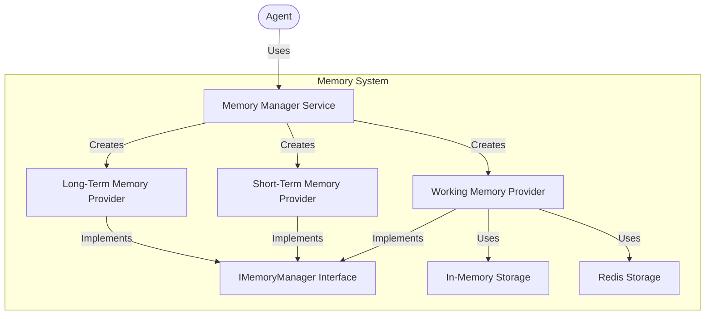
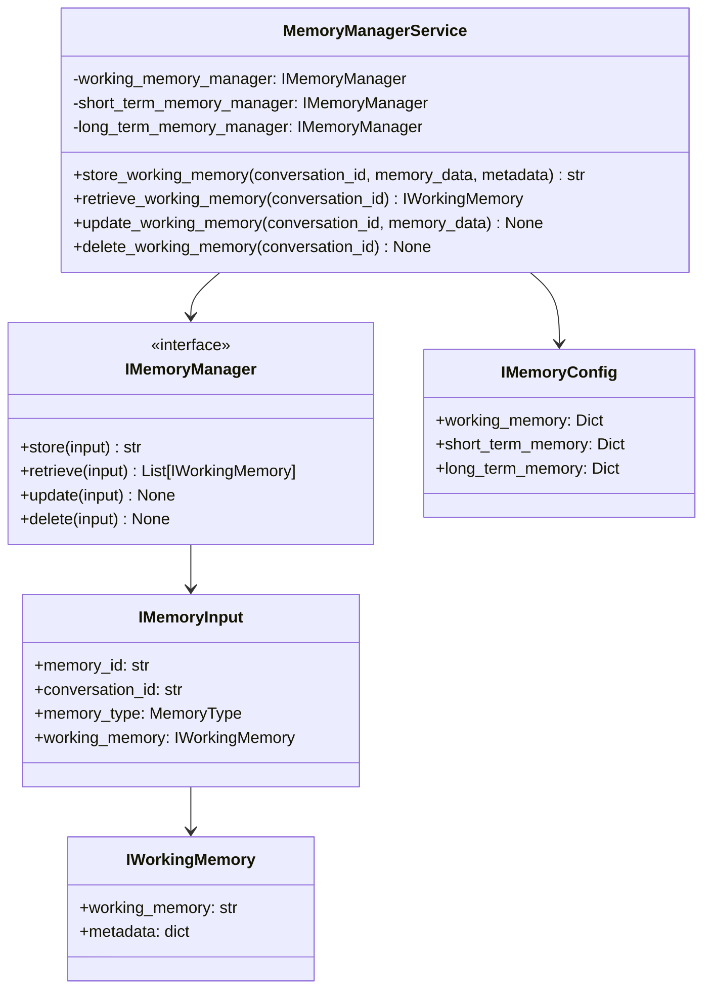

# Memory Management System

The memory management system in Arshai provides a flexible framework for storing and retrieving conversation context and knowledge across interactions. This document explains the architecture, components, and implementation details of the memory system.

## Architecture Overview

The memory management system follows a clean, modular architecture with distinct memory types and storage providers:



## Memory Types

The memory system supports different types of memory for different purposes:

### Working Memory

Working memory represents the active conversation context, including:
- Recent conversation history
- Current interaction state
- Contextual information for the language model
- Session-specific data

### Short-Term Memory

Short-term memory provides temporary storage for:
- Intermediate processing results
- Temporary data caching
- Session information beyond the current interaction
- Information that may be needed in the near future

### Long-Term Memory

Long-term memory serves as persistent storage for:
- User preferences and settings
- Historical conversation summaries
- Learned facts and information
- Knowledge base content

## Core Components

### Memory Manager Service

The `MemoryManagerService` provides a unified interface for accessing different types of memory:



### Memory Providers

Memory providers implement the `IMemoryManager` interface and provide specific storage mechanisms:

#### InMemoryManager

The `InMemoryManager` provides volatile, in-memory storage:
- Uses a dictionary for storage
- Supports time-to-live (TTL) for automatic expiration
- Includes periodic cleanup of expired memories
- Suitable for development, testing, and single-instance applications

#### RedisWorkingMemoryManager

The `RedisWorkingMemoryManager` provides persistent, distributed storage:
- Uses Redis for storage
- Supports TTL through Redis expiration
- Handles serialization and deserialization
- Suitable for production deployments and distributed systems

## Implementation Details

### Core Interfaces

#### IMemoryManager Interface

```python
class IMemoryManager(Protocol):
    """Universal interface for memory management systems."""
    
    def store(self, input: IMemoryInput) -> str:
        """
        Universal method to store any type of memory data.

        Args:
            input: IMemoryInput containing data and metadata for storage

        Returns:
            str: Unique identifier for the stored memory
        """
        ...

    def retrieve(self, input: IMemoryInput) -> List[IWorkingMemory]:
        """
        Universal method to retrieve any type of memory data.

        Args:
            input: IMemoryInput containing query and retrieval parameters

        Returns:
            List[IWorkingMemory]: Matching memory entries
        """
        ...

    def update(self, input: IMemoryInput) -> None:
        """
        Universal method to update any type of memory data.

        Args:
            input: IMemoryInput containing memory ID and update data
        """
        ...

    def delete(self, input: IMemoryInput) -> None:
        """
        Universal method to delete memory data.

        Args:
            input: IMemoryInput containing memory ID or deletion criteria
        """
        ...
```

#### IMemoryInput Data Structure

```python
class IMemoryInput(IDTO):
    """Input structure for memory operations."""
    
    memory_id: Optional[str] = Field(
        default=None,
        description="Unique identifier for a specific memory entry"
    )
    conversation_id: str = Field(
        description="Identifier for the conversation context"
    )
    memory_type: MemoryType = Field(
        description="Type of memory (working, short-term, long-term)"
    )
    working_memory: Optional[IWorkingMemory] = Field(
        default=None,
        description="Memory content for storage or update operations"
    )
    metadata: Optional[Dict[str, Any]] = Field(
        default=None,
        description="Additional metadata about the memory"
    )
```

#### IWorkingMemory Data Structure

```python
class IWorkingMemory(IDTO):
    """Structure for working memory content."""
    
    working_memory: str = Field(
        description="Textual content of the working memory"
    )
    metadata: Optional[Dict[str, Any]] = Field(
        default=None,
        description="Additional metadata for the working memory"
    )
    
    @classmethod
    def initialize_memory(cls) -> "IWorkingMemory":
        """Create an initialized empty working memory."""
        return cls(working_memory="", metadata={})
```

### Memory Manager Service Implementation

```python
class MemoryManagerService:
    """Service for managing different types of memory."""
    
    def __init__(self, config: Dict[str, Any]):
        """
        Initialize the memory manager service.
        
        Args:
            config: Configuration for memory providers
        """
        # Create memory providers based on configuration
        self.working_memory_manager = self._create_memory_manager(
            config.get("working_memory", {})
        )
        self.short_term_memory_manager = self._create_memory_manager(
            config.get("short_term_memory", {})
        )
        self.long_term_memory_manager = self._create_memory_manager(
            config.get("long_term_memory", {})
        )
    
    def _create_memory_manager(self, config: Dict[str, Any]) -> IMemoryManager:
        """
        Create a memory manager based on configuration.
        
        Args:
            config: Configuration for the memory manager
            
        Returns:
            IMemoryManager: Configured memory manager
        """
        provider = config.get("provider", "in_memory")
        
        if provider == "in_memory":
            return InMemoryManager(ttl=config.get("ttl", 3600))
        elif provider == "redis":
            return RedisWorkingMemoryManager(
                redis_url=config.get("redis_url", "redis://localhost:6379/0"),
                ttl=config.get("ttl", 3600),
                key_prefix=config.get("key_prefix", "arshai:memory:")
            )
        else:
            raise ValueError(f"Unsupported memory provider: {provider}")
    
    def store_working_memory(self, 
                            conversation_id: str, 
                            memory_data: Union[str, IWorkingMemory], 
                            metadata: Optional[Dict[str, Any]] = None) -> str:
        """
        Store working memory for a conversation.
        
        Args:
            conversation_id: ID of the conversation
            memory_data: Working memory data to store
            metadata: Optional metadata for the memory
            
        Returns:
            str: Memory ID for the stored data
        """
        # Convert string to IWorkingMemory if needed
        if isinstance(memory_data, str):
            working_memory = IWorkingMemory(
                working_memory=memory_data,
                metadata=metadata or {}
            )
        else:
            working_memory = memory_data
            
        memory_input = IMemoryInput(
            conversation_id=conversation_id,
            memory_type=MemoryType.WORKING_MEMORY,
            working_memory=working_memory
        )
        
        return self.working_memory_manager.store(memory_input)
    
    def retrieve_working_memory(self, conversation_id: Optional[str]) -> Optional[IWorkingMemory]:
        """
        Retrieve working memory for a conversation.
        
        Args:
            conversation_id: ID of the conversation
            
        Returns:
            Optional[IWorkingMemory]: Working memory data if found, None otherwise
        """
        if not conversation_id:
            return IWorkingMemory.initialize_memory()
        
        memory_input = IMemoryInput(
            conversation_id=conversation_id,
            memory_type=MemoryType.WORKING_MEMORY
        )
        
        result = self.working_memory_manager.retrieve(memory_input)
        if result:
            return result[0]
        
        # Initialize new working memory if none exists
        return IWorkingMemory.initialize_memory()
```

### Memory Provider Implementations

#### InMemoryManager Implementation

```python
class InMemoryManager(IMemoryManager):
    """In-memory implementation of IMemoryManager."""
    
    def __init__(self, ttl: int = 3600):
        """
        Initialize the in-memory manager.
        
        Args:
            ttl: Time-to-live for memory entries in seconds (default: 1 hour)
        """
        self.memory_store = {}
        self.ttl = ttl
        self.last_cleanup = time.time()
        self.cleanup_interval = 300  # 5 minutes
    
    def store(self, input: IMemoryInput) -> str:
        """Store memory data."""
        self._clean_expired_memories()
        
        memory_id = input.memory_id or str(uuid.uuid4())
        expiration = time.time() + self.ttl
        
        self.memory_store[memory_id] = {
            "conversation_id": input.conversation_id,
            "memory_type": input.memory_type,
            "working_memory": input.working_memory,
            "expiration": expiration
        }
        
        return memory_id
    
    def retrieve(self, input: IMemoryInput) -> List[IWorkingMemory]:
        """Retrieve memory data."""
        self._clean_expired_memories()
        
        results = []
        for memory_id, data in self.memory_store.items():
            if (data["conversation_id"] == input.conversation_id and
                data["memory_type"] == input.memory_type):
                if data["expiration"] > time.time():
                    results.append(data["working_memory"])
        
        return results
    
    def update(self, input: IMemoryInput) -> None:
        """Update memory data."""
        if not input.memory_id or input.memory_id not in self.memory_store:
            raise ValueError(f"Memory ID not found: {input.memory_id}")
        
        data = self.memory_store[input.memory_id]
        data["working_memory"] = input.working_memory
        data["expiration"] = time.time() + self.ttl
    
    def delete(self, input: IMemoryInput) -> None:
        """Delete memory data."""
        if input.memory_id:
            if input.memory_id in self.memory_store:
                del self.memory_store[input.memory_id]
        else:
            # Delete all memories for the conversation and type
            to_delete = []
            for memory_id, data in self.memory_store.items():
                if (data["conversation_id"] == input.conversation_id and
                    data["memory_type"] == input.memory_type):
                    to_delete.append(memory_id)
            
            for memory_id in to_delete:
                del self.memory_store[memory_id]
    
    def _clean_expired_memories(self) -> None:
        """Clean expired memories periodically."""
        current_time = time.time()
        if current_time - self.last_cleanup < self.cleanup_interval:
            return
        
        self.last_cleanup = current_time
        to_delete = []
        
        for memory_id, data in self.memory_store.items():
            if data["expiration"] <= current_time:
                to_delete.append(memory_id)
        
        for memory_id in to_delete:
            del self.memory_store[memory_id]
```

#### RedisWorkingMemoryManager Implementation

```python
class RedisWorkingMemoryManager(IMemoryManager):
    """Redis-based implementation of IMemoryManager."""
    
    def __init__(self, redis_url: str, ttl: int = 3600, key_prefix: str = "arshai:memory:"):
        """
        Initialize the Redis memory manager.
        
        Args:
            redis_url: Redis connection URL
            ttl: Time-to-live for memory entries in seconds (default: 1 hour)
            key_prefix: Prefix for Redis keys
        """
        self.redis_url = redis_url
        self.ttl = ttl
        self.key_prefix = key_prefix
        self._redis_client = None
    
    async def _get_redis_client(self):
        """Get or create Redis client."""
        if not self._redis_client:
            self._redis_client = await aioredis.from_url(self.redis_url)
        return self._redis_client
    
    def _get_key(self, memory_id: str) -> str:
        """Generate Redis key for a memory ID."""
        return f"{self.key_prefix}{memory_id}"
    
    async def store(self, input: IMemoryInput) -> str:
        """Store memory data in Redis."""
        redis = await self._get_redis_client()
        
        memory_id = input.memory_id or str(uuid.uuid4())
        key = self._get_key(memory_id)
        
        # Create a dictionary with all data
        data = {
            "conversation_id": input.conversation_id,
            "memory_type": input.memory_type.value,
            "working_memory": input.working_memory.dict(),
        }
        
        # Store as JSON in Redis
        await redis.set(key, json.dumps(data), ex=self.ttl)
        
        # Create an index for conversation lookup
        index_key = f"{self.key_prefix}index:{input.conversation_id}:{input.memory_type.value}"
        await redis.sadd(index_key, memory_id)
        await redis.expire(index_key, self.ttl)
        
        return memory_id
    
    async def retrieve(self, input: IMemoryInput) -> List[IWorkingMemory]:
        """Retrieve memory data from Redis."""
        redis = await self._get_redis_client()
        
        if input.memory_id:
            # Retrieve specific memory
            key = self._get_key(input.memory_id)
            data = await redis.get(key)
            
            if data:
                data_dict = json.loads(data)
                return [IWorkingMemory(**data_dict["working_memory"])]
            
            return []
        else:
            # Retrieve all memories for conversation and type
            index_key = f"{self.key_prefix}index:{input.conversation_id}:{input.memory_type.value}"
            memory_ids = await redis.smembers(index_key)
            
            results = []
            for memory_id in memory_ids:
                key = self._get_key(memory_id)
                data = await redis.get(key)
                
                if data:
                    data_dict = json.loads(data)
                    results.append(IWorkingMemory(**data_dict["working_memory"]))
            
            return results
    
    async def update(self, input: IMemoryInput) -> None:
        """Update memory data in Redis."""
        if not input.memory_id:
            raise ValueError("Memory ID is required for updates")
        
        redis = await self._get_redis_client()
        key = self._get_key(input.memory_id)
        
        # Get existing data
        data = await redis.get(key)
        if not data:
            raise ValueError(f"Memory ID not found: {input.memory_id}")
        
        # Update data
        data_dict = json.loads(data)
        data_dict["working_memory"] = input.working_memory.dict()
        
        # Store updated data
        await redis.set(key, json.dumps(data_dict), ex=self.ttl)
    
    async def delete(self, input: IMemoryInput) -> None:
        """Delete memory data from Redis."""
        redis = await self._get_redis_client()
        
        if input.memory_id:
            # Delete specific memory
            key = self._get_key(input.memory_id)
            data = await redis.get(key)
            
            if data:
                data_dict = json.loads(data)
                index_key = f"{self.key_prefix}index:{data_dict['conversation_id']}:{data_dict['memory_type']}"
                await redis.srem(index_key, input.memory_id)
                await redis.delete(key)
        else:
            # Delete all memories for conversation and type
            index_key = f"{self.key_prefix}index:{input.conversation_id}:{input.memory_type.value}"
            memory_ids = await redis.smembers(index_key)
            
            for memory_id in memory_ids:
                key = self._get_key(memory_id)
                await redis.delete(key)
            
            await redis.delete(index_key)
```

## Usage Examples

### Creating and Configuring the Memory Manager

```python
from src.memory import MemoryManagerService

# Create memory manager with configuration
memory_manager = MemoryManagerService(
    config={
        "working_memory": {
            "provider": "redis",  # or "in_memory"
            "ttl": 3600,  # 1 hour TTL
            "redis_url": "redis://localhost:6379/0"
        },
        "short_term_memory": {
            "provider": "redis",
            "ttl": 86400,  # 24 hour TTL
            "redis_url": "redis://localhost:6379/1"
        },
        "long_term_memory": {
            "provider": "redis",
            "ttl": 0,  # No expiration
            "redis_url": "redis://localhost:6379/2"
        }
    }
)
```

### Storing and Retrieving Working Memory

```python
# Store working memory
memory_id = memory_manager.store_working_memory(
    conversation_id="conversation123",
    memory_data="""
    USER PROFILE:
    Name: John Doe
    
    CONVERSATION HISTORY:
    User asked about Python installation.
    Agent provided download links.
    
    CURRENT CONTEXT:
    User is having issues with pip install.
    """,
    metadata={
        "user_id": "user123",
        "session_id": "session456"
    }
)

# Retrieve working memory
memory = memory_manager.retrieve_working_memory(
    conversation_id="conversation123"
)

print(f"Working memory: {memory.working_memory}")
print(f"Metadata: {memory.metadata}")

# Update working memory
memory.working_memory += "\nUser resolved the pip issue by updating Python."
memory_manager.update_working_memory(
    conversation_id="conversation123",
    memory_data=memory
)

# Delete working memory
memory_manager.delete_working_memory(
    conversation_id="conversation123"
)
```

### Integration with Agents

```python
from src.agents import BaseAgent
from src.memory import MemoryManagerService
from seedwork.interfaces.imemorymanager import IWorkingMemory

class ConversationalAgent(BaseAgent):
    """Agent with memory integration."""
    
    def __init__(self, config, memory_manager=None):
        """Initialize with optional memory manager."""
        super().__init__(config)
        self.memory_manager = memory_manager or MemoryManagerService(
            config=config.get("memory", {})
        )
    
    async def process_message(self, message, conversation_id=None):
        """Process a user message with memory context."""
        # Retrieve working memory
        memory = self.memory_manager.retrieve_working_memory(conversation_id)
        
        # Prepare context from memory
        context = self._prepare_context_from_memory(memory)
        
        # Process message with context
        response = self._generate_response(message, context)
        
        # Update memory with new interaction
        self._update_memory(memory, message, response, conversation_id)
        
        return response
    
    def _prepare_context_from_memory(self, memory):
        """Extract relevant context from memory."""
        # Implementation details
        return memory.working_memory
    
    def _update_memory(self, memory, message, response, conversation_id):
        """Update working memory with new interaction."""
        # Add the new message and response to memory
        memory.working_memory += f"\nUser: {message}\nAssistant: {response}"
        
        # Store updated memory
        self.memory_manager.update_working_memory(
            conversation_id=conversation_id,
            memory_data=memory
        )
```

## Best Practices

### Memory Organization

1. **Structured Format**:
   - Use a consistent structure for working memory
   - Include clear sections for user profile, conversation history, and current context
   - Format information for easy parsing by LLMs

2. **Context Management**:
   - Be mindful of LLM context window limitations
   - Implement summarization for long conversations
   - Retain the most relevant information in working memory

3. **Memory Types**:
   - Use working memory for immediate context
   - Use short-term memory for session information
   - Use long-term memory for persistent user information

### Performance Optimization

1. **Caching**:
   - Implement caching for frequently accessed memories
   - Consider local caching for distributed systems
   - Use Redis's built-in caching capabilities

2. **TTL Strategy**:
   - Set appropriate TTL values based on data importance
   - Use longer TTL for more important information
   - Consider implementing variable TTL based on content

3. **Memory Size Management**:
   - Implement summarization for large memory entries
   - Compress or archive old conversations
   - Use chunking for large memory objects

### Security Considerations

1. **Data Protection**:
   - Encrypt sensitive memory data
   - Implement secure deletion practices
   - Follow data retention policies

2. **Access Control**:
   - Restrict memory access by conversation ownership
   - Implement user authentication for memory retrieval
   - Validate access rights before memory operations

3. **Data Privacy**:
   - Implement anonymization where appropriate
   - Respect user privacy settings in memory storage
   - Provide mechanisms for users to delete their data

## Troubleshooting

### Common Issues

1. **Missing Memory**:
   - Check if the conversation ID is correct
   - Verify TTL settings - memory may have expired
   - Ensure memory was properly stored initially

2. **Performance Issues**:
   - Monitor Redis memory usage
   - Check for large memory objects
   - Optimize retrieval queries

3. **Consistency Problems**:
   - Check for race conditions in updates
   - Implement proper concurrency control
   - Use transactions for related operations

## Future Enhancements

1. **Semantic Memory Retrieval**:
   - Implement vector-based memory retrieval
   - Store memory embeddings for similarity search
   - Integrate with vector databases

2. **Intelligent Memory Management**:
   - Automatic prioritization of important information
   - Dynamic context window management
   - Adaptive summarization based on content importance

3. **Multi-modal Memory**:
   - Support for storing image references
   - Audio memory integration
   - Structured data memory (JSON, tables) 